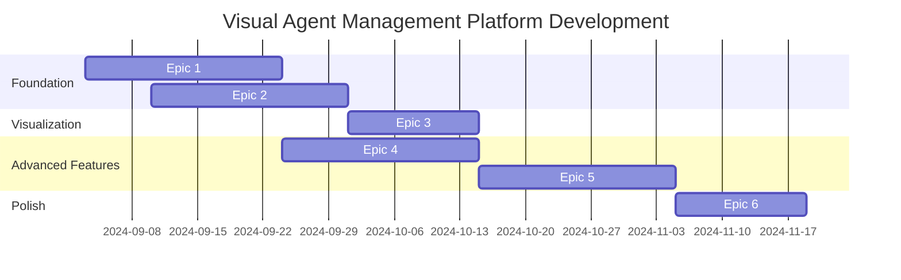

# Epic Structure - Visual Agent Management Platform

## 🎯 **Development Epic Breakdown**

Based on the true project vision of **visual management for parallel Claude Code CLI agents**, here are the structured development epics:

---

## **Epic 1: Agent Management Foundation** 🤖
**Timeline**: Weeks 1-3  
**Priority**: Critical Path  
**Dependencies**: None

### **Story 1.1: Multi-Agent CLI Wrapper Enhancement**
**Acceptance Criteria:**
- [x] Current `claude_cli_wrapper.py` supports single agent
- [ ] Extend wrapper to manage multiple parallel Claude CLI processes
- [ ] Each agent has unique process ID and communication channel
- [ ] Agent isolation prevents one failure from affecting others
- [ ] Resource allocation controls (memory, CPU limits) per agent

**Technical Tasks:**
```python
# Files to modify/create:
python-sdk/multi_agent_wrapper.py
python-sdk/agent_process_manager.py
python-sdk/resource_monitor.py
```

### **Story 1.2: Agent Lifecycle Management**
**Acceptance Criteria:**
- [ ] Create agents with configurable roles (Manager, Worker, Custom)
- [ ] Start, pause, resume, and terminate agents through API
- [ ] Real-time agent status monitoring (Active/Idle/Processing/Error)
- [ ] Automatic restart on agent failure with configurable retry limits
- [ ] Clean shutdown with Epic 3 process management integration

**Technical Tasks:**
```python
# New components:
agent_orchestrator/
├── agent_manager.py          # Agent lifecycle
├── status_monitor.py         # Health checking
├── recovery_manager.py       # Failure handling
└── config_manager.py         # Agent configurations
```

### **Story 1.3: Agent Communication Protocol**
**Acceptance Criteria:**
- [ ] Define message format for Manager-Worker communication
- [ ] Implement task handoff protocol (Manager → Worker)
- [ ] Result feedback protocol (Worker → Manager)
- [ ] Human intervention protocol (UI → Agent)
- [ ] Error reporting and escalation protocol

**Technical Tasks:**
```python
# Communication layer:
communication/
├── message_protocol.py       # Message format definitions
├── task_handoff.py          # Manager-Worker coordination
├── result_aggregator.py     # Collect and format results
└── intervention_handler.py  # Human input processing
```

---

## **Epic 2: Visual Dashboard Foundation** 🖥️
**Timeline**: Weeks 2-4  
**Priority**: Critical Path  
**Dependencies**: Epic 1.1 (CLI wrapper)

### **Story 2.1: React Dashboard Bootstrap**
**Acceptance Criteria:**
- [x] Current `dual-agent-monitor/` has basic React setup
- [ ] Enhance UI for multi-agent management
- [ ] Agent creation and configuration interface
- [ ] Real-time agent status display
- [ ] WebSocket connection to Python orchestrator
- [ ] Responsive design for Windows desktop

**Technical Tasks:**
```typescript
// UI Components to enhance:
dual-agent-monitor/src/components/
├── AgentManagement/
│   ├── AgentCreator.tsx      # Create agents
│   ├── AgentList.tsx        # Display all agents
│   ├── AgentSettings.tsx     # Configure agent behavior
│   └── StatusIndicator.tsx   # Real-time status
└── Dashboard/
    ├── OverviewPanel.tsx     # System overview
    ├── MetricsDisplay.tsx    # Performance metrics
    └── ControlPanel.tsx      # System controls
```

### **Story 2.2: WebSocket Real-Time Communication**
**Acceptance Criteria:**
- [x] Basic WebSocket server exists in monitoring system
- [ ] Bi-directional communication between React and Python
- [ ] Agent status updates in real-time (<100ms latency)
- [ ] Command execution from UI to agent orchestrator
- [ ] Message queuing for reliable delivery
- [ ] Connection recovery and reconnection handling

**Technical Tasks:**
```python
# WebSocket enhancement:
websocket_server/
├── agent_bridge.py          # Bridge UI to agent orchestrator
├── real_time_updates.py     # Push agent status updates
├── command_processor.py     # Handle UI commands
└── connection_manager.py    # Manage WebSocket connections
```

### **Story 2.3: Task Management Interface**
**Acceptance Criteria:**
- [ ] Create tasks through UI form interface
- [ ] Display task queue with priorities and assignments
- [ ] Drag-and-drop task reassignment between agents
- [ ] Task status visualization (Pending → In Progress → Complete)
- [ ] Task output preview and download
- [ ] Manual task intervention controls

**Technical Tasks:**
```typescript
// Task management UI:
dual-agent-monitor/src/components/TaskManagement/
├── TaskCreator.tsx          # Task creation form
├── TaskQueue.tsx           # Active task display
├── TaskCard.tsx            # Individual task representation
├── TaskAssignment.tsx      # Drag-drop assignment
└── TaskOutput.tsx          # Results preview
```

---

## **Epic 3: Workflow Visualization** 🎨
**Timeline**: Weeks 4-6  
**Priority**: High  
**Dependencies**: Epic 1 (Agent Management), Epic 2.2 (WebSocket)

### **Story 3.1: Real-Time Workflow Canvas**
**Acceptance Criteria:**
- [ ] Interactive canvas showing agent workflow
- [ ] Visual representation of tasks flowing between agents
- [ ] Real-time updates as agents communicate
- [ ] Zoom and pan functionality for complex workflows
- [ ] Node-and-connection diagram (agents as nodes, tasks as connections)
- [ ] Animated task handoffs between agents

**Technical Tasks:**
```typescript
// Workflow visualization:
dual-agent-monitor/src/components/WorkflowCanvas/
├── FlowCanvas.tsx           # Main canvas component
├── AgentNode.tsx           # Visual agent representation
├── TaskFlow.tsx            # Task movement visualization
├── ConnectionLine.tsx       # Communication paths
├── HandoffAnimation.tsx    # Task transfer effects
└── CanvasControls.tsx      # Zoom, pan, reset controls
```

### **Story 3.2: Agent Communication Display**
**Acceptance Criteria:**
- [ ] Chat-style interface showing agent conversations
- [ ] Message bubbles with agent identification and timestamps
- [ ] Filter messages by agent, priority, or message type
- [ ] Highlight decision points requiring human intervention
- [ ] Export conversation logs for analysis
- [ ] Message search functionality

**Technical Tasks:**
```typescript
// Communication monitoring:
dual-agent-monitor/src/components/Communication/
├── ChatView.tsx            # Main conversation display
├── MessageBubble.tsx       # Individual message styling
├── MessageFilter.tsx       # Filter controls
├── DecisionHighlight.tsx   # Highlight important decisions
├── ConversationExport.tsx  # Export functionality
└── SearchBar.tsx           # Message search
```

### **Story 3.3: Interactive Workflow Control**
**Acceptance Criteria:**
- [ ] Pause, resume, or stop workflow execution
- [ ] Manual task injection into running workflows
- [ ] Override agent decisions with human input
- [ ] Approve or reject agent-proposed actions
- [ ] Emergency stop functionality for all agents
- [ ] Workflow rollback to previous state

**Technical Tasks:**
```typescript
// Workflow control interface:
dual-agent-monitor/src/components/WorkflowControl/
├── ExecutionControls.tsx    # Play, pause, stop controls
├── TaskInjector.tsx        # Manual task creation
├── DecisionOverride.tsx    # Human intervention
├── ApprovalPanel.tsx       # Approve/reject actions
├── EmergencyStop.tsx       # Emergency controls
└── StateManager.tsx        # Workflow state handling
```

---

## **Epic 4: Advanced Agent Coordination** 🔄
**Timeline**: Weeks 5-7  
**Priority**: Medium  
**Dependencies**: Epic 1-3 (Foundation systems)

### **Story 4.1: Intelligent Task Distribution**
**Acceptance Criteria:**
- [ ] Manager agent analyzes tasks and breaks them into subtasks
- [ ] Automatic workload balancing across available Worker agents
- [ ] Task dependency resolution and sequencing
- [ ] Priority-based task scheduling
- [ ] Resource-aware task assignment (agent capabilities vs. task requirements)
- [ ] Retry logic for failed tasks with different agents

**Technical Tasks:**
```python
# Task distribution intelligence:
task_distribution/
├── task_analyzer.py         # Break down complex tasks
├── workload_balancer.py     # Distribute across agents
├── dependency_resolver.py   # Handle task dependencies
├── scheduler.py            # Priority-based scheduling
├── capability_matcher.py   # Match tasks to agent skills
└── retry_manager.py        # Handle task failures
```

### **Story 4.2: Dynamic Agent Scaling**
**Acceptance Criteria:**
- [ ] Automatically create additional Worker agents when workload increases
- [ ] Scale down agents when work decreases to save resources
- [ ] Configure minimum and maximum agent limits
- [ ] Monitor system resources to prevent over-allocation
- [ ] Graceful agent termination without losing work
- [ ] Agent specialization (different Worker types for different tasks)

**Technical Tasks:**
```python
# Dynamic scaling system:
scaling/
├── workload_monitor.py      # Monitor system load
├── scaling_decisions.py     # When to scale up/down
├── agent_spawner.py        # Create new agents
├── resource_checker.py     # Monitor system resources
├── graceful_shutdown.py    # Clean agent termination
└── specialization.py       # Different agent types
```

---

## **Epic 5: Production Features** 🚀
**Timeline**: Weeks 7-9  
**Priority**: Medium  
**Dependencies**: All previous epics

### **Story 5.1: Session Management & Persistence**
**Acceptance Criteria:**
- [ ] Save agent configurations and workflow states
- [ ] Resume interrupted sessions after app restart
- [ ] Session history with replay capability
- [ ] Export/import workflow configurations
- [ ] Template system for common workflows
- [ ] Version control for workflow configurations

**Technical Tasks:**
```python
# Persistence layer:
persistence/
├── session_manager.py       # Save/restore sessions
├── state_serializer.py      # Workflow state handling
├── config_exporter.py      # Export configurations
├── template_manager.py     # Workflow templates
├── version_control.py      # Configuration versioning
└── replay_system.py        # Session replay
```

### **Story 5.2: Monitoring & Analytics**
**Acceptance Criteria:**
- [ ] Performance metrics for agent efficiency
- [ ] Task completion time analysis
- [ ] Resource usage monitoring and alerts
- [ ] Error rate tracking and reporting
- [ ] Agent communication pattern analysis
- [ ] System health dashboard with historical data

**Technical Tasks:**
```typescript
// Analytics dashboard:
dual-agent-monitor/src/components/Analytics/
├── MetricsDashboard.tsx     # Performance overview
├── CompletionAnalytics.tsx  # Task completion metrics
├── ResourceMonitor.tsx      # System resource usage
├── ErrorReporting.tsx       # Error tracking
├── CommunicationAnalytics.tsx  # Agent interaction patterns
└── HealthIndicators.tsx     # System health status
```

### **Story 5.3: Error Handling & Recovery**
**Acceptance Criteria:**
- [ ] Comprehensive error classification and handling
- [ ] Automatic recovery procedures for common failures
- [ ] User notification system for critical errors
- [ ] Detailed error logging with debugging information
- [ ] Manual recovery tools for complex failures
- [ ] System stability monitoring and alerts

**Technical Tasks:**
```python
# Error handling system:
error_handling/
├── error_classifier.py     # Categorize different errors
├── recovery_procedures.py  # Automated recovery
├── notification_system.py  # User alerts
├── debug_logger.py         # Detailed logging
├── manual_recovery.py      # User-driven recovery tools
└── stability_monitor.py    # System health checks
```

---

## **Epic 6: Polish & Deployment** ✨
**Timeline**: Weeks 8-10  
**Priority**: Low  
**Dependencies**: All core functionality complete

### **Story 6.1: User Experience Enhancement**
**Acceptance Criteria:**
- [ ] Comprehensive onboarding tutorial for new users
- [ ] Contextual help system throughout the interface
- [ ] Keyboard shortcuts for power users
- [ ] Dark/light theme support
- [ ] Customizable dashboard layouts
- [ ] Accessibility features (screen reader support, keyboard navigation)

### **Story 6.2: Windows Deployment Package**
**Acceptance Criteria:**
- [ ] Windows installer (.msi) with all dependencies
- [ ] Automatic detection and installation of prerequisites (Node.js, Python)
- [ ] System tray integration for background operation
- [ ] Windows startup integration (optional)
- [ ] Uninstaller with complete cleanup
- [ ] Auto-update mechanism for future releases

### **Story 6.3: Documentation & Testing**
**Acceptance Criteria:**
- [ ] Complete user manual with screenshots and tutorials
- [ ] Developer documentation for extending the system
- [ ] API documentation for integration with other tools
- [ ] Comprehensive test suite with >80% coverage
- [ ] Performance benchmarks and optimization guidelines
- [ ] Troubleshooting guide for common issues

---

## 📊 **Epic Dependencies & Timeline**



## 🎯 **Success Criteria by Epic**

### **Epic 1 Success**: Multiple Claude CLI agents running independently with communication
### **Epic 2 Success**: Visual dashboard showing real-time agent status and task management
### **Epic 3 Success**: Interactive workflow visualization with real-time updates
### **Epic 4 Success**: Intelligent task coordination between Manager and Worker agents
### **Epic 5 Success**: Production-ready system with persistence and monitoring
### **Epic 6 Success**: Polished application ready for end-user deployment

---

**This epic structure transforms the existing codebase into a comprehensive visual agent management platform, leveraging current Python CLI wrapper and React infrastructure while building toward the true vision of intuitive, visual agent coordination.**