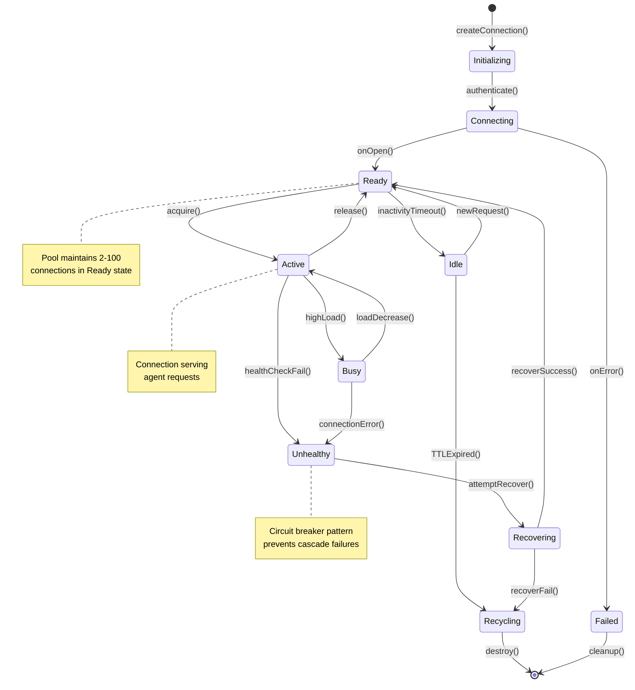
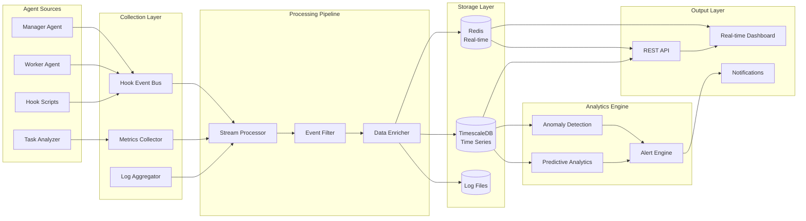
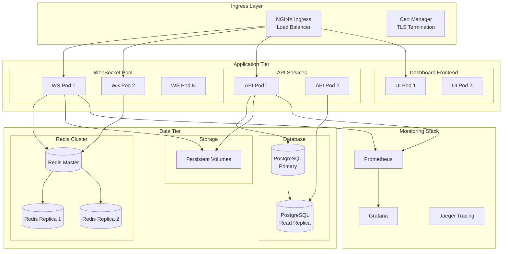
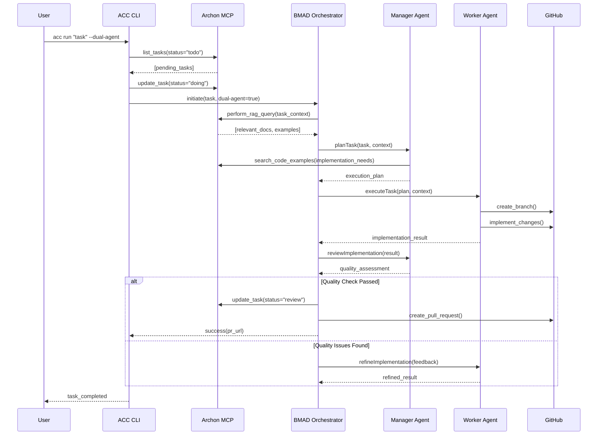
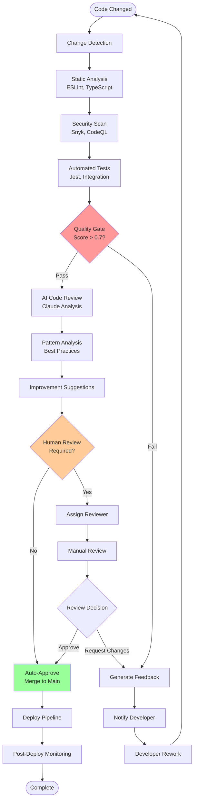
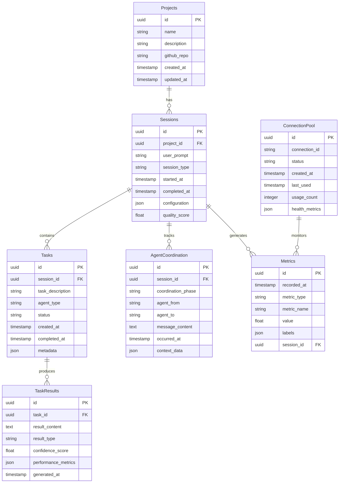
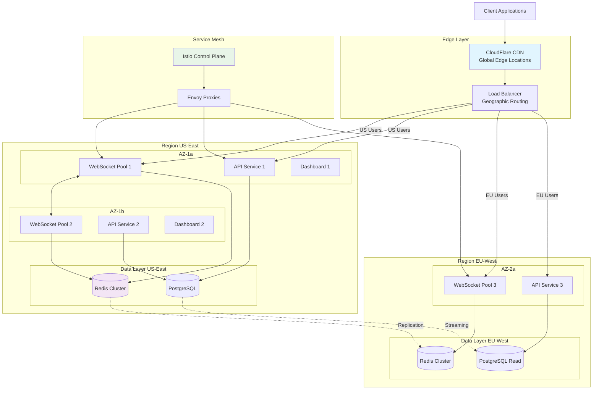
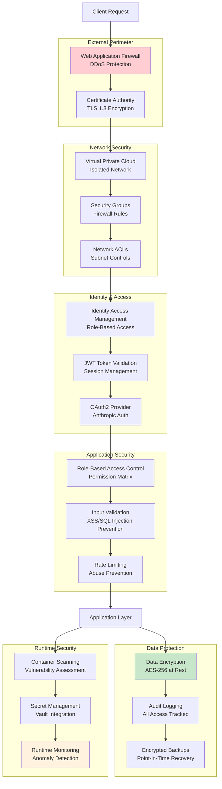
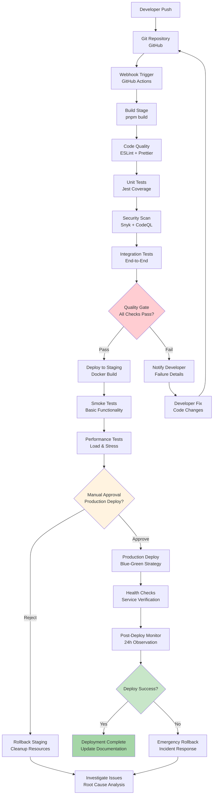

# Architecture Diagrams - Automatic Claude Code

Comprehensive Mermaid diagrams documenting the WebSocket pooling, monitoring, and dual-agent system architecture.

## 1. Overall System Architecture

High-level view of all system components and their interactions.

```mermaid
graph TB
    subgraph "Client Layer"
        CLI[ACC CLI]
        WEB[Dashboard UI<br/>React Frontend]
    end
    
    subgraph "Core Engine"
        SDK[SDK Autopilot Engine]
        COORD[Dual-Agent Coordinator]
        POOL[WebSocket Pool Manager]
        SESS[Session Manager]
    end
    
    subgraph "Agent Layer"
        MGR[Manager Agent<br/>Opus Model]
        WKR[Worker Agent<br/>Sonnet Model]
        COMP[Task Completion<br/>Analyzer]
    end
    
    subgraph "Communication Layer"
        WS[WebSocket Server]
        REST[REST API<br/>:4005]
        HOOKS[Hook Scripts<br/>PowerShell/Bash]
    end
    
    subgraph "Data Layer"
        REDIS[(Redis<br/>Connection State)]
        FS[(File System<br/>Sessions & Logs)]
        MEM[(Memory Graph<br/>Context Storage)]
    end
    
    subgraph "External Services"
        CLAUDE[Claude API<br/>Anthropic SDK]
        GITHUB[GitHub API<br/>Repository Ops)]
        ARCHON[Archon MCP<br/>Knowledge Base)]
    end
    
    CLI --> SDK
    WEB --> WS
    SDK --> COORD
    COORD --> MGR
    COORD --> WKR
    SDK --> COMP
    SDK --> POOL
    POOL --> WS
    WS --> REST
    HOOKS --> REST
    SDK --> SESS
    SESS --> FS
    POOL --> REDIS
    MGR --> CLAUDE
    WKR --> CLAUDE
    CLI --> GITHUB
    SDK --> ARCHON
    WKR --> MEM
    MGR --> MEM
```

## 2. WebSocket Pool Connection Lifecycle

State machine showing connection management and pooling strategy.



## 3. Monitoring Data Flow

Real-time data flow from agents to dashboard with metrics collection.



## 4. Kubernetes Deployment Topology

Multi-tier Kubernetes deployment with high availability and scaling.



## 5. BMAD Agent Orchestration Flow

BMAD (Brownfield Multi-Agent Development) orchestration with Archon integration.



## 6. AI Code Review Pipeline

Automated code review pipeline with quality gates and feedback loops.



## 7. Database Schema Relationships

Entity relationships for session management, monitoring, and agent coordination.



## 8. Network Architecture with Load Balancing

Network topology showing load balancing, CDN, and service mesh architecture.



## 9. Security Layers and Boundaries

Security architecture with multiple defense layers and access controls.



## 10. CI/CD Pipeline Flow

Continuous integration and deployment pipeline with quality gates and automated testing.



---

Each diagram provides detailed visualization of the system's architecture components, showing clear relationships between services, data flow patterns, and operational procedures. These diagrams support the comprehensive understanding needed for system maintenance, scaling, and future development.