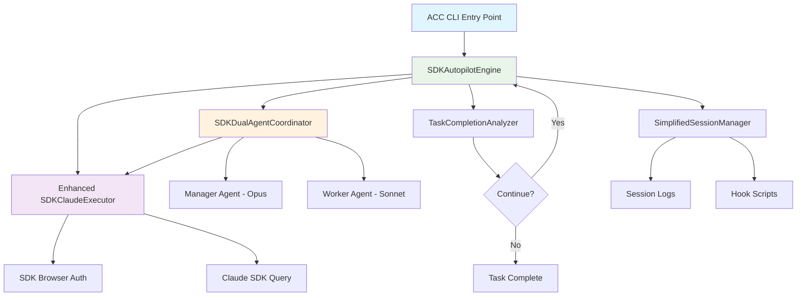

# **Automatic Claude Code - Brownfield Enhancement Architecture**
*SDK-Only Architectural Transformation*

---

## **Introduction**

This document outlines the architectural approach for transforming automatic-claude-code from its current hybrid PTY/API/SDK architecture to a clean SDK-only implementation. Its primary goal is to serve as the technical blueprint for eliminating architectural complexity while maintaining the core autopilot functionality and dual-agent capabilities.

**Relationship to Existing Architecture:**
This document defines a **replacement architecture** rather than supplemental additions. The SDK-only approach will eliminate substantial portions of the current codebase while preserving the user interface and core functionality through a dramatically simplified technical foundation.

### **Existing Project Analysis**

**Current Project State (v2.0.0):**
- **Primary Purpose:** SDK-integrated TypeScript CLI for dual-agent AI development automation with autopilot capabilities
- **Current Tech Stack:** Node.js/TypeScript, Commander.js CLI, Claude SDK, WebSocket monitoring, React dashboard
- **Architecture Style:** Clean SDK-only execution model with direct Claude CLI integration
- **Deployment Method:** NPM package with global CLI binary (`acc`), Docker containerization, optional monitoring infrastructure

**Available Documentation:**
- Comprehensive README.md with feature documentation and usage examples
- CLAUDE.md with project instructions and architectural notes
- Package.json with well-structured dependencies and build scripts
- Working PowerShell/Bash hook scripts for monitoring integration
- BMad method integration with specialized agents for different roles

**Identified Constraints:**
- Must maintain CLI interface compatibility (`acc` commands and options)
- SDK integration dependency - leverages existing Claude CLI setup
- Existing user workflows and session formats must remain functional
- Hook script integration must continue working for external monitoring
- Cross-platform support (Windows, macOS, Linux) must be preserved

**Change Log:**
| Change | Date | Version | Description | Author |
|--------|------|---------|-------------|--------|
| SDK-Only Architecture Design | 2025-09-02 | 2.0 | Complete architectural transformation to SDK-only approach | Architect (Winston) |
| SDK-Only Implementation | 2025-09-02 | 2.0 | Implementation completed, PTY and browser auth removed | Documentation Manager |

---

## **Enhancement Scope and Integration Strategy**

### **Enhancement Overview**
**Enhancement Type:** Technology Stack Upgrade & Architectural Simplification  
**Scope:** ✅ **COMPLETED** - Eliminated PTY and complex browser session management, consolidated to SDK-only execution with simplified monitoring  
**Integration Impact:** Major - ✅ **COMPLETED** - Removed substantial existing infrastructure while preserving user interface compatibility

### **Integration Approach**
**Code Integration Strategy:** ✅ **COMPLETED** - Replaced existing execution engines with single SDK-based executor, eliminated PTY controllers and complex coordination logic  
**Database Integration:** Maintain existing session storage format for compatibility with current tooling  
**API Integration:** N/A - removing API execution paths in favor of SDK-only approach  
**UI Integration:** Preserve CLI interface exactly, make monitoring dashboard truly optional (can be completely disabled)

### **Compatibility Requirements**
- **Existing API Compatibility:** CLI commands and flags must remain identical to current implementation
- **Database Schema Compatibility:** Session files and log formats must remain compatible with existing analysis tools  
- **UI/UX Consistency:** Terminal user experience must be indistinguishable from current implementation
- **Performance Impact:** SDK-only approach should match or exceed current execution performance while reducing memory footprint

---

## **Tech Stack Alignment**

### **Existing Technology Stack**
| Category | Current Technology | Version | Usage in Enhancement | Notes |
|----------|-------------------|---------|---------------------|--------|
| Core Runtime | Node.js | >=18.0.0 | **Preserved** - Core execution environment | No changes needed |
| Language | TypeScript | ^5.3.3 | **Preserved** - All new code in TypeScript | Existing patterns maintained |
| CLI Framework | Commander.js | ^12.0.0 | **Preserved** - User interface layer | Interface compatibility critical |
| Claude Integration | @anthropic-ai/claude-code | ^1.0.98 | **Enhanced** - Becomes sole execution engine | Existing integration expanded |
| Process Management | node-pty | ^1.0.0 | **Eliminated** - No longer needed | Replaced by SDK calls |
| Session Storage | File system | Built-in | **Preserved** - Simplified implementation | Format compatibility maintained |
| Logging | Custom Logger | Built-in | **Simplified** - Reduced complexity | Core functionality preserved |
| Configuration | JSON config files | Built-in | **Preserved** - Streamlined options | SDK-specific config only |

### **Technology Eliminations**
| Technology | Version | Purpose | Elimination Rationale | Replacement |
|-----------|---------|---------|---------------------|-------------|
| node-pty | ^1.0.0 | PTY process management | Complex, error-prone, not needed with SDK | Direct SDK query calls |
| WebSocket infrastructure | ws ^8.18.0 | Agent coordination | Over-engineered for SDK approach | Function calls within process |
| Complex browser detection | Custom | Multi-browser auth detection | SDK handles authentication internally | SDK's built-in browser auth |
| Monitoring server | Express-based | Real-time coordination tracking | Adds complexity, makes monitoring mandatory | Optional simplified logging |

---

## **Component Architecture**

### **New Components**

#### **SDKAutopilotEngine**
**Responsibility:** Core autopilot loop using only SDK execution - replaces PTY-based execution and coordination  
**Integration Points:** Replaces `AgentCoordinator`, `ptyController`, and complex session management

**Key Interfaces:**
- `runAutopilotLoop(task: string, options: AutopilotOptions): Promise<void>`
- `executeTask(prompt: string, context: ExecutionContext): Promise<SDKResult>`

**Dependencies:**
- **Existing Components:** Logger (simplified), Config (streamlined)
- **New Components:** SDKDualAgentCoordinator, TaskCompletionAnalyzer

**Technology Stack:** TypeScript, Claude SDK, minimal logging

#### **SDKDualAgentCoordinator** 
**Responsibility:** Simplified dual-agent coordination via direct SDK calls - eliminates PTY process communication  
**Integration Points:** Replaces complex `AgentCoordinator` with direct function calls

**Key Interfaces:**
- `coordinateAgents(task: string, options: DualAgentOptions): Promise<CoordinationResult>`
- `executeManagerPhase(context: ManagerContext): Promise<ManagerResult>`
- `executeWorkerPhase(managerOutput: ManagerResult): Promise<WorkerResult>`

**Dependencies:**
- **Existing Components:** SDKClaudeExecutor (enhanced)
- **New Components:** SDKAutopilotEngine

**Technology Stack:** TypeScript, Claude SDK with model selection (opus/sonnet)

#### **TaskCompletionAnalyzer**
**Responsibility:** Determines when autopilot should continue or stop based on SDK response analysis  
**Integration Points:** Replaces existing completion detection with SDK-specific response parsing

**Key Interfaces:**
- `analyzeCompletion(sdkResponse: SDKResponse): CompletionAnalysis`
- `shouldContinue(analysis: CompletionAnalysis, context: TaskContext): boolean`

**Dependencies:**
- **Existing Components:** Logger (for decision tracking)
- **New Components:** None (standalone analysis component)

**Technology Stack:** TypeScript with response pattern matching

#### **SimplifiedSessionManager**
**Responsibility:** Lightweight session tracking compatible with existing log formats but optimized for SDK-only execution  
**Integration Points:** Maintains compatibility with existing session analysis tools while eliminating complexity

**Key Interfaces:**
- `createSession(task: string, workDir: string): Promise<SessionId>`
- `logIteration(sessionId: SessionId, iteration: IterationData): Promise<void>`
- `getSessionHistory(sessionId: SessionId): Promise<SessionData>`

**Dependencies:**
- **Existing Components:** File system operations, existing log format structures
- **New Components:** SDKAutopilotEngine (for session data)

**Technology Stack:** TypeScript, Node.js file system, JSON storage

### **Component Interaction Diagram**



---

## **Source Tree Integration**

### **Existing Project Structure**
```plaintext
automatic-claude-code/
├── src/
│   ├── services/
│   │   ├── claudeExecutor.ts           # ELIMINATE - Replace with SDK-only
│   │   ├── ptyController.ts            # ELIMINATE - No longer needed
│   │   ├── browserSessionManager.ts    # ELIMINATE - SDK handles auth
│   │   ├── sdkClaudeExecutor.ts        # ENHANCE - Becomes core engine
│   │   └── credentialProviders.ts      # SIMPLIFY - Minimal auth detection
│   ├── agents/
│   │   ├── agentCoordinator.ts         # ELIMINATE - Replace with SDK coordinator
│   │   ├── managerAgent.ts             # ELIMINATE - Direct SDK calls instead
│   │   └── workerAgent.ts              # ELIMINATE - Direct SDK calls instead
│   ├── index.ts                        # MODIFY - Simplified entry point
│   ├── sessionManager.ts               # SIMPLIFY - Lightweight version
│   ├── logger.ts                       # SIMPLIFY - Core functionality only
│   └── config.ts                       # SIMPLIFY - SDK-only options
├── dual-agent-monitor/                 # OPTIONAL - Make truly optional
└── package.json                        # SIMPLIFY - Remove PTY dependencies
```

### **New File Organization** 
```plaintext
automatic-claude-code/
├── src/
│   ├── core/                           # New - Core SDK-only functionality
│   │   ├── SDKAutopilotEngine.ts       # Primary autopilot logic
│   │   ├── TaskCompletionAnalyzer.ts   # Completion detection
│   │   └── SimplifiedSessionManager.ts # Lightweight session tracking
│   ├── agents/                         # Restructured - SDK-based agents
│   │   └── SDKDualAgentCoordinator.ts  # Simple dual-agent coordination
│   ├── services/
│   │   ├── sdkClaudeExecutor.ts        # Enhanced - Single execution engine
│   │   └── authDetector.ts             # New - Simple browser auth detection
│   ├── index.ts                        # Simplified CLI entry point
│   ├── logger.ts                       # Preserved - Core functionality
│   ├── config.ts                       # Streamlined - SDK options only
│   └── types.ts                        # Enhanced - SDK-specific types
├── monitoring/                         # Optional - Standalone monitoring
│   └── optional-dashboard/             # Completely decoupled from core
└── package.json                        # Cleaned - Minimal dependencies
```

### **Integration Guidelines**
- **File Naming:** Maintain existing patterns (camelCase for files, PascalCase for classes)
- **Folder Organization:** New `core/` folder for SDK-only components, preserve `services/` for infrastructure
- **Import/Export Patterns:** Maintain barrel exports and clear dependency direction (core → services → external)

---

## **Infrastructure and Deployment Integration**

### **Existing Infrastructure**
**Current Deployment:** NPM global package installation with `npm link` for development access  
**Infrastructure Tools:** Docker containerization, PM2 process management for monitoring, PowerShell/Bash scripts  
**Environments:** Development (local), containerized deployment, optional monitoring infrastructure

### **Enhancement Deployment Strategy**
**Deployment Approach:** Preserve existing NPM package structure, eliminate complex monitoring dependencies  
**Infrastructure Changes:** Remove monitoring server requirements, simplify Docker configuration  
**Pipeline Integration:** Maintain existing build process but with simplified dependencies and faster build times

### **Rollback Strategy**
**Rollback Method:** Version-based NPM rollback, existing session data remains compatible  
**Risk Mitigation:** Parallel deployment capability - old and new versions can coexist during transition  
**Monitoring:** Simplified console-based monitoring with optional external dashboard

---

## **Coding Standards and Conventions**

### **Existing Standards Compliance**
**Code Style:** TypeScript with strict mode, ESLint configuration, consistent async/await patterns  
**Linting Rules:** Existing ESLint rules maintained, simplified for reduced complexity  
**Testing Patterns:** Jest-based testing, integration tests for core functionality  
**Documentation Style:** JSDoc comments, comprehensive README, inline code comments

### **Critical Integration Rules**
- **Existing API Compatibility:** All CLI commands must work identically to current implementation
- **Session Format Integration:** Log files must remain compatible with existing analysis tools
- **Error Handling:** Maintain existing error patterns but simplify error types for SDK-only execution  
- **Logging Consistency:** Preserve log format and structure for external tooling compatibility

---

## **Testing Strategy**

### **Integration with Existing Tests**
**Existing Test Framework:** Jest with TypeScript support, comprehensive integration testing  
**Test Organization:** Tests mirror source structure, separate unit and integration test suites  
**Coverage Requirements:** Maintain existing coverage standards while simplifying test complexity

### **New Testing Requirements**

#### **Unit Tests for New Components**
- **Framework:** Jest (existing)
- **Location:** `src/__tests__/` following existing patterns
- **Coverage Target:** 90%+ for core SDK components
- **Integration with Existing:** Reuse existing test utilities and mocking patterns

#### **Integration Tests**
- **Scope:** End-to-end autopilot functionality, dual-agent coordination, CLI interface compatibility
- **Existing System Verification:** Automated verification that CLI behavior remains identical
- **New Feature Testing:** SDK authentication, task completion detection, simplified session management

#### **Regression Testing**
- **Existing Feature Verification:** Comprehensive CLI command testing, session format validation
- **Automated Regression Suite:** All existing commands must produce identical results
- **Manual Testing Requirements:** Browser authentication across different browsers and platforms

---

## **Security Integration**

### **Existing Security Measures**
**Authentication:** Browser-based authentication through Claude SDK  
**Authorization:** User-level permissions through Claude subscription  
**Data Protection:** Local file system storage, no external data transmission beyond Claude API  
**Security Tools:** No additional security infrastructure required

### **Enhancement Security Requirements**
**New Security Measures:** Simplified authentication reduces attack surface  
**Integration Points:** SDK handles all authentication securely, no credential storage needed  
**Compliance Requirements:** Maintain existing data privacy standards

### **Security Testing**
**Existing Security Tests:** Browser authentication validation, session isolation  
**New Security Test Requirements:** SDK authentication failure handling, secure session management  
**Penetration Testing:** Not required - simplified architecture reduces security complexity

---

## **Next Steps**

### **Developer Handoff**

**Implementation Sequence for SDK-Only Transformation:**

For developers starting implementation of this SDK-only architectural transformation:

**Phase 1: SDK Foundation (Story 1.1)**
- Enhance `src/services/sdkClaudeExecutor.ts` to handle all current use cases  
- Create `src/core/SDKAutopilotEngine.ts` as the new primary execution engine
- Implement comprehensive SDK authentication testing across browsers
- **Key Integration Point:** Ensure CLI interface remains identical during this phase

**Phase 2: Autopilot Logic (Story 1.2)**  
- Implement `src/core/TaskCompletionAnalyzer.ts` for SDK response analysis
- Integrate autopilot loop with enhanced SDK executor
- **Verification Checkpoint:** All existing `acc run` commands must work identically
- **Critical:** Session continuity must work correctly with SDK query calls

**Phase 3: Dual-Agent Simplification (Story 1.3)**
- Create `src/agents/SDKDualAgentCoordinator.ts` using direct SDK calls
- Replace PTY coordination with function-based coordination  
- **Integration Requirement:** Dual-agent quality must match or exceed current implementation
- **Key Decision:** Manager (Opus) and Worker (Sonnet) coordination via SDK sessions

**Phase 4: Legacy Elimination (Story 1.4)**
- Remove `src/services/ptyController.ts`, `browserSessionManager.ts`, `claudeExecutor.ts`
- Remove PTY dependencies from `package.json`
- Update `src/config.ts` to SDK-only configuration options
- **Migration Safety:** Provide clear deprecation warnings for removed CLI flags

**Phase 5: Monitoring Simplification (Story 1.5)**
- Implement `src/core/SimplifiedSessionManager.ts` with existing format compatibility
- Make monitoring dashboard completely optional
- **Compatibility Requirement:** Existing log analysis tools must continue working

**Critical Technical Constraints Based on Actual Project Analysis:**
- Browser authentication via SDK must work reliably across Chrome, Firefox, Safari, Edge
- Session file formats in `~/.automatic-claude-code/sessions/` must remain compatible
- Hook scripts in `.claude/hooks/` must continue receiving events
- CLI command structure and all existing flags must remain functional
- Performance must match or exceed current implementation

**Integration Verification at Each Phase:**
- Run existing test suite to ensure no regressions
- Verify CLI commands produce identical output
- Test dual-agent coordination quality
- Validate hook script integration
- Confirm session format compatibility

This architecture provides the technical foundation for transforming your "Frankenstein" codebase into the clean, focused SDK-only autopilot tool you originally envisioned, while maintaining complete compatibility with existing user workflows.