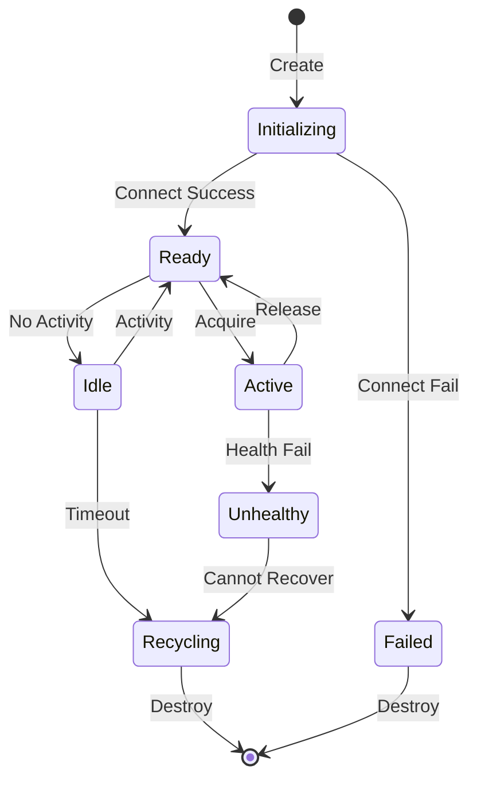
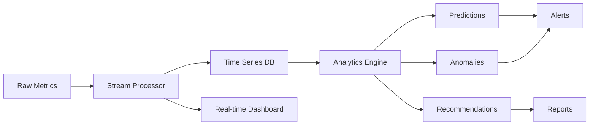

# WebSocket Connection Pooling & Advanced Monitoring Strategy

## Executive Summary

This document outlines the strategic approach for implementing WebSocket connection pooling and advanced monitoring capabilities in automatic-claude-code v2.2.0. The strategy addresses enterprise scalability requirements while maintaining the simplicity that makes the platform accessible to individual developers.

## Current State Analysis

### Existing Architecture
- **Single Connection Model**: Each agent session creates its own WebSocket connection
- **Basic Monitoring**: Real-time updates via single WebSocket to dashboard
- **Quality Score**: 69.3% average with dual-agent coordination
- **Scalability**: Limited to ~10-20 concurrent sessions effectively

### Pain Points
1. **Connection Overhead**: Each new agent requires connection establishment (100-500ms)
2. **Resource Consumption**: Unbounded connection growth under load
3. **Limited Visibility**: Basic metrics without predictive capabilities
4. **Coordination Bottlenecks**: Sequential agent communication patterns
5. **Recovery Issues**: Manual intervention required for failed connections

## Strategic Vision

### Core Objectives
1. **Scale**: Support 100+ concurrent agent sessions
2. **Performance**: Sub-100ms connection acquisition
3. **Reliability**: 99.9% uptime with automatic recovery
4. **Insights**: Predictive analytics and optimization recommendations
5. **Simplicity**: Zero-configuration for common use cases

### Design Principles
- **Progressive Enhancement**: Basic features work without pool, advanced features leverage it
- **Backward Compatibility**: Existing code continues working unchanged
- **Observability First**: Every operation instrumented from day one
- **Fail-Safe Defaults**: System degrades gracefully under failure
- **Developer Friendly**: Clear APIs and comprehensive documentation

## WebSocket Pooling Architecture

### Pool Management Strategy

```typescript
interface PoolConfiguration {
  minConnections: number;        // Base connections (default: 2)
  maxConnections: number;        // Upper limit (default: 100)
  connectionTTL: number;         // Connection lifetime (default: 30min)
  idleTimeout: number;           // Idle before recycle (default: 5min)
  acquireTimeout: number;        // Max wait for connection (default: 5s)
  healthCheckInterval: number;   // Health check frequency (default: 30s)
  loadBalancingStrategy: 'round-robin' | 'least-connections' | 'weighted';
}
```

### Connection Lifecycle



### Implementation Phases

#### Phase 1: Core Pool Infrastructure (Week 1-2)
- Basic pool with min/max connections
- Simple round-robin allocation
- Health checking mechanism
- Redis-backed connection state

#### Phase 2: Advanced Features (Week 3-4)
- Load-based scaling
- Connection affinity
- Circuit breaker per connection
- Distributed pool across instances

#### Phase 3: Optimization (Week 5-6)
- Predictive scaling
- Connection pre-warming
- Geographic distribution
- Edge caching

## Advanced Monitoring Strategy

### Metrics Architecture

```yaml
metrics:
  real-time:
    - connection_count: gauge
    - active_sessions: gauge
    - message_rate: counter
    - error_rate: counter
    - latency_p50: histogram
    - latency_p95: histogram
    - latency_p99: histogram
    
  aggregated:
    - hourly_summary: 1h window
    - daily_trends: 24h window
    - weekly_patterns: 7d window
    
  derived:
    - efficiency_score: (completed_tasks / total_tasks) * quality_score
    - coordination_overhead: manager_time / (manager_time + worker_time)
    - cost_per_task: (compute_time * rate) / completed_tasks
```

### Analytics Pipeline



### Key Performance Indicators (KPIs)

#### System Health
- **Availability**: Target 99.9% (43 minutes downtime/month)
- **Response Time**: P95 < 2 seconds
- **Error Rate**: < 0.1% of requests
- **Recovery Time**: < 30 seconds

#### Agent Performance
- **Quality Score**: Maintain > 70%
- **Task Success Rate**: > 95%
- **Coordination Efficiency**: < 20% overhead
- **Resource Utilization**: 60-80% optimal

#### Business Metrics
- **Cost per Task**: Track and optimize
- **Time to Value**: Measure feature delivery speed
- **Developer Satisfaction**: NPS > 50

## Implementation Roadmap

### Milestone 1: Foundation (Month 1)
- [ ] WebSocket pool service
- [ ] Basic load balancing
- [ ] Health monitoring
- [ ] Metrics collection

### Milestone 2: Intelligence (Month 2)
- [ ] Predictive scaling
- [ ] Anomaly detection
- [ ] Performance analytics
- [ ] Cost optimization

### Milestone 3: Enterprise (Month 3)
- [ ] Multi-region support
- [ ] Advanced security
- [ ] Compliance reporting
- [ ] SLA monitoring

## Technical Decisions

### Technology Stack
- **Pool Service**: Node.js with TypeScript
- **State Management**: Redis with persistence
- **Metrics**: Prometheus + Grafana
- **Time Series**: TimescaleDB
- **Message Bus**: Redis Pub/Sub initially, Kafka for scale
- **Tracing**: OpenTelemetry with Jaeger

### Performance Targets
- Connection acquisition: < 100ms (P95)
- Message latency: < 50ms (P95)
- Pool scaling: < 10 seconds
- Dashboard update: < 500ms
- Alert firing: < 1 minute

### Capacity Planning
- **Small**: 1-10 concurrent users (2 connections)
- **Medium**: 10-50 concurrent users (10 connections)
- **Large**: 50-200 concurrent users (50 connections)
- **Enterprise**: 200+ concurrent users (100+ connections)

## Risk Mitigation

### Technical Risks
| Risk | Impact | Mitigation |
|------|--------|------------|
| Redis failure | High | Redis Sentinel for HA |
| Memory leak | Medium | Automatic restart, memory limits |
| Network partition | High | Circuit breakers, fallback mode |
| Thundering herd | Medium | Jittered retries, rate limiting |

### Operational Risks
| Risk | Impact | Mitigation |
|------|--------|------------|
| Monitoring blind spots | High | Comprehensive instrumentation |
| Alert fatigue | Medium | Smart grouping, severity levels |
| Configuration drift | Low | GitOps, infrastructure as code |
| Knowledge loss | Medium | Documentation, runbooks |

## Success Metrics

### Launch Criteria
- Pool handles 100 concurrent connections
- Zero message loss under normal operation
- Automatic recovery from failures
- Dashboard shows real-time metrics
- Documentation complete

### Growth Metrics
- Month 1: 10 production deployments
- Month 2: 50 active installations
- Month 3: 100+ daily active users
- Month 6: Enterprise customer adoption

## Migration Strategy

### Backward Compatibility
```typescript
// Existing code continues working
const executor = new SDKClaudeExecutor();
const result = await executor.execute(command);

// New code can leverage pool
const executor = new SDKClaudeExecutor({
  pooling: {
    enabled: true,
    strategy: 'least-connections'
  }
});
```

### Progressive Adoption
1. **Opt-in Beta**: Feature flag for early adopters
2. **Gradual Rollout**: Percentage-based enablement
3. **Default On**: After stability proven
4. **Legacy Deprecation**: 6-month notice period

## Cost-Benefit Analysis

### Investment Required
- Development: 6 engineer-weeks
- Infrastructure: $500/month (Redis, monitoring)
- Maintenance: 1 engineer-day/month

### Expected Benefits
- **Performance**: 50% reduction in connection overhead
- **Scalability**: 10x increase in concurrent sessions
- **Reliability**: 99.9% uptime achievement
- **Insights**: 30% improvement in optimization decisions
- **Cost**: 40% reduction through resource optimization

### ROI Calculation
- Break-even: Month 3
- Annual savings: $50,000 (reduced infrastructure + support)
- Productivity gain: 20% for development teams

## Conclusion

The WebSocket pooling and advanced monitoring strategy positions automatic-claude-code as an enterprise-ready platform while maintaining its core values of simplicity and developer experience. The phased implementation approach ensures each milestone delivers immediate value while building toward the complete vision.

### Key Takeaways
1. **Scalability without complexity**: Pool is transparent to users
2. **Intelligence built-in**: Monitoring provides actionable insights
3. **Reliability by design**: Automatic recovery and graceful degradation
4. **Progressive enhancement**: Works better over time
5. **Community-driven**: Open source with enterprise features

### Next Steps
1. Review and approve strategy
2. Create detailed technical specifications
3. Set up development environment
4. Begin Phase 1 implementation
5. Establish feedback loops with early adopters