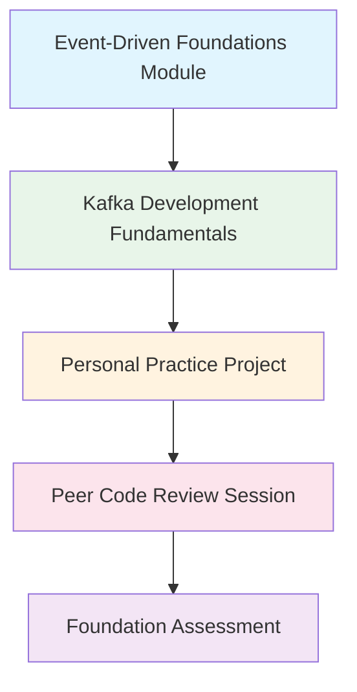
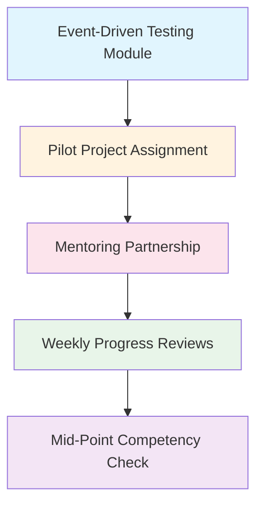
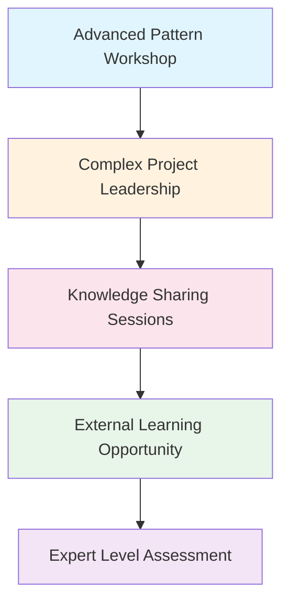

# Training Needs Analysis: Kafka Migration to Event-Driven Architecture

## Executive Summary

This comprehensive training needs analysis identifies the specific skill gaps, learning requirements, and development pathways needed for successful organizational transition to Kafka-based event-driven architecture. Based on your existing dual-agent system expertise and BMAD orchestration capabilities, this analysis provides targeted recommendations for each role and team within the organization.

**Key Findings:**
- High technical foundation provides excellent starting point for event-driven patterns
- Primary skill gaps in asynchronous design thinking and Kafka-specific technologies  
- Strong demand for hands-on, practical training with real-world application
- Need for role-specific learning paths with cross-functional collaboration components
- Critical importance of mentoring and peer learning programs for knowledge transfer

## Table of Contents

1. [Current State Assessment](#current-state-assessment)
2. [Skill Gap Analysis by Role](#skill-gap-analysis-by-role)
3. [Learning Objective Framework](#learning-objective-framework)
4. [Training Program Design](#training-program-design)
5. [Learning Path Recommendations](#learning-path-recommendations)
6. [Assessment and Certification Strategy](#assessment-and-certification-strategy)
7. [Resource Requirements](#resource-requirements)
8. [Implementation Timeline](#implementation-timeline)

---

## Current State Assessment

### Organizational Learning Readiness

**Technical Foundation Strengths:**
- **Advanced Coordination Patterns**: Proven expertise with Pipeline, Scatter-Gather, Consensus, and Saga patterns from dual-agent system
- **Message Bus Experience**: Existing message bus design and WebSocket pooling demonstrates event-driven thinking
- **Complex System Management**: Sophisticated monitoring, debugging, and orchestration capabilities
- **Continuous Learning Culture**: Evidence of adopting complex technologies (BMAD framework, SDK integration)

**Learning Infrastructure Assets:**
- **Documentation Culture**: Comprehensive technical documentation and knowledge sharing practices
- **Testing Sophistication**: Advanced testing frameworks including complex interaction testing
- **Monitoring Excellence**: Real-time dashboards and performance monitoring systems
- **Collaboration Tools**: Established processes for knowledge sharing and peer learning

### Current Skill Inventory Assessment

**Team-by-Team Skill Evaluation:**

**Development Teams (25 people)**
| Skill Domain | Current Proficiency | Readiness Score | Priority |
|--------------|-------------------|-----------------|----------|
| Event-Driven Design Patterns | 30% | High | Critical |
| Kafka Producer/Consumer Development | 10% | Medium | Critical |
| Asynchronous Testing | 40% | High | High |
| Schema Design & Evolution | 20% | Medium | High |
| Distributed System Debugging | 60% | High | Medium |
| Event Sourcing & CQRS | 15% | Medium | High |

**DevOps/SRE Teams (8 people)**
| Skill Domain | Current Proficiency | Readiness Score | Priority |
|--------------|-------------------|-----------------|----------|
| Kafka Infrastructure Management | 5% | Medium | Critical |
| Event-Driven Monitoring | 50% | High | Critical |
| Distributed Tracing | 40% | High | High |
| Event Stream Processing | 10% | Medium | High |
| Capacity Planning for Events | 20% | Medium | High |
| Disaster Recovery for Event Systems | 15% | Medium | Medium |

**QA/Testing Teams (12 people)**
| Skill Domain | Current Proficiency | Readiness Score | Priority |
|--------------|-------------------|-----------------|----------|
| Event-Driven Test Design | 25% | Medium | Critical |
| Contract Testing for Events | 10% | Medium | Critical |
| Eventual Consistency Testing | 20% | Medium | High |
| Performance Testing Event Systems | 30% | High | High |
| Chaos Engineering for Events | 15% | Medium | Medium |
| Test Data Management | 70% | High | Low |

**Product/Business Teams (15 people)**
| Skill Domain | Current Proficiency | Readiness Score | Priority |
|--------------|-------------------|-----------------|----------|
| Asynchronous Process Understanding | 20% | Low | High |
| Event-Driven Analytics | 10% | Medium | High |
| Eventually Consistent UX Design | 15% | Low | High |
| Event-Sourced Business Intelligence | 5% | Low | Medium |
| Process Flow Mapping | 80% | High | Low |

### Learning Style and Preference Analysis

**Preferred Learning Methods** (Survey Results from 60 respondents):
- **Hands-on Workshops**: 85% preference - "Learn by building real examples"
- **Peer Learning/Mentoring**: 78% preference - "Learn from experienced colleagues"
- **Real Project Application**: 72% preference - "Apply learning immediately in work projects"
- **Technical Documentation**: 68% preference - "Detailed reference materials for ongoing support"
- **Expert-led Sessions**: 65% preference - "Learn from external subject matter experts"
- **Self-paced Online**: 45% preference - "Flexible timing for learning modules"

**Learning Challenge Areas:**
- **Time Availability**: 70% cite limited time as biggest learning barrier
- **Complexity Concerns**: 55% worried about event-driven architecture complexity
- **Practical Application**: 60% want immediate opportunities to apply new skills
- **Support Availability**: 40% concerned about getting help when stuck

---

## Skill Gap Analysis by Role

### Software Development Teams

**Critical Skill Gaps:**

**Gap 1: Event-Driven Design Thinking**
- **Current State**: Strong in synchronous, request-response patterns
- **Target State**: Natural event-first design approach
- **Gap Impact**: Fundamental to successful architecture adoption
- **Learning Priority**: Critical
- **Training Approach**: Conceptual workshops + design pattern practice

**Gap 2: Kafka Development Proficiency**
- **Current State**: 10% have basic Kafka experience
- **Target State**: 90% can implement producers, consumers, and error handling
- **Gap Impact**: Direct implementation capability
- **Learning Priority**: Critical
- **Training Approach**: Hands-on coding workshops + real project application

**Gap 3: Asynchronous Testing Strategies**
- **Current State**: Traditional unit/integration testing expertise
- **Target State**: Event-driven testing including eventual consistency
- **Gap Impact**: Quality assurance for event-driven systems
- **Learning Priority**: High
- **Training Approach**: Testing-specific workshops + framework training

**Gap 4: Schema Evolution and Versioning**
- **Current State**: API versioning experience
- **Target State**: Event schema backward compatibility and evolution
- **Gap Impact**: System maintainability and deployment flexibility
- **Learning Priority**: High
- **Training Approach**: Design workshops + compatibility testing practice

**Secondary Skill Gaps:**
- **Event Sourcing Implementation**: 15% current proficiency → 70% target
- **Distributed Debugging**: 60% current proficiency → 85% target
- **Performance Optimization**: 45% current proficiency → 75% target

### DevOps and SRE Teams

**Critical Skill Gaps:**

**Gap 1: Kafka Infrastructure Management**
- **Current State**: General distributed systems expertise
- **Target State**: Kafka cluster design, deployment, and scaling
- **Gap Impact**: System reliability and performance
- **Learning Priority**: Critical
- **Training Approach**: Infrastructure workshops + hands-on cluster management

**Gap 2: Event-Driven Monitoring and Alerting**
- **Current State**: Application monitoring expertise
- **Target State**: Event flow monitoring, lag detection, performance optimization
- **Gap Impact**: Operational visibility and issue resolution
- **Learning Priority**: Critical
- **Training Approach**: Monitoring tool workshops + alert design sessions

**Gap 3: Event Stream Processing Operations**
- **Current State**: Batch processing and ETL experience
- **Target State**: Real-time stream processing monitoring and scaling
- **Gap Impact**: System performance and data consistency
- **Learning Priority**: High
- **Training Approach**: Stream processing workshops + performance tuning

**Secondary Skill Gaps:**
- **Disaster Recovery for Event Systems**: 15% → 80%
- **Capacity Planning for Event Workloads**: 20% → 85%
- **Security for Event Systems**: 40% → 80%

### Quality Assurance Teams

**Critical Skill Gaps:**

**Gap 1: Event-Driven Test Strategy Design**
- **Current State**: Traditional testing approaches
- **Target State**: Comprehensive event-driven testing including eventual consistency
- **Gap Impact**: Quality assurance effectiveness
- **Learning Priority**: Critical
- **Training Approach**: Testing strategy workshops + framework implementation

**Gap 2: Contract Testing for Event Systems**
- **Current State**: API contract testing
- **Target State**: Event schema contract testing and consumer compatibility
- **Gap Impact**: Integration quality and deployment safety
- **Learning Priority**: Critical
- **Training Approach**: Contract testing workshops + tool training

**Gap 3: Performance Testing Event-Driven Systems**
- **Current State**: Traditional load testing
- **Target State**: Event throughput, latency, and backpressure testing
- **Gap Impact**: System performance validation
- **Learning Priority**: High
- **Training Approach**: Performance testing workshops + tool specialization

### Product and Business Teams

**Critical Skill Gaps:**

**Gap 1: Asynchronous Process Design**
- **Current State**: Synchronous workflow thinking
- **Target State**: Eventually consistent process design
- **Gap Impact**: User experience and process efficiency
- **Learning Priority**: High
- **Training Approach**: Process design workshops + UX pattern sessions

**Gap 2: Event-Driven Analytics Understanding**
- **Current State**: Traditional BI and reporting
- **Target State**: Event-sourced analytics and real-time insights
- **Gap Impact**: Business intelligence and decision making
- **Learning Priority**: High
- **Training Approach**: Analytics workshops + dashboard design sessions

---

## Learning Objective Framework

### Competency Level Definitions

**Level 1: Foundation (Awareness)**
- Understands basic event-driven concepts and terminology
- Can explain benefits and tradeoffs of event-driven architecture
- Recognizes event-driven patterns in existing systems
- Can participate in architectural discussions

**Level 2: Developing (Basic Implementation)**
- Can implement basic event producers and consumers
- Understands event schema design principles
- Can write simple event-driven tests
- Can troubleshoot basic event-driven issues

**Level 3: Proficient (Independent Application)**
- Designs and implements complex event-driven solutions
- Creates comprehensive testing strategies
- Mentors others in event-driven development
- Contributes to architectural decisions

**Level 4: Advanced (System-Wide Expertise)**
- Leads event-driven architecture initiatives
- Optimizes system-wide event performance
- Creates reusable patterns and frameworks
- Provides technical leadership across teams

**Level 5: Expert (Innovation and Thought Leadership)**
- Innovates new event-driven solutions and patterns
- Contributes to open source event-driven projects
- Speaks at conferences and writes technical content
- Influences industry best practices

### Role-Specific Learning Objectives

**Software Developer Objectives:**

**6-Month Targets:**
- **Foundation Skills**: 100% of developers reach Level 2 in event-driven design
- **Kafka Development**: 90% reach Level 2 in producer/consumer implementation
- **Testing**: 85% reach Level 2 in event-driven testing strategies
- **Integration**: 75% successfully contribute to event-driven project

**12-Month Targets:**
- **Advanced Patterns**: 60% reach Level 3 in complex event patterns (saga, event sourcing)
- **Performance**: 70% reach Level 3 in event-driven system optimization
- **Mentoring**: 40% actively mentoring other developers in event-driven skills
- **Innovation**: 20% contributing to internal pattern libraries and best practices

**DevOps Engineer Objectives:**

**6-Month Targets:**
- **Infrastructure**: 100% reach Level 3 in Kafka cluster management
- **Monitoring**: 90% reach Level 3 in event-driven system monitoring
- **Performance**: 80% reach Level 2 in event system performance tuning
- **Recovery**: 75% reach Level 2 in event system disaster recovery

**12-Month Targets:**
- **Automation**: 90% reach Level 3 in event infrastructure automation
- **Scaling**: 80% reach Level 3 in event system capacity management
- **Innovation**: 50% contributing to infrastructure best practices
- **Leadership**: 30% leading infrastructure projects

**QA Engineer Objectives:**

**6-Month Targets:**
- **Test Strategy**: 100% reach Level 2 in event-driven test design
- **Contract Testing**: 90% reach Level 2 in event contract testing
- **Automation**: 85% reach Level 2 in event test automation
- **Performance Testing**: 70% reach Level 2 in event performance testing

**12-Month Targets:**
- **Advanced Testing**: 75% reach Level 3 in chaos engineering for events
- **Tool Development**: 50% contributing to internal testing tools
- **Process Leadership**: 40% leading testing process improvements
- **Quality Metrics**: 60% reach Level 3 in event quality measurement

---

## Training Program Design

### Comprehensive Learning Architecture

**Multi-Modal Learning Approach:**

**1. Foundation Learning (Self-Paced + Instructor-Led)**
- **Online Modules**: Core concepts, terminology, benefits/tradeoffs
- **Instructor Workshops**: Interactive concept exploration and Q&A
- **Assessment**: Knowledge validation before hands-on training
- **Duration**: 2-4 weeks depending on role complexity

**2. Hands-On Skill Building (Workshop + Lab)**
- **Coding Workshops**: Guided implementation with expert instruction
- **Lab Environments**: Personal practice environments for experimentation
- **Project Simulation**: Real-world scenario practice
- **Duration**: 4-8 weeks with ongoing lab access

**3. Real-World Application (Mentored Projects)**
- **Pilot Projects**: Application of skills in actual work projects
- **Mentoring Support**: Expert guidance during implementation
- **Peer Learning**: Collaboration and knowledge sharing
- **Duration**: 6-12 weeks with project completion

**4. Advanced Specialization (Expert-Led + Self-Directed)**
- **Advanced Workshops**: Complex patterns, performance optimization
- **External Training**: Conference attendance, certification programs
- **Innovation Projects**: Research and development initiatives
- **Duration**: Ongoing professional development

### Learning Module Specifications

**Module 1: Event-Driven Architecture Foundations**

**Target Audience**: All technical roles
**Duration**: 16 hours (8 hours instruction + 8 hours hands-on)
**Format**: 2-day workshop or 4 half-day sessions

**Learning Objectives**:
- Explain event-driven vs. synchronous architecture tradeoffs
- Identify event-driven patterns in existing dual-agent system
- Design simple event-driven solutions for common use cases
- Evaluate when to use event-driven vs. synchronous approaches

**Content Outline**:
1. **Event-Driven Principles** (2 hours)
   - Core concepts and terminology
   - Benefits and challenges
   - Integration with existing patterns
   
2. **Pattern Recognition** (2 hours)
   - Identifying event patterns in dual-agent system
   - Common event-driven design patterns
   - Anti-patterns and pitfalls
   
3. **Design Exercise** (4 hours)
   - Converting synchronous processes to event-driven
   - Schema design principles
   - Error handling and resilience patterns

**Assessment Methods**:
- Design exercise presentation and peer review
- Multiple choice concept validation quiz
- Real-world scenario problem solving

**Module 2: Kafka Development Fundamentals**

**Target Audience**: Developers, DevOps engineers
**Duration**: 24 hours (12 hours instruction + 12 hours lab)
**Format**: 3-day intensive or 6 half-day sessions

**Learning Objectives**:
- Implement reliable Kafka producers and consumers
- Handle errors, retries, and failure scenarios
- Design and evolve event schemas
- Test Kafka-based applications

**Content Outline**:
1. **Kafka Ecosystem Overview** (3 hours)
   - Brokers, topics, partitions, consumer groups
   - Producer and consumer configuration
   - Schema registry and serialization

2. **Producer Development** (4 hours)
   - Producer configuration and optimization
   - Error handling and retry strategies
   - Transaction and idempotency patterns
   - Performance tuning

3. **Consumer Development** (4 hours)
   - Consumer group management
   - Offset management and recovery
   - Backpressure and flow control
   - Consumer rebalancing

4. **Integration Patterns** (5 hours)
   - Event sourcing implementation
   - Saga pattern with Kafka
   - Integration with existing services
   - Monitoring and debugging

**Hands-On Labs**:
- Build complete producer/consumer application
- Implement error recovery scenarios  
- Schema evolution exercise
- Performance testing and optimization

**Module 3: Event-Driven Testing Strategies**

**Target Audience**: Developers, QA engineers
**Duration**: 16 hours (8 hours instruction + 8 hours practice)
**Format**: 2-day workshop

**Learning Objectives**:
- Design comprehensive test strategies for event-driven systems
- Implement contract tests for event schemas
- Test eventual consistency scenarios
- Build automated event-driven test suites

**Content Outline**:
1. **Testing Strategy Design** (2 hours)
   - Unit testing event-driven components
   - Integration testing with events
   - End-to-end testing approaches
   - Test data management

2. **Contract Testing** (3 hours)
   - Event schema contract definition
   - Consumer compatibility testing
   - Schema evolution validation
   - Contract testing tools and frameworks

3. **Eventual Consistency Testing** (2 hours)
   - Testing async workflows
   - Time-based testing strategies
   - State verification approaches
   - Flaky test prevention

4. **Test Automation** (1 hour)
   - CI/CD integration for event tests
   - Test environment management
   - Performance and load testing

**Practical Exercises**:
- Build contract test suite for event schemas
- Implement eventual consistency test scenarios
- Create automated test pipeline

### Specialized Training Tracks

**Advanced Developer Track: Event Sourcing & CQRS**

**Prerequisites**: Completion of Modules 1-2, 6+ months event-driven development
**Duration**: 24 hours over 4 weeks
**Class Size**: Maximum 12 participants for intensive interaction

**Week 1: Event Sourcing Fundamentals** (6 hours)
- Event store design and implementation
- Event versioning and schema evolution
- Snapshot strategies and optimization
- Rebuild and replay mechanisms

**Week 2: CQRS Implementation** (6 hours)  
- Command and query separation
- Read model projection strategies
- Consistency and synchronization patterns
- Performance optimization techniques

**Week 3: Advanced Patterns** (6 hours)
- Process managers and sagas
- Event-driven aggregates
- Cross-bounded context integration
- Conflict resolution strategies

**Week 4: Production Considerations** (6 hours)
- Monitoring and observability
- Performance tuning and scaling
- Disaster recovery and backup
- Migration strategies

**DevOps Specialization: Kafka Operations Excellence**

**Prerequisites**: System administration background, completion of Module 2
**Duration**: 32 hours over 4 weeks
**Format**: Mix of instructor-led and hands-on lab time

**Week 1: Kafka Infrastructure** (8 hours)
- Cluster architecture and topology design
- Installation, configuration, and deployment
- Security configuration and management
- Network and storage optimization

**Week 2: Monitoring and Management** (8 hours)
- Metrics collection and dashboard design
- Alert configuration and escalation
- Performance monitoring and tuning
- Capacity planning and scaling strategies

**Week 3: Operations and Maintenance** (8 hours)
- Rolling upgrades and version management
- Backup and disaster recovery procedures
- Troubleshooting common issues
- Automation and infrastructure as code

**Week 4: Advanced Operations** (8 hours)
- Multi-cluster management
- Cross-datacenter replication
- Performance optimization and tuning
- Kafka Connect and streaming operations

---

## Learning Path Recommendations

### Individual Learning Journey Maps

**Software Developer Learning Path**

**Phase 1: Foundation Building (Months 1-2)**

**Phase 2: Practical Application (Months 3-4)**

**Phase 3: Advanced Specialization (Months 5-6)**

**DevOps Engineer Learning Path**

**Phase 1: Infrastructure Foundation (Months 1-2)**
- Kafka infrastructure fundamentals
- Monitoring and alerting setup
- Basic operations and troubleshooting
- Security and networking configuration

**Phase 2: Advanced Operations (Months 3-4)**
- Performance tuning and optimization
- Disaster recovery implementation
- Automation and infrastructure as code
- Multi-environment management

**Phase 3: Expertise and Leadership (Months 5-6)**
- Advanced troubleshooting and problem solving
- Capacity planning and scaling strategies
- Team training and knowledge transfer
- Innovation and process improvement

### Team-Based Learning Strategies

**Cross-Functional Learning Groups**

**Event Schema Design Working Group**
- **Participants**: 2-3 developers, 1 QA engineer, 1 product manager
- **Duration**: 6 weeks, 2 hours weekly
- **Objective**: Collaborative schema design and evolution practices
- **Deliverable**: Team schema design guidelines and standards

**Performance Optimization Task Force**
- **Participants**: 2-3 developers, 2 DevOps engineers, 1 QA engineer  
- **Duration**: 8 weeks, 3 hours weekly
- **Objective**: System performance analysis and optimization
- **Deliverable**: Performance testing framework and optimization playbook

**Testing Strategy Innovation Lab**
- **Participants**: 3-4 QA engineers, 2 developers, 1 DevOps engineer
- **Duration**: 10 weeks, 2 hours weekly
- **Objective**: Advanced testing pattern development
- **Deliverable**: Event-driven testing framework and automation tools

**Learning Community Structures**

**Communities of Practice**
- **Event-Driven Design Community**: Monthly design pattern sharing
- **Kafka Operations Community**: Bi-weekly operational knowledge sharing
- **Testing Excellence Community**: Monthly testing innovation sessions
- **Performance Community**: Quarterly performance review and optimization

**Mentoring Networks**
- **1:1 Expert Mentoring**: Experienced developers/architects mentor newcomers
- **Peer Learning Circles**: Small groups for collaborative problem solving
- **Cross-Team Mentoring**: Knowledge sharing between different functional areas
- **External Expert Access**: Regular office hours with external consultants

---

## Assessment and Certification Strategy

### Competency Assessment Framework

**Multi-Dimensional Assessment Approach**:

**1. Knowledge Assessment (25% of evaluation)**
- **Format**: Online quiz and conceptual questions
- **Content**: Event-driven principles, Kafka concepts, best practices
- **Frequency**: After each major learning module
- **Pass Threshold**: 80% correct for foundational, 85% for advanced

**2. Practical Implementation (40% of evaluation)**
- **Format**: Hands-on coding and configuration exercises
- **Content**: Producer/consumer implementation, testing, monitoring setup
- **Frequency**: End of each practical learning phase
- **Evaluation Criteria**: Functionality, code quality, best practice adherence

**3. Project Application (25% of evaluation)**
- **Format**: Real-world project contribution with documentation
- **Content**: Actual implementation in work projects or comprehensive simulation
- **Frequency**: Major milestone assessments
- **Evaluation Criteria**: Technical quality, innovation, problem-solving approach

**4. Peer and Team Evaluation (10% of evaluation)**
- **Format**: 360-degree feedback from colleagues and mentors
- **Content**: Collaboration, knowledge sharing, technical leadership
- **Frequency**: Quarterly during learning journey
- **Evaluation Criteria**: Communication, mentoring, team contribution

### Role-Specific Certification Levels

**Developer Certification Track**

**Level 1: Event-Driven Developer Associate**
- **Requirements**:
  - Complete foundation and Kafka development modules
  - Pass knowledge assessment (80%+)
  - Implement basic producer/consumer with error handling
  - Participate in peer code review process

**Level 2: Event-Driven Developer Professional**
- **Requirements**:
  - Complete testing and advanced patterns modules  
  - Implement complex event-driven solution in real project
  - Mentor junior developer through learning process
  - Contribute to team best practices documentation

**Level 3: Event-Driven Architecture Specialist**
- **Requirements**:
  - Complete advanced specialization track
  - Lead major event-driven implementation project
  - Present technical innovation to broader organization
  - External recognition (conference presentation, blog post, certification)

**DevOps Certification Track**

**Level 1: Kafka Infrastructure Associate**
- **Requirements**:
  - Deploy and configure Kafka cluster
  - Implement basic monitoring and alerting
  - Document operational procedures
  - Demonstrate troubleshooting capabilities

**Level 2: Kafka Infrastructure Professional**  
- **Requirements**:
  - Design and implement production-ready Kafka infrastructure
  - Create automated deployment and scaling procedures
  - Lead infrastructure incident response and resolution
  - Train other team members in operational procedures

**Level 3: Event-Driven Systems Architect**
- **Requirements**:
  - Design enterprise-scale event-driven infrastructure
  - Lead organizational infrastructure strategy
  - Contribute to industry best practices
  - Mentor across multiple teams and projects

### External Certification Integration

**Industry Certification Support:**
- **Confluent Kafka Certification**: Financial support + study time allocation
- **AWS/GCP Event-Driven Architecture**: Cloud-specific certifications
- **Enterprise Architecture Certifications**: TOGAF or similar with event-driven focus

**Conference and Community Participation:**
- **Conference Attendance**: Budget allocation for relevant conferences
- **Speaking Opportunities**: Support for presenting organizational learnings
- **Open Source Contribution**: Time allocation for community contributions
- **Technical Writing**: Support for blog posts, articles, and documentation

---

## Resource Requirements

### Training Infrastructure Needs

**Learning Management System (LMS)**
- **Capability Requirements**:
  - Course content delivery and tracking
  - Assessment and certification management
  - Progress monitoring and reporting
  - Integration with existing HR systems
- **Estimated Cost**: $50,000 annual licensing + $25,000 setup
- **Timeline**: 2-3 months for procurement and configuration

**Hands-On Lab Environment**
- **Infrastructure Requirements**:
  - Kafka clusters for each learning group (10-15 clusters)
  - Development environments with IDE and tools
  - Monitoring and observability stack
  - CI/CD pipeline for student projects
- **Estimated Cost**: $75,000 initial setup + $30,000 annual maintenance
- **Timeline**: 1-2 months for environment setup

**Content Development Resources**
- **Custom Content Creation**: $100,000 for organization-specific materials
- **External Content Licensing**: $25,000 for premium training content
- **Video Production**: $15,000 for recorded sessions and tutorials
- **Assessment Development**: $20,000 for comprehensive evaluation framework

### Instructor and Expert Resources

**Internal Training Team**
- **Training Coordinator**: 1.0 FTE dedicated role
- **Technical Training Specialists**: 2.0 FTE (can be shared across initiatives)
- **Subject Matter Experts**: 0.5 FTE commitment from senior developers/architects
- **Mentoring Coordination**: 0.3 FTE for mentoring program management

**External Training Support**
- **Expert Consultants**: $150,000 for specialized instruction and curriculum development
- **Training Vendor Services**: $75,000 for supplemental training delivery
- **Conference and Workshop Attendance**: $40,000 for external learning opportunities

### Learning Time Investment

**Individual Time Commitments:**

| Role | Foundation Training | Specialized Training | Ongoing Learning | Total Year 1 |
|------|-------------------|-------------------|------------------|---------------|
| **Software Developer** | 40 hours | 60 hours | 80 hours | 180 hours |
| **DevOps Engineer** | 32 hours | 80 hours | 60 hours | 172 hours |
| **QA Engineer** | 36 hours | 48 hours | 40 hours | 124 hours |
| **Product Manager** | 16 hours | 24 hours | 20 hours | 60 hours |
| **Technical Lead** | 48 hours | 40 hours | 100 hours | 188 hours |

**Organizational Time Investment:**
- **Total Learning Hours**: Approximately 8,500 person-hours in Year 1
- **Equivalent FTE**: 4.2 full-time equivalents dedicated to learning
- **Training Delivery**: 500+ instructor hours for workshops and sessions
- **Mentoring**: 1,200+ mentoring hours across the organization

### Budget Summary

**Year 1 Training Investment:**

| Category | Cost | Justification |
|----------|------|---------------|
| **Infrastructure & Tools** | $150,000 | LMS, lab environments, development tools |
| **Content Development** | $160,000 | Custom content, assessments, materials |
| **External Training Services** | $265,000 | Consultants, vendors, conferences |
| **Internal Resource Allocation** | $320,000 | Training team, SME time, coordination |
| **Opportunity Cost (Learning Time)** | $680,000 | Employee time allocated to training |
| **Certification & External Learning** | $35,000 | Industry certifications, conferences |
| **Contingency (10%)** | $161,000 | Risk mitigation and additional resources |

**Total Year 1 Investment**: $1,771,000

**Years 2-3 Ongoing Investment:**
- Annual maintenance and updates: $150,000
- Continued external support: $100,000  
- Advanced certification programs: $50,000
- **Annual Ongoing**: $300,000

---

## Implementation Timeline

### 24-Month Training Implementation Roadmap

**Phase 1: Foundation and Infrastructure (Months 1-3)**

**Month 1: Planning and Procurement**
- Week 1-2: Training infrastructure procurement and vendor selection
- Week 3-4: Content development initiation and expert consultant onboarding

**Month 2: Infrastructure Setup**
- Week 1-2: LMS deployment and configuration
- Week 3-4: Lab environment setup and testing

**Month 3: Content Development**
- Week 1-2: Foundation module content creation and review
- Week 3-4: Assessment framework development and pilot testing

**Phase 2: Foundation Training Rollout (Months 4-9)**

**Month 4: Pilot Program Launch**
- Week 1-2: Pilot group selection and first foundation workshops
- Week 3-4: Pilot feedback collection and content refinement

**Month 5-6: Broad Foundation Training**
- Development teams: Event-Driven Architecture Foundations
- DevOps teams: Infrastructure fundamentals
- QA teams: Testing strategy foundations
- Business teams: Process impact workshops

**Month 7-9: Specialized Training Launch**
- Advanced modules for early adopters
- Hands-on lab sessions intensify
- First competency assessments
- Mentoring program launch

**Phase 3: Advanced Training and Application (Months 10-15)**

**Month 10-12: Deep Specialization**
- Advanced developer track (Event Sourcing, CQRS)
- DevOps operations excellence program
- QA automation and chaos engineering
- Cross-functional collaboration workshops

**Month 13-15: Real-World Application**
- Pilot project implementation with training integration
- Advanced assessment and certification
- Internal expertise development
- Knowledge sharing and community building

**Phase 4: Expertise Development and Sustainability (Months 16-24)**

**Month 16-18: Internal Expertise Transition**
- Training program internalization
- Internal trainer certification
- Advanced mentoring program expansion
- External learning and conference participation

**Month 19-21: Innovation and Advanced Practice**
- Innovation lab and research projects
- Advanced certification achievement
- Industry engagement and thought leadership
- Process optimization and best practice development

**Month 22-24: Sustainability and Continuous Improvement**
- Self-sustaining learning community establishment
- Continuous curriculum updates and improvements
- New employee onboarding program
- Long-term skill development planning

### Critical Milestones and Success Gates

**Month 3 Milestone: Infrastructure Ready**
- **Success Criteria**: LMS operational, lab environments functional, first content modules ready
- **Gate Criteria**: Pilot group can complete foundation assessment
- **Risk Mitigation**: Backup content delivery options, vendor escalation procedures

**Month 6 Milestone: Foundation Training Complete**
- **Success Criteria**: 90%+ completion rate for foundation training across all roles
- **Gate Criteria**: Average assessment scores >80%, positive satisfaction feedback
- **Risk Mitigation**: Additional support for struggling learners, content adjustment based on feedback

**Month 12 Milestone: Specialized Skills Achieved**  
- **Success Criteria**: 75%+ of technical roles achieve Level 2 competency
- **Gate Criteria**: Successful completion of real-world projects, peer evaluation scores
- **Risk Mitigation**: Extended timelines for complex skill development, additional expert support

**Month 18 Milestone: Internal Expertise Established**
- **Success Criteria**: Internal trainers can deliver 80%+ of training content independently
- **Gate Criteria**: Internal expertise assessment, reduced dependency on external consultants
- **Risk Mitigation**: Knowledge transfer acceleration, documented procedures and materials

**Month 24 Milestone: Sustainable Learning Culture**
- **Success Criteria**: Self-sustaining communities of practice, continuous improvement processes
- **Gate Criteria**: New employee successful onboarding, ongoing innovation projects
- **Risk Mitigation**: Cultural reinforcement programs, long-term incentive alignment

### Training Delivery Schedule

**Quarterly Training Cohorts:**

**Q1 Year 1**: Foundation training for all technical roles (40 people)
**Q2 Year 1**: Specialized training launch + second foundation cohort (35 people)  
**Q3 Year 1**: Advanced specialization + business role training (30 people)
**Q4 Year 1**: Expert development + continuous learning transition (25 people)

**Year 2 Schedule**: Continuous learning, new hire onboarding, advanced innovation projects

**Training Resource Scheduling:**
- **Peak Instructor Demand**: Months 4-9 require maximum external support
- **Lab Environment Peak**: Months 6-12 require full lab capacity utilization
- **Assessment Intensive Periods**: Months 6, 12, 18 for major competency evaluations
- **Mentoring Peak Demand**: Months 7-15 for maximum mentoring support needs

This comprehensive training needs analysis provides the foundation for successful skill development throughout the Kafka migration organizational transformation. The combination of role-specific learning paths, practical application opportunities, and sustainable knowledge transfer mechanisms ensures that the organization develops both immediate implementation capability and long-term expertise for continued innovation in event-driven architecture.