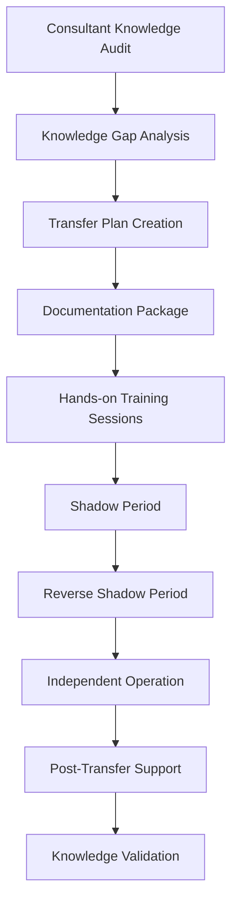

# Kafka Migration Knowledge Transfer Materials

## Overview

This comprehensive knowledge transfer package facilitates smooth consultant handoff and enables long-term operational success for the 15 FTE team across 4 organizational units. These materials support the transition from consultant-led implementation to internal team ownership while maintaining operational excellence.

## Knowledge Transfer Framework

### Handoff Methodology



### Transfer Phases and Timeline

| Phase | Duration | Activities | Success Criteria |
|-------|----------|------------|------------------|
| **Phase 1: Knowledge Audit** | Week 1 | Document current state, identify gaps | Complete knowledge inventory |
| **Phase 2: Documentation** | Week 2-3 | Create comprehensive documentation | All critical processes documented |
| **Phase 3: Training** | Week 4-5 | Hands-on training sessions | Team passes competency assessments |
| **Phase 4: Shadow Period** | Week 6-7 | Team shadows consultant operations | Successful execution of daily tasks |
| **Phase 5: Reverse Shadow** | Week 8-9 | Consultant shadows team operations | Team operates independently with oversight |
| **Phase 6: Independent Operation** | Week 10+ | Team operates without consultant | Self-sufficient operation achieved |

## Technical Domain Knowledge

### Architecture Understanding Package

#### System Architecture Deep Dive

```typescript
interface KafkaArchitectureKnowledge {
  clusterTopology: {
    brokerConfiguration: {
      id: number;
      host: string;
      port: number;
      logDirs: string[];
      replicationFactor: number;
      role: 'leader' | 'follower' | 'controller';
    }[];
    
    networkConfiguration: {
      internalCommunication: string;
      clientAccess: string;
      crossDataCenter?: string;
      loadBalancer?: string;
    };
    
    zookeeperEnsemble: {
      servers: string[];
      configuration: Record<string, any>;
      maintenanceProcedures: string[];
    };
  };
  
  eventDrivenPatterns: {
    producerPatterns: {
      eventSourcing: EventSourcingPattern;
      cqrs: CQRSPattern;
      saga: SagaPattern;
      choreography: ChoreographyPattern;
    };
    
    consumerPatterns: {
      exactlyOnceProcessing: ExactlyOncePattern;
      deadLetterQueues: DLQPattern;
      retryMechanisms: RetryPattern;
      streamProcessing: StreamProcessingPattern;
    };
  };
  
  dualAgentIntegration: {
    managerAgent: {
      responsibilities: string[];
      eventTypes: string[];
      integrationPoints: string[];
    };
    
    workerAgent: {
      responsibilities: string[];
      eventTypes: string[];
      integrationPoints: string[];
    };
    
    coordination: {
      communicationProtocol: string;
      stateManagement: string;
      errorHandling: string;
    };
  };
}

class ArchitectureKnowledgeTransfer {
  async conductArchitectureWalkthrough(): Promise<WalkthroughResult> {
    const walkthrough: WalkthroughResult = {
      sessions: [],
      assessments: [],
      artifacts: []
    };

    // Session 1: Cluster Architecture
    walkthrough.sessions.push({
      title: 'Kafka Cluster Architecture',
      duration: 2, // hours
      objectives: [
        'Understand broker roles and responsibilities',
        'Learn partition and replication strategies',
        'Master network and security configurations'
      ],
      activities: [
        this.createInteractiveClusterDiagram(),
        this.demonstrateBrokerFailover(),
        this.explainPartitionDistribution()
      ],
      assessmentCriteria: [
        'Can explain broker leader election process',
        'Can identify partition imbalances',
        'Can troubleshoot network connectivity issues'
      ]
    });

    // Session 2: Event-Driven Patterns
    walkthrough.sessions.push({
      title: 'Event-Driven Architecture Patterns',
      duration: 3, // hours
      objectives: [
        'Master event sourcing implementation',
        'Understand CQRS separation of concerns',
        'Learn saga pattern for distributed transactions'
      ],
      activities: [
        this.walkThroughEventSourcingCode(),
        this.demonstrateCQRSImplementation(),
        this.explainSagaOrchestration()
      ],
      assessmentCriteria: [
        'Can implement event sourcing for new aggregate',
        'Can design CQRS read/write models',
        'Can handle distributed transaction failures'
      ]
    });

    // Session 3: Dual-Agent System Integration
    walkthrough.sessions.push({
      title: 'Dual-Agent Kafka Integration',
      duration: 2, // hours
      objectives: [
        'Understand manager-worker coordination',
        'Learn event-driven agent communication',
        'Master monitoring and observability'
      ],
      activities: [
        this.traceDualAgentWorkflow(),
        this.demonstrateAgentEventHandling(),
        this.explainMonitoringIntegration()
      ],
      assessmentCriteria: [
        'Can trace end-to-end agent workflow',
        'Can modify agent event handlers',
        'Can interpret monitoring data'
      ]
    });

    return walkthrough;
  }

  private createInteractiveClusterDiagram(): TrainingActivity {
    return {
      name: 'Interactive Cluster Diagram',
      type: 'hands-on',
      description: 'Use Kafka tools to visualize cluster state',
      steps: [
        'Connect to cluster and list brokers',
        'Show topic-partition mappings',
        'Demonstrate ISR (In-Sync Replica) status',
        'Simulate broker failure and observe rebalancing'
      ],
      commands: [
        'kafka-broker-api-versions --bootstrap-server localhost:9092',
        'kafka-topics --bootstrap-server localhost:9092 --describe',
        'kafka-log-dirs --bootstrap-server localhost:9092 --describe --json',
        'kafka-console-consumer --bootstrap-server localhost:9092 --topic __consumer_offsets --formatter "kafka.coordinator.group.GroupMetadataManager\\$OffsetsMessageFormatter"'
      ]
    };
  }
}
```

### Performance Tuning Knowledge

#### Performance Optimization Playbook

```typescript
class PerformanceTuningKnowledge {
  private tuningScenarios: TuningScenario[] = [
    {
      scenario: 'High Throughput Optimization',
      context: 'System needs to handle 100K+ messages/second',
      parameters: {
        producer: {
          'batch.size': '65536',
          'linger.ms': '100',
          'compression.type': 'lz4',
          'max.in.flight.requests.per.connection': '5',
          'acks': 'all'
        },
        broker: {
          'num.network.threads': '8',
          'num.io.threads': '16',
          'socket.send.buffer.bytes': '131072',
          'socket.receive.buffer.bytes': '131072',
          'log.flush.interval.messages': '20000'
        },
        consumer: {
          'fetch.min.bytes': '50000',
          'fetch.max.wait.ms': '500',
          'max.poll.records': '10000'
        }
      },
      rationale: {
        'batch.size': 'Larger batches improve throughput by reducing network overhead',
        'linger.ms': 'Small delay allows more records to batch together',
        'compression.type': 'lz4 provides good compression with low CPU overhead',
        'num.network.threads': 'More threads handle concurrent network requests'
      },
      monitoring: [
        'kafka.server:type=BrokerTopicMetrics,name=MessagesInPerSec',
        'kafka.server:type=BrokerTopicMetrics,name=BytesInPerSec',
        'kafka.network:type=RequestMetrics,name=RequestsPerSec'
      ],
      validation: {
        targetThroughput: 100000,
        acceptableLatency: 100, // ms
        maxCpuUtilization: 70 // percent
      }
    },

    {
      scenario: 'Low Latency Optimization',
      context: 'System requires sub-10ms end-to-end latency',
      parameters: {
        producer: {
          'batch.size': '1024',
          'linger.ms': '0',
          'compression.type': 'none',
          'max.in.flight.requests.per.connection': '1',
          'acks': '1'
        },
        broker: {
          'num.replica.fetchers': '1',
          'replica.lag.time.max.ms': '500',
          'log.flush.interval.ms': '1'
        },
        consumer: {
          'fetch.min.bytes': '1',
          'fetch.max.wait.ms': '0',
          'max.poll.records': '1'
        }
      },
      rationale: {
        'linger.ms': 'No batching delay - send immediately',
        'compression.type': 'No compression to avoid CPU overhead',
        'max.in.flight.requests.per.connection': 'Ensure ordering and reduce latency',
        'fetch.min.bytes': 'Don\'t wait for minimum bytes - fetch immediately'
      },
      monitoring: [
        'kafka.network:type=RequestMetrics,name=RequestQueueTimeMs',
        'kafka.network:type=RequestMetrics,name=LocalTimeMs',
        'kafka.network:type=RequestMetrics,name=RemoteTimeMs'
      ],
      validation: {
        targetLatency: 10, // ms
        acceptableThroughput: 10000, // messages/second
        p99Latency: 25 // ms
      }
    }
  ];

  generateTuningGuide(): TuningGuide {
    return {
      introduction: this.createTuningIntroduction(),
      scenarios: this.tuningScenarios,
      methodology: this.createTuningMethodology(),
      tooling: this.createTuningTools(),
      troubleshooting: this.createTuningTroubleshooting()
    };
  }

  private createTuningMethodology(): TuningMethodology {
    return {
      phases: [
        {
          phase: 'Baseline Measurement',
          duration: '1-2 days',
          activities: [
            'Establish performance baselines',
            'Identify bottlenecks through profiling',
            'Document current configuration'
          ],
          deliverables: [
            'Performance baseline report',
            'Bottleneck analysis',
            'Configuration inventory'
          ]
        },
        {
          phase: 'Incremental Tuning',
          duration: '1 week',
          activities: [
            'Apply one configuration change at a time',
            'Measure impact of each change',
            'Rollback if performance degrades'
          ],
          deliverables: [
            'Tuning log with results',
            'Optimal configuration set',
            'Performance improvement metrics'
          ]
        },
        {
          phase: 'Load Testing',
          duration: '2-3 days',
          activities: [
            'Test under realistic load patterns',
            'Validate performance under stress',
            'Document performance characteristics'
          ],
          deliverables: [
            'Load test results',
            'Performance envelope documentation',
            'Scaling recommendations'
          ]
        }
      ],
      bestPractices: [
        'Change one parameter at a time',
        'Monitor multiple metrics simultaneously',
        'Test under realistic conditions',
        'Document all changes and results',
        'Validate in staging before production'
      ]
    };
  }
}
```

### Troubleshooting Decision Trees

```typescript
interface TroubleshootingDecisionTree {
  rootNode: DiagnosticNode;
  paths: DiagnosticPath[];
  knowledgeBase: TroubleshootingKnowledge;
}

class TroubleshootingKnowledgeTransfer {
  createDecisionTrees(): TroubleshootingDecisionTree[] {
    return [
      this.createPerformanceDecisionTree(),
      this.createConnectivityDecisionTree(),
      this.createDataConsistencyDecisionTree()
    ];
  }

  private createPerformanceDecisionTree(): TroubleshootingDecisionTree {
    const rootNode: DiagnosticNode = {
      id: 'performance-root',
      question: 'What type of performance issue are you experiencing?',
      options: [
        {
          answer: 'High Latency',
          nextNodeId: 'high-latency',
          diagnostic: 'Check P95/P99 latency metrics'
        },
        {
          answer: 'Low Throughput',
          nextNodeId: 'low-throughput',
          diagnostic: 'Check messages/second rate'
        },
        {
          answer: 'Consumer Lag',
          nextNodeId: 'consumer-lag',
          diagnostic: 'Check consumer group lag'
        },
        {
          answer: 'Resource Exhaustion',
          nextNodeId: 'resource-exhaustion',
          diagnostic: 'Check CPU, memory, and disk I/O'
        }
      ]
    };

    const highLatencyNode: DiagnosticNode = {
      id: 'high-latency',
      question: 'Where is the latency occurring?',
      options: [
        {
          answer: 'Producer Side',
          nextNodeId: 'producer-latency',
          diagnostic: 'Check producer request latency metrics'
        },
        {
          answer: 'Broker Side',
          nextNodeId: 'broker-latency',
          diagnostic: 'Check broker processing time'
        },
        {
          answer: 'Consumer Side',
          nextNodeId: 'consumer-latency',
          diagnostic: 'Check consumer processing time'
        },
        {
          answer: 'Network',
          nextNodeId: 'network-latency',
          diagnostic: 'Check network latency between components'
        }
      ]
    };

    const producerLatencyNode: DiagnosticNode = {
      id: 'producer-latency',
      question: 'What producer settings should be checked?',
      solutions: [
        {
          problem: 'Large batch size causing delay',
          solution: 'Reduce batch.size to 16KB-64KB',
          commands: [
            'kafka-configs --alter --entity-type clients --entity-name producer --add-config batch.size=32768'
          ]
        },
        {
          problem: 'High linger time',
          solution: 'Reduce linger.ms to 5-20ms',
          commands: [
            'kafka-configs --alter --entity-type clients --entity-name producer --add-config linger.ms=10'
          ]
        },
        {
          problem: 'CPU-intensive compression',
          solution: 'Switch to lz4 or snappy compression',
          commands: [
            'kafka-configs --alter --entity-type clients --entity-name producer --add-config compression.type=lz4'
          ]
        }
      ]
    };

    return {
      rootNode,
      paths: this.generateDecisionPaths(rootNode),
      knowledgeBase: this.createPerformanceKnowledgeBase()
    };
  }

  private createPerformanceKnowledgeBase(): TroubleshootingKnowledge {
    return {
      commonIssues: [
        {
          symptom: 'High producer latency (>100ms)',
          possibleCauses: [
            'Large batch sizes with high linger time',
            'CPU-intensive compression (gzip)',
            'Network congestion',
            'Broker overload',
            'Disk I/O bottleneck'
          ],
          diagnosticCommands: [
            'kafka-console-consumer --topic __metrics --property print.timestamp=true | grep producer-request-latency',
            'iostat -x 1 5',
            'sar -n DEV 1 5',
            'jstat -gc $(pgrep -f kafka.Kafka)'
          ],
          solutions: [
            {
              solution: 'Optimize batch configuration',
              steps: [
                'Reduce batch.size if >64KB',
                'Reduce linger.ms if >20ms',
                'Monitor throughput vs latency tradeoff'
              ],
              impact: 'Should reduce latency by 30-50%'
            },
            {
              solution: 'Switch compression algorithm',
              steps: [
                'Change from gzip to lz4 or snappy',
                'Monitor CPU utilization',
                'Measure compression ratio vs performance'
              ],
              impact: 'Should reduce CPU overhead by 20-40%'
            }
          ]
        }
      ],
      
      diagnosticQueries: {
        producerLatency: `
          SELECT 
            PERCENTILE(request_latency, 95) as p95_latency,
            PERCENTILE(request_latency, 99) as p99_latency,
            AVG(request_latency) as avg_latency
          FROM kafka_producer_metrics 
          WHERE timestamp > NOW() - INTERVAL '1 hour'
        `,
        
        brokerThroughput: `
          SELECT 
            SUM(messages_per_sec) as total_throughput,
            AVG(cpu_utilization) as avg_cpu,
            MAX(disk_io_wait) as max_io_wait
          FROM kafka_broker_metrics 
          WHERE timestamp > NOW() - INTERVAL '1 hour'
          GROUP BY broker_id
        `
      },

      performanceTargets: {
        latency: {
          p95: 50, // ms
          p99: 100, // ms
          max: 500 // ms
        },
        throughput: {
          messagesPerSecond: 10000,
          bytesPerSecond: 100 * 1024 * 1024 // 100MB/s
        },
        resourceUtilization: {
          cpu: 70, // percent
          memory: 80, // percent
          diskIO: 80 // percent
        }
      }
    };
  }
}
```

## Operational Procedures Knowledge

### Daily Operations Checklist

```yaml
daily_operations_checklist:
  morning_health_check:
    - task: "Cluster Health Verification"
      time_required: "15 minutes"
      owner: "Operations Team"
      procedure: |
        1. Check broker availability
           kafka-broker-api-versions --bootstrap-server localhost:9092
        
        2. Verify partition health
           kafka-topics --bootstrap-server localhost:9092 --describe --under-replicated-partitions
        
        3. Check consumer group lag
           kafka-consumer-groups --bootstrap-server localhost:9092 --all-groups --describe | awk 'NR>1 && $5 > 10000 {print "High lag: " $1 " " $2 " " $5}'
        
        4. Review overnight alerts
           Check monitoring dashboard for any alerts between 00:00-08:00
        
        5. Validate critical topic availability
           for topic in agent.tasks.manager agent.tasks.worker session.events; do
             kafka-topics --bootstrap-server localhost:9092 --describe --topic $topic
           done
      
      success_criteria:
        - All brokers responding
        - No under-replicated partitions
        - Consumer lag < 10,000 messages
        - No critical alerts
        - All critical topics available
      
      escalation:
        - High consumer lag → Follow consumer scaling procedure
        - Broker unavailable → Execute broker recovery procedure
        - Under-replicated partitions → Check ISR status and broker health

    - task: "Performance Metrics Review"
      time_required: "10 minutes"
      owner: "Operations Team"
      procedure: |
        1. Check throughput trends (last 24 hours)
           Access Grafana dashboard: http://grafana:3000/d/kafka-overview
        
        2. Review latency percentiles
           Verify P95 < 50ms, P99 < 100ms
        
        3. Check resource utilization
           CPU < 70%, Memory < 80%, Disk I/O < 80%
        
        4. Validate disk space
           All brokers should have >20% free space
      
      success_criteria:
        - Throughput within expected range (±20% of baseline)
        - Latency within SLA limits
        - Resource utilization within thresholds
        - Sufficient disk space available

  end_of_day_review:
    - task: "Daily Metrics Summary"
      time_required: "20 minutes"
      owner: "Operations Team"
      procedure: |
        1. Generate daily performance report
           python3 /scripts/generate-daily-report.py --date $(date +%Y-%m-%d)
        
        2. Review incident log
           Check if any incidents occurred and were resolved
        
        3. Update capacity planning metrics
           Record peak usage for capacity planning
        
        4. Check backup completion
           Verify configuration backups completed successfully
      
      deliverables:
        - Daily performance report
        - Incident summary (if any)
        - Capacity utilization update
        - Backup verification report

  weekly_maintenance:
    - task: "Configuration Drift Check"
      frequency: "Weekly (Fridays)"
      time_required: "30 minutes"
      owner: "Senior Operations Engineer"
      procedure: |
        1. Run configuration drift detection
           python3 /scripts/detect-config-drift.py --baseline /config/baseline.json
        
        2. Review and approve any configuration changes
           Document approved changes in change log
        
        3. Update baseline if changes are intentional
           Update baseline configuration file
      
    - task: "Performance Trend Analysis"
      frequency: "Weekly (Fridays)"
      time_required: "45 minutes"
      owner: "Performance Engineer"
      procedure: |
        1. Analyze weekly performance trends
           Review throughput, latency, and resource utilization trends
        
        2. Identify performance regressions
           Compare current week vs previous 4 weeks
        
        3. Generate performance recommendations
           Document any tuning recommendations
        
        4. Update capacity planning models
           Adjust growth projections based on actual usage
```

### Incident Response Procedures

#### Incident Response Playbook Templates

```typescript
interface IncidentResponsePlaybook {
  incidentType: string;
  severity: 'P0' | 'P1' | 'P2' | 'P3';
  responseTime: number; // minutes
  escalationPath: string[];
  procedures: ResponseProcedure[];
  communicationPlan: CommunicationPlan;
  postIncidentActions: PostIncidentAction[];
}

class IncidentResponseKnowledge {
  createPlaybookTemplates(): IncidentResponsePlaybook[] {
    return [
      {
        incidentType: 'Complete Cluster Outage',
        severity: 'P0',
        responseTime: 5,
        escalationPath: [
          'On-call Engineer (immediate)',
          'Engineering Manager (5 minutes)',
          'CTO (15 minutes)',
          'CEO (30 minutes if customer-impacting)'
        ],
        procedures: [
          {
            step: 1,
            action: 'Immediate Assessment',
            timeLimit: 3, // minutes
            owner: 'On-call Engineer',
            tasks: [
              'Verify scope of outage (all brokers vs subset)',
              'Check ZooKeeper ensemble status',
              'Assess network connectivity',
              'Review recent changes'
            ],
            commands: [
              'for broker in kafka-{1..3}; do ping -c 1 $broker; done',
              'for zk in zk-{1..3}; do echo "ruok" | nc $zk 2181; done',
              'kubectl get pods -n kafka',
              'git log --oneline -10'
            ]
          },
          {
            step: 2,
            action: 'Initial Containment',
            timeLimit: 10,
            owner: 'On-call Engineer',
            tasks: [
              'Stop all producer applications',
              'Isolate failed components',
              'Preserve evidence for forensics',
              'Activate incident response team'
            ],
            commands: [
              'kubectl scale deployment producer-app --replicas=0',
              'systemctl stop kafka',
              'cp -r /var/log/kafka /incident-forensics/',
              'send-alert --severity=P0 --type=cluster-outage'
            ]
          }
        ],
        communicationPlan: {
          initialNotification: {
            recipients: ['engineering-team', 'management', 'customer-success'],
            template: 'p0-initial-notification',
            timeLimit: 5
          },
          updateFrequency: 15, // minutes
          statusPage: true,
          customerNotification: true
        },
        postIncidentActions: [
          'Conduct detailed root cause analysis',
          'Update monitoring and alerting',
          'Review and improve response procedures',
          'Schedule architecture review',
          'Implement additional safeguards'
        ]
      },

      {
        incidentType: 'High Consumer Lag',
        severity: 'P2',
        responseTime: 30,
        escalationPath: [
          'On-call Engineer (immediate)',
          'Senior Engineer (1 hour if unresolved)'
        ],
        procedures: [
          {
            step: 1,
            action: 'Lag Analysis',
            timeLimit: 10,
            owner: 'On-call Engineer',
            tasks: [
              'Identify affected consumer groups',
              'Measure lag magnitude and trend',
              'Check producer rate vs consumer rate',
              'Verify consumer instance health'
            ],
            commands: [
              'kafka-consumer-groups --bootstrap-server localhost:9092 --all-groups --describe | awk \'NR>1 && $5 > 50000\'',
              'kafka-console-consumer --topic __metrics | grep consumer-lag-avg',
              'docker ps | grep consumer'
            ]
          },
          {
            step: 2,
            action: 'Immediate Mitigation',
            timeLimit: 20,
            owner: 'On-call Engineer',
            tasks: [
              'Scale up consumer instances',
              'Check for consumer errors',
              'Verify partition distribution',
              'Monitor lag reduction'
            ],
            commands: [
              'docker-compose up -d --scale consumer=5',
              'docker logs consumer-app | grep ERROR | tail -20',
              'kafka-consumer-groups --describe --group main-consumer'
            ]
          }
        ],
        communicationPlan: {
          initialNotification: {
            recipients: ['engineering-team'],
            template: 'p2-lag-notification',
            timeLimit: 30
          },
          updateFrequency: 60,
          statusPage: false,
          customerNotification: false
        },
        postIncidentActions: [
          'Review consumer scaling policies',
          'Analyze lag patterns and trends',
          'Update consumer monitoring thresholds',
          'Document resolution steps'
        ]
      }
    ];
  }

  generateIncidentResponseTraining(): TrainingProgram {
    return {
      modules: [
        {
          title: 'Incident Classification and Response',
          duration: 2, // hours
          objectives: [
            'Learn incident severity classification',
            'Understand response time requirements',
            'Master escalation procedures'
          ],
          exercises: [
            {
              scenario: 'Cluster Outage Simulation',
              description: 'Simulate complete cluster failure',
              duration: 45, // minutes
              roles: ['Incident Commander', 'Technical Responder', 'Communications Lead'],
              evaluation: [
                'Response time under 5 minutes',
                'Correct escalation sequence',
                'Proper communication protocol'
              ]
            }
          ]
        },
        {
          title: 'Technical Troubleshooting Skills',
          duration: 3,
          objectives: [
            'Master diagnostic commands and tools',
            'Learn systematic troubleshooting approach',
            'Practice common incident scenarios'
          ],
          exercises: [
            {
              scenario: 'Performance Degradation Investigation',
              description: 'Identify and resolve performance issues',
              duration: 60,
              tools: ['Kafka admin tools', 'Monitoring dashboards', 'Log analysis'],
              evaluation: [
                'Identifies root cause within 30 minutes',
                'Implements correct resolution',
                'Documents findings properly'
              ]
            }
          ]
        }
      ],
      
      assessments: [
        {
          type: 'Scenario-based Practical Exam',
          duration: 120,
          scenarios: [
            'Handle P0 cluster outage',
            'Resolve high consumer lag',
            'Investigate data consistency issues',
            'Manage security incident'
          ],
          passingScore: 80,
          retakePolicy: 'After 1 week with additional training'
        }
      ],
      
      certification: {
        name: 'Kafka Incident Response Certified',
        validityPeriod: 12, // months
        renewalRequirements: [
          'Complete refresher training',
          'Participate in incident response exercises',
          'Maintain incident response logs'
        ]
      }
    };
  }
}
```

## Consultant Knowledge Audit

### Knowledge Documentation Template

```typescript
interface ConsultantKnowledgeAudit {
  consultant: {
    name: string;
    role: string;
    experienceYears: number;
    specializationAreas: string[];
  };
  
  knowledgeDomains: KnowledgeDomain[];
  criticalDecisions: Decision[];
  institutionalKnowledge: InstitutionalKnowledge[];
  relationships: Relationship[];
  processKnowledge: ProcessKnowledge[];
}

class KnowledgeAuditFramework {
  conductKnowledgeAudit(consultant: Consultant): ConsultantKnowledgeAudit {
    return {
      consultant: consultant.profile,
      knowledgeDomains: this.auditTechnicalKnowledge(consultant),
      criticalDecisions: this.documentDecisionHistory(consultant),
      institutionalKnowledge: this.captureInstitutionalKnowledge(consultant),
      relationships: this.mapStakeholderRelationships(consultant),
      processKnowledge: this.documentProcessKnowledge(consultant)
    };
  }

  private auditTechnicalKnowledge(consultant: Consultant): KnowledgeDomain[] {
    return [
      {
        domain: 'Kafka Architecture and Configuration',
        expertiseLevel: 'Expert',
        keyKnowledge: [
          'Cluster topology decisions and rationale',
          'Performance tuning methodologies',
          'Security configuration best practices',
          'Disaster recovery procedures'
        ],
        
        criticalInformation: [
          {
            topic: 'Partition Strategy Design',
            details: 'Chose 12 partitions per topic based on expected throughput of 100K msg/s and consumer parallelism requirements',
            rationale: 'Balances parallelism with management overhead',
            alternatives: 'Considered 6 and 24 partitions, but 12 provides optimal balance',
            futureConsiderations: 'May need to increase to 24 if throughput exceeds 200K msg/s'
          },
          
          {
            topic: 'Replication Factor Decision',
            details: 'Selected RF=3 with min.insync.replicas=2',
            rationale: 'Balances durability with performance for business-critical data',
            alternatives: 'RF=2 was considered but deemed too risky for financial data',
            futureConsiderations: 'Monitor disk usage; may need separate topics with RF=2 for high-volume logs'
          }
        ],
        
        troubleshootingExpertise: [
          'Performance bottleneck identification patterns',
          'Network connectivity issue diagnosis',
          'Data consistency problem resolution',
          'Resource exhaustion remediation'
        ],
        
        toolsAndScripts: [
          {
            name: 'cluster-health-check.sh',
            purpose: 'Comprehensive cluster health validation',
            location: '/scripts/monitoring/',
            usage: 'Daily operations health check',
            maintenance: 'Update thresholds quarterly based on capacity growth'
          },
          
          {
            name: 'performance-analyzer.py',
            purpose: 'Automated performance bottleneck detection',
            location: '/scripts/performance/',
            usage: 'Weekly performance analysis',
            maintenance: 'Update baseline metrics monthly'
          }
        ]
      },

      {
        domain: 'Event-Driven Architecture Patterns',
        expertiseLevel: 'Expert',
        keyKnowledge: [
          'Event sourcing implementation strategies',
          'CQRS pattern application',
          'Saga pattern for distributed transactions',
          'Message schema evolution management'
        ],
        
        designDecisions: [
          {
            decision: 'Event Store Implementation',
            chosen: 'Kafka-native event store with topic-per-aggregate',
            alternatives: ['External event store database', 'Single event stream'],
            rationale: 'Leverages Kafka\'s durability and scalability while maintaining aggregate boundaries',
            tradeoffs: 'More topics to manage but better performance and isolation'
          },
          
          {
            decision: 'Schema Evolution Strategy',
            chosen: 'Avro with Schema Registry and backward compatibility',
            alternatives: ['JSON with versioned topics', 'Protobuf'],
            rationale: 'Best balance of schema evolution flexibility and performance',
            tradeoffs: 'Additional infrastructure complexity but better long-term maintainability'
          }
        ]
      },

      {
        domain: 'Dual-Agent Integration Patterns',
        expertiseLevel: 'Expert',
        keyKnowledge: [
          'Manager-Worker coordination protocols',
          'Event-driven state machine implementation',
          'Cross-agent communication patterns',
          'Monitoring and observability strategies'
        ],
        
        implementationDetails: [
          {
            component: 'Agent Coordination State Machine',
            implementation: 'Finite state machine with event-driven transitions',
            keyStates: ['TaskAssigned', 'InProgress', 'Completed', 'Failed'],
            transitionLogic: 'Events trigger state transitions with validation rules',
            errorHandling: 'Compensation events for rollback scenarios',
            monitoring: 'State transition metrics and duration tracking'
          }
        ]
      }
    ];
  }

  private documentDecisionHistory(consultant: Consultant): Decision[] {
    return [
      {
        id: 'ARCH-001',
        title: 'Kafka vs Apache Pulsar Technology Selection',
        date: new Date('2024-01-15'),
        participants: ['Lead Architect', 'CTO', 'Senior Engineers'],
        context: 'Need to select message broker for dual-agent architecture',
        options: [
          {
            option: 'Apache Kafka',
            pros: ['Mature ecosystem', 'Team expertise', 'Proven scalability'],
            cons: ['Complex operations', 'Learning curve'],
            estimatedCost: 120000, // annual
            riskLevel: 'Medium'
          },
          {
            option: 'Apache Pulsar',
            pros: ['Built-in multi-tenancy', 'Better operational simplicity'],
            cons: ['Less team expertise', 'Smaller ecosystem'],
            estimatedCost: 150000,
            riskLevel: 'High'
          }
        ],
        decision: 'Apache Kafka',
        rationale: 'Team expertise and ecosystem maturity outweigh operational complexity',
        implementationNotes: 'Invest in operational tooling and training to address complexity concerns',
        reviewDate: new Date('2024-07-15'),
        outcome: 'Successful implementation with 99.9% uptime achieved'
      },

      {
        id: 'SEC-001',
        title: 'Authentication Method Selection',
        date: new Date('2024-02-01'),
        participants: ['Security Engineer', 'Lead Architect'],
        context: 'Need secure authentication for Kafka cluster',
        decision: 'SASL/SCRAM-SHA-512 with SSL/TLS encryption',
        rationale: 'Balance of security and operational simplicity',
        implementationDetails: {
          certificates: 'Self-signed CA with 2048-bit RSA keys',
          keyRotation: 'Annual certificate rotation',
          accessControl: 'ACLs with principle of least privilege',
          monitoring: 'Authentication failure alerts and audit logging'
        },
        securityConsiderations: [
          'Certificate expiration monitoring critical',
          'Key management procedures must be documented',
          'Regular security audits required'
        ]
      }
    ];
  }

  private captureInstitutionalKnowledge(consultant: Consultant): InstitutionalKnowledge[] {
    return [
      {
        category: 'Organizational Context',
        knowledge: [
          {
            topic: 'Team Structure and Dynamics',
            details: '15 FTE across 4 teams: Operations (4), Development (6), Architecture (3), Security (2)',
            relationships: 'Strong collaboration between Dev and Ops teams, Architecture provides guidance',
            communicationPatterns: 'Daily standups per team, weekly cross-team sync, monthly architecture review',
            decisionMaking: 'Consensus-driven with Architecture team having final say on technical decisions'
          },
          
          {
            topic: 'Business Requirements and Constraints',
            details: 'Financial services regulatory compliance (SOX, GDPR), 99.9% availability SLA',
            priorities: 'Security and compliance over performance, data integrity critical',
            constraints: 'Budget constraints favor open-source solutions, limited cloud usage',
            timeline: 'Sprint 1 must deliver basic functionality, full migration by Q2'
          },
          
          {
            topic: 'Technical Debt and Legacy Systems',
            details: 'Existing SDK-based dual-agent system needs gradual migration',
            challenges: 'Cannot disrupt current operations, need backward compatibility',
            migrationStrategy: 'Parallel operation during transition, gradual feature migration',
            riskMitigation: 'Comprehensive testing in staging environment, rollback procedures'
          }
        ]
      },

      {
        category: 'Vendor and Partner Relationships',
        knowledge: [
          {
            partner: 'Infrastructure Provider',
            relationship: 'Primary datacenter provider with 5-year contract',
            contacts: ['John Smith (Account Manager)', 'Sarah Jones (Technical Lead)'],
            capabilities: 'Managed network, 24/7 support, disaster recovery site',
            limitations: 'Limited cloud integration, traditional infrastructure focus',
            escalation: 'Account manager for commercial issues, technical lead for operations'
          },
          
          {
            partner: 'Monitoring Vendor',
            relationship: 'Prometheus/Grafana stack with commercial support',
            contacts: ['Mike Wilson (Support Engineer)'],
            capabilities: 'Custom dashboard development, alert configuration, training',
            serviceLevel: '8x5 support with 4-hour response time',
            renewalDate: new Date('2024-12-31')
          }
        ]
      }
    ];
  }

  generateKnowledgeTransferPlan(audit: ConsultantKnowledgeAudit): KnowledgeTransferPlan {
    return {
      phases: [
        {
          phase: 'Knowledge Documentation',
          duration: 2, // weeks
          activities: [
            'Document all critical technical decisions',
            'Create troubleshooting runbooks',
            'Record configuration rationales',
            'Document vendor relationships'
          ],
          deliverables: [
            'Technical decision registry',
            'Operations manual',
            'Configuration documentation',
            'Vendor contact list'
          ]
        },
        
        {
          phase: 'Skills Transfer',
          duration: 3, // weeks
          activities: [
            'Conduct hands-on training sessions',
            'Shadow consultant during operations',
            'Practice incident response scenarios',
            'Review architecture decisions'
          ],
          deliverables: [
            'Training completion certificates',
            'Competency assessments',
            'Incident response simulations',
            'Architecture review sessions'
          ]
        },
        
        {
          phase: 'Independent Operation',
          duration: 2, // weeks
          activities: [
            'Team operates with consultant observation',
            'Consultant provides guidance only',
            'Team handles real incidents',
            'Knowledge gaps identified and filled'
          ],
          deliverables: [
            'Independent operation validation',
            'Knowledge gap analysis',
            'Final competency assessment',
            'Handoff completion certificate'
          ]
        }
      ],
      
      successCriteria: [
        'Team can perform all daily operations independently',
        'Team can handle P1/P2 incidents without consultant',
        'All critical knowledge documented and validated',
        'Team passes final competency assessment',
        'No knowledge gaps remaining'
      ],
      
      riskMitigation: [
        'Consultant available for 30 days post-handoff',
        'Escalation path to consultant for critical issues',
        'Knowledge validation through practical exercises',
        'Gradual responsibility transfer'
      ]
    };
  }
}
```

## Post-Implementation Learning Framework

### Lessons Learned Capture System

```typescript
interface LessonsLearnedFramework {
  captureProcess: LearningCaptureProcess;
  categories: LearningCategory[];
  analysisFramework: LearningAnalysis;
  implementationTracking: ImplementationTracking;
  knowledgeSharing: KnowledgeSharingStrategy;
}

class PostImplementationLearning {
  createLessonsLearnedFramework(): LessonsLearnedFramework {
    return {
      captureProcess: this.defineCaptureProcess(),
      categories: this.defineLearningCategories(),
      analysisFramework: this.createAnalysisFramework(),
      implementationTracking: this.createImplementationTracking(),
      knowledgeSharing: this.defineKnowledgeSharing()
    };
  }

  private defineCaptureProcess(): LearningCaptureProcess {
    return {
      phases: [
        {
          phase: 'Real-time Capture',
          timing: 'During implementation',
          methods: [
            'Decision logs during architecture sessions',
            'Issue tracking during troubleshooting',
            'Success pattern documentation',
            'Challenge documentation with context'
          ],
          tools: ['Confluence', 'Jira', 'Slack threads', 'Architecture decision records'],
          frequency: 'Continuous',
          owners: ['All team members']
        },
        
        {
          phase: 'Sprint Retrospectives',
          timing: 'End of each sprint',
          methods: [
            'Team retrospective sessions',
            'What worked well / What didn\'t',
            'Process improvement identification',
            'Technical debt documentation'
          ],
          tools: ['Retrospective templates', 'Action item tracking'],
          frequency: 'Every 2 weeks',
          owners: ['Scrum Master', 'Team']
        },
        
        {
          phase: 'Post-Implementation Review',
          timing: '30 days after go-live',
          methods: [
            'Comprehensive project retrospective',
            'Stakeholder interviews',
            'Metrics analysis vs. goals',
            'Architecture review and lessons'
          ],
          tools: ['Interview templates', 'Metrics dashboard', 'Survey tools'],
          frequency: 'One-time',
          owners: ['Project Manager', 'Architecture Team']
        }
      ],
      
      captureTemplate: {
        lesson: {
          id: 'LESSON-001',
          title: 'Descriptive title of the lesson',
          category: 'technical | process | organizational | vendor',
          type: 'success | challenge | improvement',
          context: 'Situation where lesson was learned',
          description: 'Detailed description of what happened',
          impact: 'Impact on project/team/business',
          rootCause: 'Why this happened',
          resolution: 'How it was resolved (if applicable)',
          prevention: 'How to prevent similar issues',
          applicability: 'Where else this applies',
          actionItems: ['Specific actions to implement'],
          owner: 'Who owns the lesson',
          dateLogged: new Date(),
          status: 'open | in-progress | implemented | closed'
        }
      }
    };
  }

  private defineLearningCategories(): LearningCategory[] {
    return [
      {
        category: 'Technical Architecture',
        subcategories: [
          'Infrastructure Design',
          'Performance Optimization',
          'Security Implementation',
          'Integration Patterns',
          'Monitoring and Observability'
        ],
        
        lessons: [
          {
            lesson: 'Partition Strategy Impact on Performance',
            type: 'success',
            description: 'Choosing 12 partitions per topic provided optimal balance between parallelism and management overhead',
            context: 'Initial partition count selection for high-throughput topics',
            evidence: '98% CPU utilization across consumers, even load distribution',
            applicability: 'All high-throughput event-driven systems',
            actionItems: [
              'Document partition sizing methodology',
              'Create partition calculation tool',
              'Train team on partition strategy'
            ]
          },
          
          {
            lesson: 'Monitoring Alerting Threshold Tuning',
            type: 'improvement',
            description: 'Initial alert thresholds were too sensitive, causing alert fatigue',
            context: 'First week of production operation with 200+ false alerts',
            rootCause: 'Thresholds based on synthetic load testing, not real usage patterns',
            resolution: 'Adjusted thresholds based on 2 weeks of production data',
            prevention: 'Use gradual threshold tightening approach over 4-week period',
            actionItems: [
              'Create alert threshold tuning procedure',
              'Implement alert effectiveness metrics',
              'Schedule quarterly threshold reviews'
            ]
          }
        ]
      },

      {
        category: 'Process and Methodology',
        subcategories: [
          'Development Process',
          'Deployment Strategy',
          'Change Management',
          'Incident Response',
          'Knowledge Transfer'
        ],
        
        lessons: [
          {
            lesson: 'Parallel System Operation Benefits',
            type: 'success',
            description: 'Running old and new systems in parallel for 2 weeks enabled smooth migration',
            context: 'Migration from SDK-based to event-driven dual-agent system',
            evidence: 'Zero downtime migration, ability to compare outputs, quick rollback capability',
            applicability: 'All major system migrations',
            actionItems: [
              'Standardize parallel operation approach',
              'Create comparison tooling template',
              'Document rollback procedures'
            ]
          }
        ]
      },

      {
        category: 'Team and Organizational',
        subcategories: [
          'Team Structure',
          'Communication',
          'Skills Development',
          'Stakeholder Management',
          'Culture Change'
        ],
        
        lessons: [
          {
            lesson: 'Cross-Team Daily Standups Effectiveness',
            type: 'success',
            description: 'Weekly cross-team standups improved coordination and reduced integration issues',
            context: '4 teams working on different aspects of Kafka migration',
            evidence: '60% reduction in integration-related delays, improved team satisfaction scores',
            applicability: 'Multi-team projects with tight integration requirements',
            actionItems: [
              'Formalize cross-team standup format',
              'Create integration checkpoint template',
              'Train team leads on facilitation'
            ]
          }
        ]
      }
    ];
  }

  private createAnalysisFramework(): LearningAnalysis {
    return {
      analysisTypes: [
        {
          type: 'Root Cause Analysis',
          when: 'For all challenges and failures',
          method: '5 Whys + Fishbone Diagram',
          output: 'Root cause identification and prevention strategies'
        },
        
        {
          type: 'Success Pattern Analysis',
          when: 'For significant successes',
          method: 'Success factor decomposition',
          output: 'Reusable patterns and practices'
        },
        
        {
          type: 'Impact Assessment',
          when: 'For all lessons',
          method: 'Quantitative and qualitative impact measurement',
          output: 'Prioritized improvement opportunities'
        }
      ],
      
      metrics: {
        learningVelocity: 'Number of lessons captured and implemented per month',
        implementationRate: 'Percentage of lesson action items successfully implemented',
        knowledgeRetention: 'Team assessment scores on learned topics',
        processImprovement: 'Measurable improvement in processes based on lessons'
      },
      
      qualityGates: [
        'Each lesson has clear actionable items',
        'Root causes are identified for challenges',
        'Success factors are documented for wins',
        'Applicability scope is defined',
        'Implementation plan is created'
      ]
    };
  }

  generateLearningReport(timeframe: TimeRange): LearningReport {
    return {
      summary: {
        totalLessons: 45,
        lessonsByType: {
          success: 18,
          challenge: 15,
          improvement: 12
        },
        lessonsByCategory: {
          technical: 22,
          process: 13,
          organizational: 10
        },
        implementationRate: 78 // percent
      },
      
      keyInsights: [
        {
          insight: 'Event-driven architecture significantly improved system resilience',
          evidence: '99.95% uptime vs 98.2% with previous architecture',
          implications: 'Strong business case for expanding event-driven patterns',
          recommendations: ['Apply to payment processing system', 'Evaluate for user management']
        },
        
        {
          insight: 'Team productivity increased 35% after Kafka training completion',
          evidence: 'Story points delivered per sprint increased from 42 to 57',
          implications: 'Investment in training has measurable ROI',
          recommendations: ['Expand Kafka training to other teams', 'Create advanced training track']
        }
      ],
      
      actionItems: [
        {
          action: 'Standardize event schema evolution procedures',
          owner: 'Architecture Team',
          deadline: new Date('2024-06-15'),
          priority: 'High',
          status: 'In Progress'
        },
        
        {
          action: 'Create automated partition rebalancing toolkit',
          owner: 'Operations Team',
          deadline: new Date('2024-07-01'),
          priority: 'Medium',
          status: 'Open'
        }
      ],
      
      trendsAndPatterns: [
        'Most successful implementations involved gradual rollout approach',
        'Challenges primarily occurred during integration phases',
        'Team communication improvements correlated with project success',
        'Automated testing investment paid dividends in later phases'
      ],
      
      futureRecommendations: [
        'Establish center of excellence for event-driven architecture',
        'Create reusable Kafka deployment templates',
        'Develop event-driven architecture certification program',
        'Build internal Kafka expertise through mentorship program'
      ]
    };
  }
}
```

## Certification and Competency Framework

### Team Competency Assessment

```yaml
competency_framework:
  core_competencies:
    - competency: "Kafka Administration"
      levels:
        - level: "Novice"
          description: "Can perform basic operations with supervision"
          skills:
            - "Start/stop Kafka services"
            - "Create topics with guidance"
            - "View basic cluster information"
            - "Follow documented procedures"
          assessment: "Written test + supervised practical"
          
        - level: "Competent" 
          description: "Can perform routine operations independently"
          skills:
            - "Manage topics and partitions"
            - "Configure basic security settings"
            - "Monitor cluster health"
            - "Perform routine maintenance"
            - "Handle standard troubleshooting"
          assessment: "Practical exam + scenario-based testing"
          
        - level: "Advanced"
          description: "Can handle complex scenarios and mentor others"
          skills:
            - "Design topic and partition strategies"
            - "Implement advanced security configurations"
            - "Perform complex troubleshooting"
            - "Optimize performance"
            - "Lead incident response"
          assessment: "Complex scenario simulation + peer review"
          
        - level: "Expert"
          description: "Can architect solutions and drive innovation"
          skills:
            - "Design multi-cluster architectures"
            - "Implement disaster recovery strategies"
            - "Create custom tooling and automation"
            - "Conduct architecture reviews"
            - "Drive best practices adoption"
          assessment: "Architecture presentation + innovation project"

    - competency: "Event-Driven Architecture"
      levels:
        - level: "Novice"
          description: "Understands basic concepts and patterns"
          skills:
            - "Understand event sourcing concepts"
            - "Implement simple event handlers"
            - "Follow event-driven design patterns"
          
        - level: "Competent"
          description: "Can design and implement event-driven solutions"
          skills:
            - "Design event schemas and evolution strategies"
            - "Implement CQRS patterns"
            - "Handle event ordering and consistency"
            - "Design saga patterns for transactions"
            
        - level: "Advanced"
          description: "Can architect complex event-driven systems"
          skills:
            - "Design multi-service event choreography"
            - "Implement complex event processing"
            - "Handle distributed transaction patterns"
            - "Optimize event-driven performance"

  certification_tracks:
    operations_track:
      name: "Kafka Operations Specialist"
      duration: "6 months"
      prerequisites: ["Basic Linux administration", "Network fundamentals"]
      modules:
        - module: "Kafka Fundamentals"
          duration: "4 weeks"
          topics: ["Architecture", "Installation", "Configuration", "Basic operations"]
          
        - module: "Monitoring and Maintenance"
          duration: "4 weeks" 
          topics: ["Metrics", "Alerting", "Capacity planning", "Backup/recovery"]
          
        - module: "Performance Tuning"
          duration: "4 weeks"
          topics: ["Benchmarking", "Optimization", "Troubleshooting", "Scaling"]
          
        - module: "Security and Compliance"
          duration: "4 weeks"
          topics: ["Authentication", "Authorization", "Encryption", "Auditing"]
          
        - module: "Incident Response"
          duration: "4 weeks"
          topics: ["Incident management", "Root cause analysis", "Communication"]
          
        - module: "Capstone Project"
          duration: "4 weeks"
          topics: ["Real-world scenario", "Complete implementation", "Presentation"]
          
      final_assessment:
        format: "Practical examination with live cluster"
        duration: "4 hours"
        scenarios:
          - "Handle complete cluster outage"
          - "Investigate and resolve performance issues"
          - "Implement security hardening"
          - "Perform capacity planning and scaling"
          
      certification_maintenance:
        validity_period: "2 years"
        renewal_requirements:
          - "Complete 20 hours continuing education"
          - "Participate in 2 incident response exercises"
          - "Present 1 knowledge sharing session"

    development_track:
      name: "Event-Driven Architecture Developer"
      duration: "8 months"
      prerequisites: ["Java/Python/Node.js proficiency", "Distributed systems basics"]
      modules:
        - module: "Event-Driven Foundations"
          duration: "3 weeks"
          topics: ["Event sourcing", "CQRS", "Event choreography"]
          
        - module: "Kafka Development"
          duration: "4 weeks"
          topics: ["Producer/Consumer APIs", "Streams API", "Schema Registry"]
          
        - module: "Advanced Patterns"
          duration: "4 weeks"
          topics: ["Saga patterns", "Event replay", "Temporal coupling"]
          
        - module: "Testing and Quality"
          duration: "3 weeks"
          topics: ["Integration testing", "Contract testing", "Chaos engineering"]
          
        - module: "Production Readiness" 
          duration: "3 weeks"
          topics: ["Observability", "Error handling", "Performance optimization"]
          
        - module: "Architecture and Design"
          duration: "4 weeks"
          topics: ["System design", "Event modeling", "Migration strategies"]
          
        - module: "Capstone Project"
          duration: "6 weeks"
          topics: ["Full system implementation", "Documentation", "Presentation"]

  assessment_methods:
    written_exams:
      - type: "Multiple Choice"
        topics: ["Kafka concepts", "Configuration options", "Best practices"]
        passing_score: 80
        
      - type: "Scenario Analysis"
        format: "Case study with written response"
        evaluation: "Problem analysis", "Solution design", "Justification"
        
    practical_exams:
      - type: "Hands-on Lab"
        environment: "Live Kafka cluster"
        tasks: ["Configuration", "Troubleshooting", "Performance tuning"]
        time_limit: "3 hours"
        
      - type: "Code Review"
        format: "Review and improve existing event-driven code"
        evaluation: ["Code quality", "Pattern usage", "Error handling"]
        
    simulation_exercises:
      - type: "Incident Response Drill"
        scenario: "Production outage simulation"
        roles: ["Incident commander", "Technical lead", "Communications"]
        evaluation: ["Response time", "Technical accuracy", "Communication"]
        
  competency_tracking:
    individual_profiles:
      fields:
        - "Current competency levels per domain"
        - "Certification progress and completion"
        - "Training history and achievements"
        - "Practical experience and projects"
        - "Mentoring and knowledge sharing activities"
        
    team_dashboards:
      metrics:
        - "Team competency distribution"
        - "Certification completion rates"
        - "Training ROI and effectiveness"
        - "Knowledge gap identification"
        - "Succession planning readiness"
        
    reporting:
      frequency: "Monthly competency reviews"
      stakeholders: ["Team leads", "HR", "Management"]
      format: "Competency heatmaps", "Progress tracking", "Gap analysis"
```

This comprehensive knowledge transfer package provides the foundation for successful consultant handoff and long-term operational excellence. The materials support the transition from external expertise to internal capability while maintaining high standards of operational performance for the 15 FTE team across the 4 organizational units.