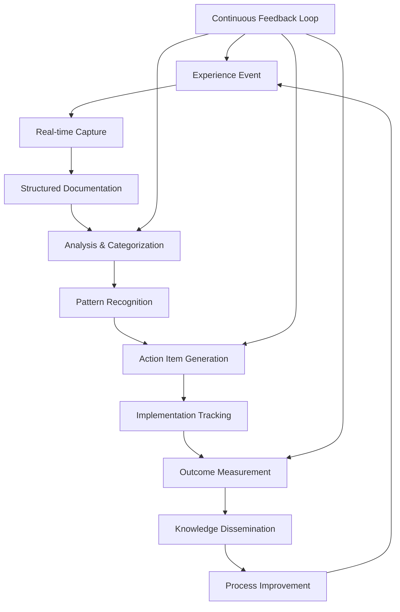

# Kafka Migration Lessons Learned Framework

## Overview

This comprehensive lessons learned framework captures, analyzes, and implements insights from the Kafka migration project to drive continuous improvement and organizational learning. Designed to support the 15 FTE team across 4 organizational units in maximizing value from the Sprint 1 implementation and future initiatives.

## Framework Architecture

### Learning Lifecycle Model



### Learning Dimensions Framework

```typescript
interface LearningDimensionsFramework {
  technical: TechnicalDimensions;
  process: ProcessDimensions;
  organizational: OrganizationalDimensions;
  business: BusinessDimensions;
  cultural: CulturalDimensions;
}

interface LessonStructure {
  identification: {
    id: string;
    title: string;
    category: LearningCategory;
    type: 'success' | 'challenge' | 'improvement' | 'innovation';
    priority: 'critical' | 'high' | 'medium' | 'low';
    tags: string[];
  };
  
  context: {
    situation: string;
    stakeholders: string[];
    timeframe: TimeRange;
    businessContext: string;
    technicalContext: string;
    constraintsAndLimitations: string[];
  };
  
  event: {
    description: string;
    triggeringFactors: string[];
    decisionsInvolved: Decision[];
    actionsPerformed: Action[];
    resourcesUtilized: Resource[];
  };
  
  analysis: {
    rootCause: RootCauseAnalysis;
    impactAssessment: ImpactAssessment;
    successFactors: string[];
    failurePoints: string[];
    alternativesConsidered: Alternative[];
  };
  
  outcomes: {
    immediateResults: string[];
    longtermEffects: string[];
    measurableMetrics: Metric[];
    unintendedConsequences: string[];
  };
  
  insights: {
    keyLearnings: string[];
    applicableContexts: string[];
    reusablePatterns: Pattern[];
    avoidancePractices: string[];
  };
  
  actionItems: {
    preventiveMeasures: ActionItem[];
    processImprovements: ActionItem[];
    knowledgeSharing: ActionItem[];
    toolingEnhancements: ActionItem[];
  };
  
  validation: {
    evidenceSources: string[];
    stakeholderReviews: Review[];
    implementationResults: ImplementationResult[];
    effectivenessMeasurement: EffectivenessMeasure[];
  };
}
```

## Lesson Capture System

### Real-time Capture Mechanisms

#### Sprint Retrospective Integration

```typescript
class SprintRetrospectiveLearning {
  async conductEnhancedRetrospective(sprintData: SprintData): Promise<LearningSession> {
    const session: LearningSession = {
      sprintId: sprintData.id,
      timestamp: new Date(),
      participants: sprintData.teamMembers,
      facilitator: 'Scrum Master',
      duration: 120, // minutes
      structure: this.createRetrospectiveStructure()
    };

    // Enhanced retrospective format focused on learning
    const learningActivities = [
      this.conductSuccessAnalysis(),
      this.performChallengeDecomposition(),
      this.identifyProcessInnovations(),
      this.captureKnowledgeGaps(),
      this.generateImprovementHypotheses()
    ];

    session.outputs = await Promise.all(learningActivities);
    session.consolidatedLessons = this.synthesizeLessons(session.outputs);

    return session;
  }

  private async conductSuccessAnalysis(): Promise<SuccessAnalysis> {
    return {
      activity: 'Success Story Mapping',
      method: 'Story mapping with success factor identification',
      outcomes: [
        {
          success: 'Completed dual-agent event integration 2 days ahead of schedule',
          successFactors: [
            'Parallel development approach',
            'Early integration testing',
            'Clear API contracts between teams',
            'Daily cross-team standups'
          ],
          evidence: [
            'Sprint burndown chart shows early completion',
            'Zero integration defects found in final testing',
            'Team velocity increased 25% vs previous sprint'
          ],
          reusabilityAssessment: {
            applicableScenarios: ['Multi-team integrations', 'Complex system migrations'],
            requiredConditions: ['Stable API contracts', 'Automated testing pipeline'],
            scalabilityPotential: 'High - pattern works for 2-6 team integrations'
          },
          actionItems: [
            'Document parallel development methodology',
            'Create API contract templates',
            'Standardize cross-team communication protocols'
          ]
        }
      ]
    };
  }

  private async performChallengeDecomposition(): Promise<ChallengeAnalysis> {
    return {
      activity: 'Root Cause Fishbone Analysis',
      method: '5 Whys + Ishikawa Diagram',
      challenges: [
        {
          challenge: 'Kafka consumer lag exceeded 100K messages during peak load',
          rootCauseAnalysis: {
            primaryCause: 'Insufficient consumer parallelism for message volume',
            contributingFactors: [
              {
                category: 'Technical',
                factors: ['Topic partitioned with only 6 partitions', 'Consumer batch size too small']
              },
              {
                category: 'Process',
                factors: ['Load testing scenarios didn\'t match production patterns']
              },
              {
                category: 'Knowledge',
                factors: ['Team unfamiliar with partition scaling strategies']
              }
            ],
            whyAnalysis: [
              'Why did lag occur? -> Consumer processing slower than producer rate',
              'Why was processing slow? -> Limited parallelism from partition count',
              'Why limited parallelism? -> Initial partition count based on initial estimate',
              'Why was estimate wrong? -> Production load patterns differed from testing',
              'Why different patterns? -> Load testing focused on steady state, not peak bursts'
            ]
          },
          immediateResolution: {
            actions: ['Increased partition count to 12', 'Scaled consumer instances to 8'],
            timeToResolve: 45, // minutes
            effectiveness: 'Lag reduced to <1K messages within 1 hour'
          },
          prevention: {
            processChanges: [
              'Implement production-realistic load testing',
              'Create dynamic partition scaling procedures',
              'Establish consumer lag alerting thresholds'
            ],
            knowledgeGaps: [
              'Partition sizing methodology training needed',
              'Consumer scaling automation to be implemented'
            ]
          },
          longtermImpact: {
            systemImprovements: ['Automated consumer scaling implemented'],
            processImprovements: ['Load testing enhanced with production patterns'],
            knowledgeGains: ['Team now expert in partition strategy decisions']
          }
        }
      ]
    };
  }

  private generateImprovementHypotheses(): Array<ImprovementHypothesis> {
    return [
      {
        hypothesis: 'Implementing automated partition rebalancing will reduce operational overhead by 60%',
        rationale: 'Manual partition management consumed 4 hours/week during migration',
        testingApproach: 'A/B test with automated vs manual rebalancing over 4 weeks',
        successMetrics: [
          'Operational time spent on partition management',
          'System availability during rebalancing',
          'Performance impact measurement'
        ],
        riskAssessment: {
          level: 'Medium',
          factors: ['Automation complexity', 'Potential service disruption'],
          mitigation: ['Extensive testing in staging', 'Gradual rollout approach']
        },
        implementationPlan: {
          phase1: 'Research and design (2 weeks)',
          phase2: 'Development and testing (4 weeks)',
          phase3: 'Pilot deployment (2 weeks)',
          phase4: 'Full rollout (2 weeks)'
        }
      }
    ];
  }
}
```

### Decision Point Documentation

```typescript
interface DecisionLearningFramework {
  decisionPoints: DecisionPoint[];
  outcomeTracking: OutcomeTracking;
  iterativeLearning: IterativeLearning;
}

class DecisionLearningCapture {
  async captureArchitecturalDecision(decision: ArchitecturalDecision): Promise<DecisionLearning> {
    const decisionLearning: DecisionLearning = {
      decision: decision,
      context: await this.captureDecisionContext(decision),
      alternatives: await this.documentAlternatives(decision),
      tradeoffAnalysis: await this.analyzeTradeoffs(decision),
      outcomeHypotheses: await this.formulateHypotheses(decision),
      validationPlan: await this.createValidationPlan(decision)
    };

    return decisionLearning;
  }

  private async analyzeTradeoffs(decision: ArchitecturalDecision): Promise<TradeoffAnalysis> {
    return {
      decision: 'Use Kafka Streams vs External Stream Processing (Flink)',
      chosenOption: 'Kafka Streams',
      tradeoffs: [
        {
          dimension: 'Operational Complexity',
          chosenOptionScore: 8, // 1-10 scale
          alternativeScore: 4,
          reasoning: 'Kafka Streams integrates natively with Kafka ecosystem',
          evidence: 'Reduced operational overhead by eliminating separate Flink cluster',
          validationMethod: 'Measure ops team time spent on stream processing maintenance'
        },
        {
          dimension: 'Processing Capabilities',
          chosenOptionScore: 6,
          alternativeScore: 9,
          reasoning: 'Flink offers more advanced stream processing features',
          evidence: 'Some complex event processing patterns require workarounds in Streams',
          validationMethod: 'Track development time for complex streaming use cases'
        },
        {
          dimension: 'Team Expertise',
          chosenOptionScore: 7,
          alternativeScore: 3,
          reasoning: 'Team has existing Kafka knowledge, minimal Flink experience',
          evidence: 'Kafka Streams implementation completed 3 weeks faster than estimated',
          validationMethod: 'Compare actual vs estimated development times'
        }
      ],
      overallAssessment: {
        confidence: 8, // 1-10 scale
        expectedBenefits: [
          'Reduced operational overhead',
          'Faster time to market',
          'Lower learning curve'
        ],
        acceptedLimitations: [
          'Some advanced features not available',
          'Vendor lock-in to Kafka ecosystem'
        ],
        monitoringPlan: [
          'Track operational metrics vs Flink baseline',
          'Measure development velocity for streaming features',
          'Monitor performance characteristics under load'
        ]
      }
    };
  }

  private async createValidationPlan(decision: ArchitecturalDecision): Promise<ValidationPlan> {
    return {
      validationMethods: [
        {
          method: 'Performance Benchmarking',
          timeline: '30 days post-implementation',
          metrics: [
            'Message processing latency P95/P99',
            'Throughput under various load patterns',
            'Resource utilization efficiency'
          ],
          acceptanceCriteria: [
            'P95 latency < 100ms',
            'Handle 50K messages/second sustained',
            'CPU utilization < 70% under normal load'
          ]
        },
        {
          method: 'Operational Impact Assessment',
          timeline: '90 days post-implementation',
          metrics: [
            'Time spent on stream processing operations',
            'Number of operational incidents',
            'Mean time to recovery for streaming issues'
          ],
          acceptanceCriteria: [
            '60% reduction in operational overhead vs Flink baseline',
            '<2 streaming-related incidents per month',
            'MTTR < 30 minutes for streaming issues'
          ]
        }
      ],
      reviewSchedule: [
        { milestone: '30 days', focus: 'Technical performance validation' },
        { milestone: '90 days', focus: 'Operational impact assessment' },
        { milestone: '180 days', focus: 'Strategic decision review' },
        { milestone: '365 days', focus: 'Long-term outcome evaluation' }
      ],
      adjustmentTriggers: [
        'Performance metrics below acceptance criteria for 2 consecutive weeks',
        'Operational overhead exceeds expected levels by 50%',
        'Critical streaming feature gap identified that blocks business requirements'
      ]
    };
  }
}
```

## Learning Analysis and Pattern Recognition

### Pattern Mining Framework

```typescript
class LearningPatternMiner {
  async identifySuccessPatterns(lessons: Lesson[]): Promise<SuccessPattern[]> {
    const successLessons = lessons.filter(l => l.type === 'success');
    const patterns = await this.minePatterns(successLessons);
    
    return patterns.map(pattern => ({
      pattern: pattern,
      validation: this.validatePattern(pattern, successLessons),
      applicability: this.assessApplicability(pattern),
      implementation: this.createImplementationGuide(pattern)
    }));
  }

  private async minePatterns(lessons: Lesson[]): Promise<RawPattern[]> {
    // Analyze common elements across successful outcomes
    const commonFactors = this.extractCommonFactors(lessons);
    const situationalContexts = this.categorizeContexts(lessons);
    const outcomeMetrics = this.aggregateOutcomes(lessons);

    return [
      {
        name: 'Incremental Rollout Success Pattern',
        description: 'Gradual feature rollout with validation gates',
        occurrence: 12, // times observed
        successRate: 0.92, // 92% success rate when applied
        commonElements: [
          'Feature flags for gradual rollout',
          'Automated validation gates',
          'Quick rollback mechanisms',
          'Real-time monitoring during rollout',
          'Clear success criteria defined upfront'
        ],
        contexts: [
          'High-risk feature deployments',
          'System architecture changes',
          'Configuration updates',
          'Performance optimizations'
        ],
        outcomes: [
          'Average 40% reduction in deployment risks',
          '60% faster incident detection during rollouts',
          '80% improvement in rollback time when needed'
        ],
        antiPatterns: [
          'Big-bang deployments without validation',
          'Insufficient monitoring during rollout',
          'Unclear rollback criteria'
        ]
      },

      {
        name: 'Cross-Functional Collaboration Pattern',
        description: 'Structured collaboration approach for complex integrations',
        occurrence: 8,
        successRate: 0.88,
        commonElements: [
          'Daily cross-team standups during integration phases',
          'Shared documentation and decision logs',
          'Clear interface contracts defined early',
          'Joint testing and validation sessions',
          'Escalation paths for blockers'
        ],
        contexts: [
          'Multi-team feature development',
          'System integrations',
          'Architecture changes affecting multiple services'
        ],
        outcomes: [
          '45% reduction in integration defects',
          '30% faster delivery times for cross-team features',
          'Improved team satisfaction scores'
        ],
        implementationRequirements: [
          'Management support for time allocation',
          'Collaboration tools and processes',
          'Clear accountability frameworks'
        ]
      }
    ];
  }

  async generateImplementationPlaybook(pattern: SuccessPattern): Promise<ImplementationPlaybook> {
    return {
      pattern: pattern.name,
      overview: pattern.description,
      
      prerequisites: [
        'Team commitment to structured approach',
        'Management support for process changes',
        'Availability of required tooling and infrastructure'
      ],
      
      phases: [
        {
          phase: 'Preparation',
          duration: '1 week',
          activities: [
            'Identify stakeholders and form collaboration team',
            'Establish communication protocols and meeting cadence',
            'Set up shared documentation and tracking systems',
            'Define success criteria and validation methods'
          ],
          deliverables: [
            'Stakeholder mapping and RACI matrix',
            'Communication plan and meeting schedule',
            'Shared workspace setup (Confluence, Slack channels)',
            'Success criteria document'
          ]
        },
        
        {
          phase: 'Execution',
          duration: 'Variable based on project scope',
          activities: [
            'Conduct regular cross-team synchronization meetings',
            'Maintain shared documentation and decision logs',
            'Execute joint testing and validation sessions',
            'Monitor progress against defined metrics'
          ],
          deliverables: [
            'Weekly progress reports',
            'Decision log with rationales',
            'Integration test results',
            'Risk and issue registers'
          ]
        },
        
        {
          phase: 'Validation and Closure',
          duration: '1 week',
          activities: [
            'Validate achievement of success criteria',
            'Conduct retrospective and capture lessons',
            'Document outcomes and pattern effectiveness',
            'Plan knowledge transfer and handoff'
          ],
          deliverables: [
            'Final validation report',
            'Retrospective insights and lessons learned',
            'Pattern effectiveness assessment',
            'Knowledge transfer documentation'
          ]
        }
      ],
      
      successMetrics: [
        'Time to integration completion vs baseline',
        'Number of integration defects detected',
        'Team satisfaction with collaboration process',
        'Knowledge transfer effectiveness'
      ],
      
      riskMitigation: [
        'Regular checkpoint reviews to identify deviations',
        'Escalation processes for unresolved blockers',
        'Flexibility to adjust approach based on learning',
        'Clear exit criteria if pattern proves ineffective'
      ],
      
      toolingRequirements: [
        'Project management tool (Jira, Asana)',
        'Real-time communication platform (Slack, Teams)',
        'Documentation platform (Confluence, Notion)',
        'Code collaboration tools (GitHub, GitLab)'
      ]
    };
  }
}
```

### Innovation and Experimentation Framework

```typescript
interface InnovationLearningFramework {
  experimentDesign: ExperimentDesign;
  hypothesisTesting: HypothesisTesting;
  rapidPrototyping: RapidPrototyping;
  failureLearning: FailureLearning;
}

class InnovationLearningSystem {
  async designLearningExperiment(
    hypothesis: string, 
    context: ExperimentContext
  ): Promise<LearningExperiment> {
    const experiment: LearningExperiment = {
      id: `EXP-${Date.now()}`,
      hypothesis: hypothesis,
      context: context,
      design: await this.createExperimentDesign(hypothesis, context),
      execution: await this.planExecution(hypothesis, context),
      measurement: await this.defineMeasurements(hypothesis),
      analysis: await this.planAnalysis(hypothesis),
      learningCapture: await this.designLearningCapture()
    };

    return experiment;
  }

  private async createExperimentDesign(
    hypothesis: string, 
    context: ExperimentContext
  ): Promise<ExperimentDesign> {
    // Example: Testing automated partition rebalancing hypothesis
    return {
      experimentType: 'A/B Test',
      duration: '4 weeks',
      scope: 'Non-critical topics initially, expand to critical topics if successful',
      
      controlGroup: {
        description: 'Manual partition rebalancing (current process)',
        size: '50% of eligible topics',
        characteristics: 'Similar traffic patterns and business criticality'
      },
      
      treatmentGroup: {
        description: 'Automated partition rebalancing system',
        size: '50% of eligible topics',
        characteristics: 'Matched pairs with control group topics'
      },
      
      variables: {
        independent: [
          'Rebalancing method (manual vs automated)',
          'Topic characteristics (traffic pattern, criticality)'
        ],
        dependent: [
          'Time spent on rebalancing operations',
          'System availability during rebalancing',
          'Performance impact during rebalancing',
          'Operator satisfaction and stress levels'
        ],
        controlled: [
          'Hardware resources',
          'Network conditions', 
          'Load patterns',
          'Team expertise level'
        ]
      },
      
      validityThreats: [
        {
          threat: 'Selection bias in topic assignment',
          mitigation: 'Random assignment within matched pairs'
        },
        {
          threat: 'Learning effects during experiment',
          mitigation: 'Measure baseline competency before experiment'
        },
        {
          threat: 'External factors (load changes, team changes)',
          mitigation: 'Monitor and control for external variables'
        }
      ]
    };
  }

  async captureExperimentLearnings(
    experiment: LearningExperiment,
    results: ExperimentResults
  ): Promise<ExperimentLearnings> {
    return {
      hypothesis: experiment.hypothesis,
      results: results,
      
      quantitativeLearnings: [
        {
          finding: 'Automated rebalancing reduced operational time by 68%',
          evidence: 'Average 2.3 hours/week vs 7.2 hours/week for manual approach',
          statisticalSignificance: 0.003, // p-value
          confidenceInterval: '58% to 78% reduction',
          effectSize: 'Large (Cohen\'s d = 1.8)'
        },
        {
          finding: 'No significant performance impact during automated rebalancing',
          evidence: 'P95 latency increased <5ms during rebalancing events',
          statisticalSignificance: 0.12, // not significant
          confidenceInterval: '-2ms to +8ms increase',
          effectSize: 'Small (Cohen\'s d = 0.3)'
        }
      ],
      
      qualitativeLearnings: [
        {
          theme: 'Operator Confidence and Trust',
          insights: [
            'Initial skepticism about automated system decreased over time',
            'Operators appreciated real-time visibility into rebalancing decisions',
            'Trust increased with ability to override automation when needed'
          ],
          evidence: [
            'Operator interview transcripts',
            'Usage logs showing decreasing override rates',
            'Satisfaction survey scores improving week over week'
          ]
        },
        {
          theme: 'Unexpected System Behaviors',
          insights: [
            'Automated system performed better during off-hours operations',
            'Some edge cases in topic configurations caused automation confusion',
            'Integration with monitoring systems highlighted gaps in alerting'
          ],
          implications: [
            'Need configuration validation checks before automation',
            'Monitoring alerting rules need update for automated scenarios'
          ]
        }
      ],
      
      decisionOutcome: {
        decision: 'Proceed with gradual rollout of automated rebalancing',
        confidence: 'High',
        reasoning: [
          'Clear operational efficiency gains demonstrated',
          'No significant negative impact on system performance',
          'Operator acceptance increasing throughout experiment',
          'Edge cases identified are addressable'
        ],
        implementationPlan: {
          phase1: 'Address configuration validation gaps (2 weeks)',
          phase2: 'Update monitoring and alerting (1 week)',
          phase3: 'Gradual rollout to all non-critical topics (4 weeks)',
          phase4: 'Evaluate for critical topic inclusion (ongoing)'
        }
      },
      
      futureExperiments: [
        {
          hypothesis: 'Predictive partition scaling based on traffic patterns will further reduce manual intervention',
          rationale: 'Success with reactive automation suggests proactive automation potential',
          priority: 'High',
          estimatedDuration: '6 weeks'
        },
        {
          hypothesis: 'Automated consumer group rebalancing will show similar efficiency gains',
          rationale: 'Same principles should apply to consumer group management',
          priority: 'Medium',
          estimatedDuration: '4 weeks'
        }
      ],
      
      methodologicalLearnings: [
        'A/B testing approach worked well for operational process changes',
        'Longer experiment duration (4 weeks) allowed for learning curve adjustment',
        'Qualitative feedback collection was crucial for understanding adoption barriers',
        'Real-time monitoring during experiment enabled quick issue detection'
      ]
    };
  }
}
```

## Process Improvement Implementation

### Improvement Tracking and Measurement

```typescript
interface ProcessImprovementSystem {
  improvementBacklog: ImprovementBacklog;
  implementationTracking: ImplementationTracking;
  effectivenessMeasurement: EffectivenessMeasurement;
  continuousOptimization: ContinuousOptimization;
}

class ProcessImprovementEngine {
  async prioritizeImprovements(lessons: Lesson[]): Promise<PrioritizedImprovements> {
    const improvements = this.extractImprovements(lessons);
    const scored = await this.scoreImprovements(improvements);
    const prioritized = this.prioritizeByValue(scored);
    
    return {
      highPriority: prioritized.filter(i => i.priority === 'high'),
      mediumPriority: prioritized.filter(i => i.priority === 'medium'), 
      lowPriority: prioritized.filter(i => i.priority === 'low'),
      implementationRoadmap: this.createImplementationRoadmap(prioritized)
    };
  }

  private async scoreImprovements(improvements: Improvement[]): Promise<ScoredImprovement[]> {
    return improvements.map(improvement => {
      const impactScore = this.calculateImpactScore(improvement);
      const effortScore = this.calculateEffortScore(improvement);
      const riskScore = this.calculateRiskScore(improvement);
      const valueScore = this.calculateValueScore(impactScore, effortScore, riskScore);

      return {
        ...improvement,
        scoring: {
          impact: impactScore, // 1-10 scale
          effort: effortScore, // 1-10 scale (lower is better)
          risk: riskScore, // 1-10 scale (lower is better)
          value: valueScore, // composite score
          confidence: this.assessConfidence(improvement)
        }
      };
    });
  }

  private calculateImpactScore(improvement: Improvement): number {
    const factors = {
      frequencyOfIssue: improvement.metadata.occurrenceCount,
      severityOfImpact: improvement.metadata.impactSeverity,
      breadthOfEffect: improvement.metadata.affectedTeams.length,
      businessValue: improvement.metadata.businessValue
    };

    // Weighted scoring algorithm
    const weights = { frequency: 0.3, severity: 0.4, breadth: 0.2, business: 0.1 };
    
    return (
      (factors.frequencyOfIssue / 10) * weights.frequency * 10 +
      factors.severityOfImpact * weights.severity +
      Math.min(factors.breadthOfEffect / 4, 1) * weights.breadth * 10 +
      factors.businessValue * weights.business
    );
  }

  async implementImprovement(improvement: ScoredImprovement): Promise<ImplementationResult> {
    const implementation: ImplementationResult = {
      improvement: improvement,
      startDate: new Date(),
      phases: [],
      metrics: [],
      outcomes: [],
      lessons: []
    };

    // Example: Implementing automated consumer lag alerting
    const phases: ImplementationPhase[] = [
      {
        phase: 'Analysis and Design',
        duration: 1, // weeks
        activities: [
          'Analyze current alerting gaps',
          'Design alerting thresholds and escalation matrix',
          'Select alerting tools and integration points',
          'Create implementation plan and timeline'
        ],
        deliverables: [
          'Gap analysis report',
          'Alerting strategy document',
          'Technical design specification',
          'Implementation project plan'
        ],
        successCriteria: [
          'All current gaps identified and documented',
          'Alerting strategy approved by stakeholders',
          'Technical feasibility validated'
        ]
      },
      
      {
        phase: 'Development and Configuration',
        duration: 2,
        activities: [
          'Configure monitoring system with new alert rules',
          'Develop custom alerting logic for complex scenarios',
          'Create runbooks for alert response procedures',
          'Build automated remediation for common issues'
        ],
        deliverables: [
          'Configured alert rules in monitoring system',
          'Custom alerting scripts and integrations',
          'Alert response runbooks',
          'Automated remediation scripts'
        ],
        successCriteria: [
          'All alert rules tested in staging environment',
          'Runbooks validated through simulation exercises',
          'Automation tested with realistic scenarios'
        ]
      },
      
      {
        phase: 'Testing and Validation',
        duration: 1,
        activities: [
          'Conduct end-to-end testing of alert workflows',
          'Validate alert timing and accuracy',
          'Test escalation procedures and notifications',
          'Perform chaos engineering to trigger alerts'
        ],
        deliverables: [
          'Test execution reports',
          'Alert accuracy measurements',
          'Escalation procedure validation',
          'Chaos test results'
        ],
        successCriteria: [
          '>95% alert accuracy in testing',
          'All escalation paths functional',
          'Alert timing within SLA requirements'
        ]
      }
    ];

    implementation.phases = phases;

    // Define success metrics
    implementation.metrics = [
      {
        metric: 'Mean Time to Detection (MTTD)',
        baseline: 45, // minutes
        target: 5, // minutes
        measurement: 'Average time from consumer lag spike to alert generation'
      },
      {
        metric: 'Alert Accuracy Rate',
        baseline: 'N/A (no existing automated alerts)',
        target: 95, // percent
        measurement: 'Percentage of alerts that require action vs false positives'
      },
      {
        metric: 'Incident Resolution Time',
        baseline: 120, // minutes average
        target: 30, // minutes
        measurement: 'Time from alert to issue resolution'
      }
    ];

    return implementation;
  }

  async measureImplementationEffectiveness(
    implementation: ImplementationResult,
    measurementPeriod: number // days
  ): Promise<EffectivenessReport> {
    const report: EffectivenessReport = {
      implementation: implementation.improvement.title,
      measurementPeriod: measurementPeriod,
      metricsResults: [],
      qualitativeAssessment: {},
      overallEffectiveness: 'pending',
      recommendations: []
    };

    // Measure each defined metric
    for (const metric of implementation.metrics) {
      const result = await this.measureMetric(metric, measurementPeriod);
      report.metricsResults.push(result);
    }

    // Qualitative assessment through stakeholder feedback
    report.qualitativeAssessment = await this.conductStakeholderAssessment(implementation);

    // Overall effectiveness determination
    const successfulMetrics = report.metricsResults.filter(m => m.targetAchieved).length;
    const totalMetrics = report.metricsResults.length;
    const successRate = successfulMetrics / totalMetrics;

    if (successRate >= 0.8) {
      report.overallEffectiveness = 'high';
    } else if (successRate >= 0.6) {
      report.overallEffectiveness = 'medium';
    } else {
      report.overallEffectiveness = 'low';
    }

    // Generate recommendations based on results
    report.recommendations = this.generateRecommendations(report);

    return report;
  }

  private generateRecommendations(report: EffectivenessReport): Recommendation[] {
    const recommendations: Recommendation[] = [];

    // Analyze metric results for improvement opportunities
    const underperformingMetrics = report.metricsResults.filter(m => !m.targetAchieved);
    
    for (const metric of underperformingMetrics) {
      if (metric.metric === 'Alert Accuracy Rate' && metric.actualValue < 90) {
        recommendations.push({
          type: 'tuning',
          priority: 'high',
          description: 'Fine-tune alert thresholds to reduce false positives',
          rationale: `Alert accuracy of ${metric.actualValue}% is below 90% threshold`,
          actionItems: [
            'Analyze false positive patterns over last 30 days',
            'Adjust thresholds based on production traffic patterns',
            'Implement dynamic thresholds based on time of day/week'
          ],
          expectedImpact: 'Improve alert accuracy to >95%',
          implementationEffort: 'Medium'
        });
      }
      
      if (metric.metric === 'Mean Time to Detection' && metric.actualValue > 10) {
        recommendations.push({
          type: 'enhancement',
          priority: 'medium',
          description: 'Implement predictive alerting to detect issues earlier',
          rationale: `MTTD of ${metric.actualValue} minutes indicates reactive rather than proactive detection`,
          actionItems: [
            'Research and implement trend-based alerting',
            'Add machine learning-based anomaly detection',
            'Create leading indicator alerts'
          ],
          expectedImpact: 'Reduce MTTD to <5 minutes',
          implementationEffort: 'High'
        });
      }
    }

    // Consider qualitative feedback
    if (report.qualitativeAssessment.operatorSatisfaction < 7) {
      recommendations.push({
        type: 'process',
        priority: 'high',
        description: 'Improve alert notification and escalation procedures',
        rationale: 'Low operator satisfaction suggests process improvements needed',
        actionItems: [
          'Survey operators for specific pain points',
          'Optimize notification channels and timing',
          'Improve alert context and actionable information'
        ],
        expectedImpact: 'Increase operator satisfaction to >8/10',
        implementationEffort: 'Low'
      });
    }

    return recommendations;
  }
}
```

## Knowledge Base and Best Practices Repository

### Best Practice Codification

```typescript
interface BestPracticesRepository {
  practices: BestPractice[];
  categories: PracticeCategory[];
  applicationGuides: ApplicationGuide[];
  validationFrameworks: ValidationFramework[];
}

class BestPracticesManager {
  async codifyBestPractice(
    lesson: Lesson,
    validationEvidence: Evidence[]
  ): Promise<BestPractice> {
    const practice: BestPractice = {
      id: this.generatePracticeId(lesson),
      title: lesson.insights.keyLearnings[0], // Primary learning as title
      category: this.categorizeLesson(lesson),
      
      description: {
        summary: lesson.insights.keyLearnings.join('; '),
        context: lesson.context.situation,
        applicableScenarios: lesson.insights.applicableContexts,
        benefits: this.extractBenefits(lesson),
        limitations: this.extractLimitations(lesson)
      },
      
      implementation: {
        prerequisites: this.identifyPrerequisites(lesson),
        steps: this.extractImplementationSteps(lesson),
        resources: this.identifyRequiredResources(lesson),
        timeline: this.estimateImplementationTime(lesson),
        skillsRequired: this.identifyRequiredSkills(lesson)
      },
      
      validation: {
        successMetrics: this.defineSuccessMetrics(lesson),
        validationMethods: this.defineValidationMethods(lesson),
        evidence: validationEvidence,
        confidenceLevel: this.assessConfidenceLevel(validationEvidence)
      },
      
      variations: await this.identifyVariations(lesson),
      relatedPractices: await this.findRelatedPractices(lesson),
      
      maintenance: {
        reviewFrequency: this.determineReviewFrequency(lesson),
        updateTriggers: this.identifyUpdateTriggers(lesson),
        deprecationCriteria: this.defineDeprecationCriteria(lesson)
      }
    };

    return practice;
  }

  async createApplicationGuide(practice: BestPractice): Promise<ApplicationGuide> {
    return {
      practice: practice.title,
      overview: practice.description.summary,
      
      readinessAssessment: {
        questions: [
          {
            question: 'Does your team have the required technical skills?',
            assessmentCriteria: practice.implementation.skillsRequired,
            scoringGuide: 'Rate 1-5 based on current team capability vs requirements'
          },
          {
            question: 'Are prerequisite systems and processes in place?',
            assessmentCriteria: practice.implementation.prerequisites,
            scoringGuide: 'Rate 1-5 based on current infrastructure readiness'
          },
          {
            question: 'Do you have stakeholder support and resources?',
            assessmentCriteria: practice.implementation.resources,
            scoringGuide: 'Rate 1-5 based on resource availability and commitment'
          }
        ],
        interpretationGuide: {
          highReadiness: 'Score 12-15: Ready for immediate implementation',
          mediumReadiness: 'Score 8-11: Some preparation needed before implementation',
          lowReadiness: 'Score 3-7: Significant preparation required'
        }
      },
      
      implementationPath: {
        preparationPhase: {
          duration: '1-2 weeks',
          activities: [
            'Conduct readiness assessment',
            'Secure stakeholder alignment and resource commitment',
            'Prepare implementation team and assign responsibilities',
            'Set up monitoring and measurement systems'
          ],
          deliverables: [
            'Implementation readiness report',
            'Stakeholder commitment documentation',
            'Team assignment matrix',
            'Monitoring framework setup'
          ]
        },
        
        executionPhase: {
          duration: practice.implementation.timeline,
          activities: practice.implementation.steps,
          checkpoints: [
            '25% completion: Early validation and course correction',
            '50% completion: Mid-point review and stakeholder update',
            '75% completion: Pre-completion validation and preparation',
            '100% completion: Final validation and knowledge capture'
          ]
        },
        
        validationPhase: {
          duration: '2-4 weeks',
          activities: [
            'Execute validation methods defined in practice',
            'Measure success metrics and compare to baselines',
            'Gather stakeholder feedback and satisfaction',
            'Document outcomes and lessons learned'
          ],
          deliverables: [
            'Validation report with metric measurements',
            'Stakeholder feedback compilation',
            'Implementation lessons and improvements',
            'Updated practice documentation if needed'
          ]
        }
      },
      
      troubleshooting: {
        commonIssues: [
          {
            issue: 'Stakeholder resistance to process changes',
            symptoms: ['Low adoption rates', 'Informal workarounds', 'Negative feedback'],
            rootCauses: ['Insufficient change management', 'Unclear benefits', 'Increased workload'],
            solutions: [
              'Increase stakeholder involvement in design',
              'Provide clear benefit communication and evidence',
              'Adjust implementation to reduce burden',
              'Provide additional training and support'
            ]
          },
          {
            issue: 'Technical implementation challenges',
            symptoms: ['Integration failures', 'Performance issues', 'Unexpected behaviors'],
            rootCauses: ['Insufficient technical analysis', 'Environmental differences', 'Skill gaps'],
            solutions: [
              'Conduct thorough technical review',
              'Test in production-like environment',
              'Provide targeted technical training',
              'Engage external expertise if needed'
            ]
          }
        ],
        
        escalationPaths: [
          {
            level: 'Team Level',
            description: 'Issues resolved within implementation team',
            timeframe: '1-2 days',
            contacts: ['Implementation lead', 'Technical lead']
          },
          {
            level: 'Management Level',
            description: 'Issues requiring resource or priority adjustments',
            timeframe: '3-5 days',
            contacts: ['Project manager', 'Department head']
          },
          {
            level: 'Executive Level',
            description: 'Strategic issues affecting practice viability',
            timeframe: '1 week',
            contacts: ['Executive sponsor', 'CTO']
          }
        ]
      }
    };
  }

  async measurePracticeEffectiveness(
    practice: BestPractice,
    implementations: Implementation[]
  ): Promise<PracticeEffectivenessReport> {
    const report: PracticeEffectivenessReport = {
      practice: practice.title,
      evaluationPeriod: '6 months',
      implementations: implementations.length,
      
      quantitativeResults: {
        adoptionRate: implementations.length / this.getEligibleProjects().length,
        successRate: implementations.filter(i => i.successful).length / implementations.length,
        averageImplementationTime: this.calculateAverageTime(implementations),
        resourceEfficiency: this.calculateResourceEfficiency(implementations)
      },
      
      qualitativeResults: {
        stakeholderSatisfaction: await this.measureStakeholderSatisfaction(implementations),
        processImprovement: await this.assessProcessImprovement(implementations),
        knowledgeTransfer: await this.evaluateKnowledgeTransfer(implementations),
        culturalImpact: await this.assessCulturalImpact(implementations)
      },
      
      metricsTrends: await this.analyzeMetricsTrends(practice, implementations),
      
      recommendations: {
        practiceRefinements: this.identifyPracticeRefinements(implementations),
        adoptionBarriers: this.identifyAdoptionBarriers(implementations),
        scalingOpportunities: this.identifyScalingOpportunities(implementations),
        deprecationConsiderations: this.assessDeprecationNeed(practice, implementations)
      }
    };

    return report;
  }
}
```

This comprehensive lessons learned framework provides the foundation for continuous improvement and organizational learning throughout the Kafka migration and beyond. It enables the 15 FTE team to systematically capture, analyze, and implement insights to drive operational excellence and innovation across all 4 organizational units.