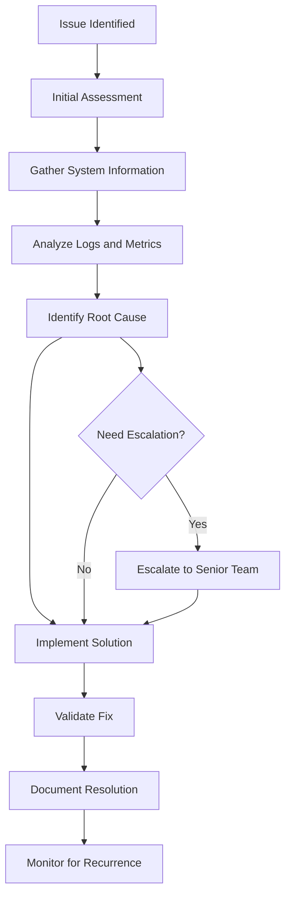

# Kafka Comprehensive Troubleshooting Guide

## Overview

This guide provides systematic troubleshooting procedures for Apache Kafka issues in the dual-agent architecture. Designed for operations teams, developers, and consultants managing the 15 FTE team across 4 organizational units during and after the Sprint 1 migration.

## Diagnostic Framework

### Troubleshooting Methodology



### Issue Classification System

```yaml
classification_matrix:
  performance_issues:
    - high_latency
    - low_throughput
    - consumer_lag
    - memory_issues
    - disk_io_problems
    - network_bottlenecks
    
  connectivity_issues:
    - broker_unreachable
    - client_connection_failures
    - ssl_handshake_errors
    - dns_resolution_problems
    - firewall_blocking
    
  data_consistency_issues:
    - message_loss
    - duplicate_messages
    - out_of_order_processing
    - schema_evolution_problems
    - partition_data_corruption
    
  operational_issues:
    - broker_failures
    - zookeeper_problems
    - disk_space_exhaustion
    - configuration_drift
    - rolling_restart_problems
    
  security_issues:
    - authentication_failures
    - authorization_denials
    - certificate_expiration
    - acl_misconfigurations
    - sasl_problems
```

## Performance Troubleshooting

### High Latency Issues

#### Diagnostic Decision Tree

```typescript
class LatencyDiagnosticTree {
  async diagnoseHighLatency(): Promise<DiagnosticResult> {
    const metrics = await this.gatherLatencyMetrics();
    const issues: DiagnosticIssue[] = [];

    // Check producer latency
    if (metrics.producerLatencyP99 > 100) {
      const producerIssues = await this.diagnoseProducerLatency();
      issues.push(...producerIssues);
    }

    // Check broker processing latency
    if (metrics.brokerProcessingLatencyP99 > 50) {
      const brokerIssues = await this.diagnoseBrokerLatency();
      issues.push(...brokerIssues);
    }

    // Check consumer latency
    if (metrics.consumerLatencyP99 > 200) {
      const consumerIssues = await this.diagnoseConsumerLatency();
      issues.push(...consumerIssues);
    }

    // Check network latency
    if (metrics.networkLatencyP99 > 20) {
      const networkIssues = await this.diagnoseNetworkLatency();
      issues.push(...networkIssues);
    }

    return {
      severity: this.calculateSeverity(issues),
      rootCauses: issues,
      recommendations: this.generateRecommendations(issues)
    };
  }

  private async diagnoseProducerLatency(): Promise<DiagnosticIssue[]> {
    const issues: DiagnosticIssue[] = [];

    // Check batch configuration
    const batchConfig = await this.getProducerBatchConfig();
    if (batchConfig.batchSize > 100000) {
      issues.push({
        type: 'LARGE_BATCH_SIZE',
        severity: 'MEDIUM',
        description: 'Producer batch size is too large',
        recommendation: 'Reduce batch.size to 16384-65536 bytes',
        commands: ['kafka-configs --alter --entity-type clients --entity-name producer --add-config batch.size=32768']
      });
    }

    // Check linger configuration
    if (batchConfig.lingerMs > 100) {
      issues.push({
        type: 'HIGH_LINGER_TIME',
        severity: 'MEDIUM',
        description: 'Producer linger.ms is too high',
        recommendation: 'Reduce linger.ms to 5-20ms for low latency',
        commands: ['kafka-configs --alter --entity-type clients --entity-name producer --add-config linger.ms=10']
      });
    }

    // Check compression
    const compressionType = await this.getCompressionType();
    if (compressionType === 'gzip') {
      issues.push({
        type: 'CPU_INTENSIVE_COMPRESSION',
        severity: 'LOW',
        description: 'GZIP compression increases CPU overhead',
        recommendation: 'Consider using lz4 or snappy for lower latency',
        commands: ['kafka-configs --alter --entity-type clients --entity-name producer --add-config compression.type=lz4']
      });
    }

    return issues;
  }

  private async diagnoseBrokerLatency(): Promise<DiagnosticIssue[]> {
    const issues: DiagnosticIssue[] = [];

    // Check disk I/O
    const diskMetrics = await this.getDiskMetrics();
    if (diskMetrics.avgIOWait > 10) {
      issues.push({
        type: 'HIGH_DISK_IO_WAIT',
        severity: 'HIGH',
        description: `High disk I/O wait time: ${diskMetrics.avgIOWait}ms`,
        recommendation: 'Check disk performance and consider SSD upgrade',
        commands: [
          'iostat -x 1 10',
          'iotop -d 1',
          'df -h',
          'lsblk'
        ]
      });
    }

    // Check memory usage
    const memoryMetrics = await this.getMemoryMetrics();
    if (memoryMetrics.pageCache < 0.3) {
      issues.push({
        type: 'LOW_PAGE_CACHE',
        severity: 'MEDIUM',
        description: 'Page cache utilization is low',
        recommendation: 'Increase system memory or reduce JVM heap size',
        commands: [
          'free -h',
          'cat /proc/meminfo',
          'ps aux | grep kafka'
        ]
      });
    }

    // Check JVM garbage collection
    const gcMetrics = await this.getGCMetrics();
    if (gcMetrics.fullGCFrequency > 1) {
      issues.push({
        type: 'FREQUENT_FULL_GC',
        severity: 'HIGH',
        description: 'Frequent full GC cycles detected',
        recommendation: 'Tune JVM heap size and GC settings',
        commands: [
          'jstat -gc $(pgrep -f kafka.Kafka) 5s',
          'jmap -histo $(pgrep -f kafka.Kafka) | head -20'
        ]
      });
    }

    return issues;
  }
}
```

#### Performance Tuning Playbook

```bash
#!/bin/bash
# high-latency-troubleshooting.sh

echo "=== High Latency Troubleshooting - $(date) ==="

# Step 1: Gather baseline metrics
echo "Gathering baseline metrics..."
baseline_file="/tmp/kafka-baseline-$(date +%Y%m%d-%H%M%S).log"

# Producer latency metrics
echo "Producer Latency Metrics:" >> $baseline_file
kafka-console-consumer --bootstrap-server localhost:9092 \
  --topic __metrics --timeout-ms 10000 | \
  grep "kafka.producer.request-latency-avg" >> $baseline_file

# Broker request handling metrics
echo "Broker Request Handling Metrics:" >> $baseline_file
kafka-console-consumer --bootstrap-server localhost:9092 \
  --topic __metrics --timeout-ms 10000 | \
  grep "kafka.network.request-time-avg" >> $baseline_file

# Consumer processing metrics
echo "Consumer Processing Metrics:" >> $baseline_file
kafka-consumer-groups --bootstrap-server localhost:9092 \
  --all-groups --describe >> $baseline_file

# Step 2: System resource analysis
echo "Analyzing system resources..."

# CPU usage
echo "CPU Usage Analysis:"
for broker in kafka-broker-{1..3}; do
  echo "Broker: $broker"
  ssh $broker "top -bn1 | grep -E 'Cpu|kafka' | head -10"
done

# Memory analysis
echo "Memory Analysis:"
for broker in kafka-broker-{1..3}; do
  echo "Broker: $broker"
  ssh $broker "free -h && echo && ps aux | grep kafka | head -5"
done

# Disk I/O analysis
echo "Disk I/O Analysis:"
for broker in kafka-broker-{1..3}; do
  echo "Broker: $broker"
  ssh $broker "iostat -x 1 3 | tail -10"
done

# Network analysis
echo "Network Analysis:"
for broker in kafka-broker-{1..3}; do
  echo "Broker: $broker"
  ssh $broker "ss -tuln | grep 9092"
  ssh $broker "netstat -i"
done

# Step 3: JVM analysis
echo "JVM Analysis:"
for broker in kafka-broker-{1..3}; do
  echo "Broker: $broker"
  ssh $broker "jstat -gc \$(pgrep -f kafka.Kafka) | tail -1"
  ssh $broker "jstat -gcutil \$(pgrep -f kafka.Kafka) | tail -1"
done

# Step 4: Configuration analysis
echo "Configuration Analysis:"
echo "Current Producer Configuration:"
kafka-configs --bootstrap-server localhost:9092 \
  --describe --entity-type clients --entity-name producer

echo "Current Broker Configuration:"
kafka-configs --bootstrap-server localhost:9092 \
  --describe --entity-type brokers --entity-default

echo "=== Analysis Complete - Results in $baseline_file ==="

# Step 5: Generate recommendations
echo "Generating performance recommendations..."
recommendations_file="/tmp/kafka-recommendations-$(date +%Y%m%d-%H%M%S).md"

cat > $recommendations_file << 'EOF'
# Kafka Performance Tuning Recommendations

## Producer Optimizations

### Batch Size Tuning
```bash
# Reduce batch size for lower latency
kafka-configs --bootstrap-server localhost:9092 --alter \
  --entity-type clients --entity-name producer \
  --add-config 'batch.size=16384'

# Reduce linger time
kafka-configs --bootstrap-server localhost:9092 --alter \
  --entity-type clients --entity-name producer \
  --add-config 'linger.ms=5'
```

### Compression Optimization
```bash
# Use lz4 for better latency/compression tradeoff
kafka-configs --bootstrap-server localhost:9092 --alter \
  --entity-type clients --entity-name producer \
  --add-config 'compression.type=lz4'
```

## Broker Optimizations

### Memory Settings
```bash
# Optimize JVM heap (should be 25-50% of total RAM)
export KAFKA_HEAP_OPTS="-Xmx6g -Xms6g"

# Optimize GC settings
export KAFKA_JVM_PERFORMANCE_OPTS="-XX:+UseG1GC -XX:MaxGCPauseMillis=20"
```

### Disk I/O Optimization
```bash
# Increase OS page cache by reducing JVM heap
# Monitor with: cat /proc/meminfo | grep -E 'MemFree|Cached|Buffers'

# Set appropriate log segment size
kafka-configs --bootstrap-server localhost:9092 --alter \
  --entity-type topics --entity-name high-throughput-topic \
  --add-config 'segment.ms=86400000'  # 1 day
```

## Network Optimizations

### Socket Buffer Tuning
```bash
# Increase socket buffer sizes
kafka-configs --bootstrap-server localhost:9092 --alter \
  --entity-type brokers --entity-default \
  --add-config 'socket.send.buffer.bytes=131072'

kafka-configs --bootstrap-server localhost:9092 --alter \
  --entity-type brokers --entity-default \
  --add-config 'socket.receive.buffer.bytes=131072'
```
EOF

echo "Recommendations saved to: $recommendations_file"
```

### Low Throughput Issues

#### Throughput Diagnostic Framework

```typescript
class ThroughputDiagnostics {
  async diagnoseLowThroughput(targetThroughput: number): Promise<ThroughputAnalysis> {
    const currentMetrics = await this.getCurrentThroughputMetrics();
    const bottlenecks: Bottleneck[] = [];

    // Analyze producer throughput
    if (currentMetrics.producerThroughput < targetThroughput * 0.8) {
      const producerBottlenecks = await this.analyzeProducerBottlenecks();
      bottlenecks.push(...producerBottlenecks);
    }

    // Analyze broker throughput
    const brokerBottlenecks = await this.analyzeBrokerBottlenecks();
    bottlenecks.push(...brokerBottlenecks);

    // Analyze consumer throughput
    if (currentMetrics.consumerLag > 10000) {
      const consumerBottlenecks = await this.analyzeConsumerBottlenecks();
      bottlenecks.push(...consumerBottlenecks);
    }

    return {
      currentThroughput: currentMetrics,
      targetThroughput,
      bottlenecks,
      recommendations: this.generateThroughputRecommendations(bottlenecks)
    };
  }

  private async analyzeProducerBottlenecks(): Promise<Bottleneck[]> {
    const bottlenecks: Bottleneck[] = [];

    // Check batching configuration
    const batchConfig = await this.getProducerBatchConfig();
    if (batchConfig.batchSize < 16384) {
      bottlenecks.push({
        component: 'producer',
        type: 'SMALL_BATCH_SIZE',
        impact: 'high',
        description: 'Batch size is too small for high throughput',
        solution: 'Increase batch.size to 64KB-1MB for high throughput scenarios'
      });
    }

    // Check compression settings
    const compressionType = await this.getCompressionType();
    if (compressionType === 'none') {
      bottlenecks.push({
        component: 'producer',
        type: 'NO_COMPRESSION',
        impact: 'medium',
        description: 'No compression may limit network throughput',
        solution: 'Enable lz4 or snappy compression'
      });
    }

    // Check in-flight requests
    const inFlightRequests = await this.getInFlightRequests();
    if (inFlightRequests < 5) {
      bottlenecks.push({
        component: 'producer',
        type: 'LOW_PARALLELISM',
        impact: 'high',
        description: 'Low max.in.flight.requests.per.connection limits parallelism',
        solution: 'Increase max.in.flight.requests.per.connection to 5'
      });
    }

    return bottlenecks;
  }

  private async analyzeBrokerBottlenecks(): Promise<Bottleneck[]> {
    const bottlenecks: Bottleneck[] = [];

    // Check partition count
    const topicMetrics = await this.getTopicMetrics();
    for (const topic of topicMetrics) {
      if (topic.partitionCount < 12 && topic.messageRate > 10000) {
        bottlenecks.push({
          component: 'broker',
          type: 'INSUFFICIENT_PARTITIONS',
          impact: 'high',
          description: `Topic ${topic.name} has only ${topic.partitionCount} partitions for high throughput`,
          solution: `Increase partitions for topic ${topic.name} to at least 12-24`
        });
      }
    }

    // Check replication settings
    for (const topic of topicMetrics) {
      const minISR = await this.getMinInSyncReplicas(topic.name);
      if (minISR > 2 && topic.messageRate > 50000) {
        bottlenecks.push({
          component: 'broker',
          type: 'HIGH_REPLICATION_OVERHEAD',
          impact: 'medium',
          description: `Topic ${topic.name} has min.insync.replicas=${minISR}`,
          solution: 'Consider reducing min.insync.replicas to 2 for high throughput'
        });
      }
    }

    // Check broker resource utilization
    const brokerMetrics = await this.getBrokerResourceMetrics();
    for (const broker of brokerMetrics) {
      if (broker.cpuUtilization > 80) {
        bottlenecks.push({
          component: 'broker',
          type: 'HIGH_CPU_UTILIZATION',
          impact: 'high',
          description: `Broker ${broker.id} CPU utilization: ${broker.cpuUtilization}%`,
          solution: 'Scale out brokers or optimize CPU-intensive operations'
        });
      }

      if (broker.diskIOUtilization > 80) {
        bottlenecks.push({
          component: 'broker',
          type: 'DISK_IO_BOTTLENECK',
          impact: 'high',
          description: `Broker ${broker.id} disk I/O utilization: ${broker.diskIOUtilization}%`,
          solution: 'Upgrade to faster storage or distribute load'
        });
      }
    }

    return bottlenecks;
  }

  private generateThroughputRecommendations(bottlenecks: Bottleneck[]): ThroughputRecommendation[] {
    const recommendations: ThroughputRecommendation[] = [];

    // Group bottlenecks by component
    const producerBottlenecks = bottlenecks.filter(b => b.component === 'producer');
    const brokerBottlenecks = bottlenecks.filter(b => b.component === 'broker');
    const consumerBottlenecks = bottlenecks.filter(b => b.component === 'consumer');

    // Generate producer recommendations
    if (producerBottlenecks.length > 0) {
      recommendations.push({
        priority: 'HIGH',
        category: 'producer_optimization',
        title: 'Optimize Producer Configuration',
        commands: [
          'kafka-configs --alter --entity-type clients --entity-name producer --add-config batch.size=65536',
          'kafka-configs --alter --entity-type clients --entity-name producer --add-config linger.ms=100',
          'kafka-configs --alter --entity-type clients --entity-name producer --add-config compression.type=lz4',
          'kafka-configs --alter --entity-type clients --entity-name producer --add-config max.in.flight.requests.per.connection=5'
        ],
        expectedImprovement: '30-50% throughput increase'
      });
    }

    // Generate broker recommendations
    if (brokerBottlenecks.some(b => b.type === 'INSUFFICIENT_PARTITIONS')) {
      recommendations.push({
        priority: 'HIGH',
        category: 'topic_scaling',
        title: 'Increase Topic Partitions',
        commands: [
          'kafka-topics --alter --topic high-throughput-topic --partitions 24 --bootstrap-server localhost:9092'
        ],
        expectedImprovement: '2-3x throughput increase'
      });
    }

    return recommendations;
  }
}
```

### Consumer Lag Issues

#### Consumer Lag Analysis and Resolution

```bash
#!/bin/bash
# consumer-lag-analysis.sh

CONSUMER_GROUP=$1
LAG_THRESHOLD=${2:-10000}

if [ -z "$CONSUMER_GROUP" ]; then
  echo "Usage: $0 <consumer-group> [lag-threshold]"
  echo "Available consumer groups:"
  kafka-consumer-groups --bootstrap-server localhost:9092 --list
  exit 1
fi

echo "=== Consumer Lag Analysis for Group: $CONSUMER_GROUP ==="

# Get current consumer group status
echo "Current Consumer Group Status:"
kafka-consumer-groups --bootstrap-server localhost:9092 \
  --group $CONSUMER_GROUP --describe

# Calculate total lag
total_lag=$(kafka-consumer-groups --bootstrap-server localhost:9092 \
  --group $CONSUMER_GROUP --describe | \
  awk 'NR>1 && $5 != "-" {sum+=$5} END {print sum}')

echo "Total Consumer Lag: $total_lag messages"

if [ "$total_lag" -gt "$LAG_THRESHOLD" ]; then
  echo "⚠️  ALERT: Consumer lag ($total_lag) exceeds threshold ($LAG_THRESHOLD)"
  
  # Analyze partition distribution
  echo ""
  echo "Partition Distribution Analysis:"
  kafka-consumer-groups --bootstrap-server localhost:9092 \
    --group $CONSUMER_GROUP --describe | \
    awk 'NR>1 {print "Topic:", $1, "Partition:", $2, "Lag:", $5, "Consumer:", $7}' | \
    sort -k5 -nr
  
  # Check consumer instances
  echo ""
  echo "Active Consumer Instances:"
  kafka-consumer-groups --bootstrap-server localhost:9092 \
    --group $CONSUMER_GROUP --describe | \
    awk 'NR>1 {print $7}' | sort | uniq -c
  
  # Get producer rate for comparison
  echo ""
  echo "Producer Rate Analysis:"
  for topic in $(kafka-consumer-groups --bootstrap-server localhost:9092 \
    --group $CONSUMER_GROUP --describe | awk 'NR>1 {print $1}' | sort | uniq); do
    
    echo "Topic: $topic"
    kafka-log-dirs --bootstrap-server localhost:9092 \
      --topic-list $topic --describe | \
      grep -E "size|logStartOffset|logEndOffset" | head -5
  done
  
  # Generate recommendations
  echo ""
  echo "=== RECOMMENDATIONS ==="
  
  # Check if more consumers needed
  partition_count=$(kafka-consumer-groups --bootstrap-server localhost:9092 \
    --group $CONSUMER_GROUP --describe | awk 'NR>1' | wc -l)
  
  consumer_count=$(kafka-consumer-groups --bootstrap-server localhost:9092 \
    --group $CONSUMER_GROUP --describe | \
    awk 'NR>1 {print $7}' | sort | uniq | wc -l)
  
  if [ "$consumer_count" -lt "$partition_count" ]; then
    echo "1. Scale up consumers - Current: $consumer_count, Partitions: $partition_count"
    echo "   Recommended: Add $(($partition_count - $consumer_count)) more consumer instances"
  fi
  
  # Check for slow consumers
  echo "2. Identify slow consumers:"
  kafka-consumer-groups --bootstrap-server localhost:9092 \
    --group $CONSUMER_GROUP --describe | \
    awk 'NR>1 && $5 > 1000 {print "   Slow partition:", $1"-"$2, "Lag:", $5, "Consumer:", $7}'
  
  # Check consumer configuration
  echo "3. Consumer configuration recommendations:"
  echo "   - Increase max.poll.records if processing is fast"
  echo "   - Decrease max.poll.records if processing is slow"
  echo "   - Adjust session.timeout.ms and heartbeat.interval.ms"
  echo "   - Consider enabling compression on consumer side"
  
  # Immediate actions
  echo ""
  echo "=== IMMEDIATE ACTIONS ==="
  echo "# Scale consumer instances (Docker Compose example):"
  echo "docker-compose up -d --scale kafka-consumer=\$(($consumer_count + 2))"
  echo ""
  echo "# Reset consumer group to latest offset (CAUTION: Data loss):"
  echo "kafka-consumer-groups --bootstrap-server localhost:9092 \\"
  echo "  --group $CONSUMER_GROUP --reset-offsets --to-latest --all-topics --execute"
  echo ""
  echo "# Monitor consumer lag:"
  echo "watch -n 5 'kafka-consumer-groups --bootstrap-server localhost:9092 --group $CONSUMER_GROUP --describe'"

else
  echo "✅ Consumer lag is within acceptable limits"
fi

# Performance monitoring
echo ""
echo "=== PERFORMANCE MONITORING ==="
echo "Consumer Performance Metrics:"

# Check consumer processing rate
echo "Processing Rate Analysis (over last 5 minutes):"
for topic in $(kafka-consumer-groups --bootstrap-server localhost:9092 \
  --group $CONSUMER_GROUP --describe | awk 'NR>1 {print $1}' | sort | uniq); do
  
  echo "Topic: $topic"
  # This would ideally connect to your metrics system
  # For demonstration, showing how to calculate approximate rate
  echo "  Approximate processing rate: [Would query metrics system here]"
done
```

## Connectivity and Network Issues

### Connection Troubleshooting Framework

```typescript
class KafkaConnectivityDiagnostics {
  async diagnoseConnectivityIssue(
    brokerEndpoint: string,
    clientConfig: ClientConfig
  ): Promise<ConnectivityDiagnosis> {
    const diagnosis: ConnectivityDiagnosis = {
      endpoint: brokerEndpoint,
      tests: [],
      rootCause: null,
      recommendations: []
    };

    // Layer 1: Network connectivity
    const networkTest = await this.testNetworkConnectivity(brokerEndpoint);
    diagnosis.tests.push(networkTest);

    // Layer 2: Port accessibility
    const portTest = await this.testPortAccessibility(brokerEndpoint);
    diagnosis.tests.push(portTest);

    // Layer 3: SSL/TLS handshake
    if (clientConfig.ssl?.enabled) {
      const sslTest = await this.testSSLHandshake(brokerEndpoint, clientConfig.ssl);
      diagnosis.tests.push(sslTest);
    }

    // Layer 4: SASL authentication
    if (clientConfig.sasl?.enabled) {
      const saslTest = await this.testSASLAuthentication(brokerEndpoint, clientConfig.sasl);
      diagnosis.tests.push(saslTest);
    }

    // Layer 5: Kafka protocol
    const kafkaTest = await this.testKafkaProtocol(brokerEndpoint, clientConfig);
    diagnosis.tests.push(kafkaTest);

    // Determine root cause
    diagnosis.rootCause = this.determineRootCause(diagnosis.tests);
    diagnosis.recommendations = this.generateConnectivityRecommendations(diagnosis);

    return diagnosis;
  }

  private async testNetworkConnectivity(brokerEndpoint: string): Promise<DiagnosticTest> {
    const [host, port] = brokerEndpoint.split(':');
    
    try {
      // Test basic network connectivity
      const pingResult = await this.pingHost(host);
      
      if (pingResult.success) {
        return {
          name: 'Network Connectivity',
          status: 'PASS',
          details: `Host ${host} is reachable (RTT: ${pingResult.rtt}ms)`,
          commands: [`ping -c 4 ${host}`]
        };
      } else {
        return {
          name: 'Network Connectivity', 
          status: 'FAIL',
          details: `Host ${host} is not reachable`,
          recommendations: [
            'Check network configuration',
            'Verify DNS resolution',
            'Check firewall rules'
          ],
          commands: [
            `ping -c 4 ${host}`,
            `nslookup ${host}`,
            `traceroute ${host}`
          ]
        };
      }
    } catch (error) {
      return {
        name: 'Network Connectivity',
        status: 'ERROR',
        details: `Network test failed: ${error.message}`,
        commands: [`ping -c 4 ${host}`, `telnet ${host} ${port}`]
      };
    }
  }

  private async testPortAccessibility(brokerEndpoint: string): Promise<DiagnosticTest> {
    const [host, port] = brokerEndpoint.split(':');
    
    try {
      const socket = new net.Socket();
      const timeout = 5000;

      const isAccessible = await new Promise<boolean>((resolve) => {
        const timer = setTimeout(() => {
          socket.destroy();
          resolve(false);
        }, timeout);

        socket.connect(parseInt(port), host, () => {
          clearTimeout(timer);
          socket.destroy();
          resolve(true);
        });

        socket.on('error', () => {
          clearTimeout(timer);
          resolve(false);
        });
      });

      if (isAccessible) {
        return {
          name: 'Port Accessibility',
          status: 'PASS',
          details: `Port ${port} is accessible on ${host}`,
          commands: [`telnet ${host} ${port}`, `nc -zv ${host} ${port}`]
        };
      } else {
        return {
          name: 'Port Accessibility',
          status: 'FAIL',
          details: `Port ${port} is not accessible on ${host}`,
          recommendations: [
            'Check if Kafka broker is running',
            'Verify port configuration in server.properties',
            'Check firewall rules for port access',
            'Verify load balancer configuration'
          ],
          commands: [
            `telnet ${host} ${port}`,
            `netstat -tuln | grep ${port}`,
            'systemctl status kafka'
          ]
        };
      }
    } catch (error) {
      return {
        name: 'Port Accessibility',
        status: 'ERROR',
        details: `Port accessibility test failed: ${error.message}`,
        commands: [`telnet ${host} ${port}`]
      };
    }
  }

  private async testSSLHandshake(
    brokerEndpoint: string, 
    sslConfig: SSLConfig
  ): Promise<DiagnosticTest> {
    const [host, port] = brokerEndpoint.split(':');
    
    try {
      const options = {
        host,
        port: parseInt(port),
        rejectUnauthorized: sslConfig.rejectUnauthorized ?? true,
        ca: sslConfig.ca,
        cert: sslConfig.cert,
        key: sslConfig.key
      };

      const socket = await new Promise<tls.TLSSocket>((resolve, reject) => {
        const tlsSocket = tls.connect(options, () => {
          resolve(tlsSocket);
        });

        tlsSocket.on('error', reject);
        
        setTimeout(() => {
          tlsSocket.destroy();
          reject(new Error('SSL handshake timeout'));
        }, 10000);
      });

      const cert = socket.getPeerCertificate();
      socket.destroy();

      return {
        name: 'SSL/TLS Handshake',
        status: 'PASS',
        details: `SSL handshake successful. Certificate: ${cert.subject?.CN}`,
        commands: [
          `openssl s_client -connect ${host}:${port} -verify_return_error`,
          `openssl s_client -connect ${host}:${port} -showcerts`
        ]
      };

    } catch (error) {
      return {
        name: 'SSL/TLS Handshake',
        status: 'FAIL',
        details: `SSL handshake failed: ${error.message}`,
        recommendations: [
          'Verify SSL certificate validity',
          'Check certificate chain',
          'Verify client certificate configuration',
          'Check SSL/TLS version compatibility'
        ],
        commands: [
          `openssl s_client -connect ${host}:${port}`,
          'openssl x509 -in /path/to/cert -text -noout',
          'openssl verify -CAfile /path/to/ca /path/to/cert'
        ]
      };
    }
  }

  private determineRootCause(tests: DiagnosticTest[]): string | null {
    const failedTests = tests.filter(test => test.status === 'FAIL');
    
    if (failedTests.length === 0) {
      return null;
    }

    // Prioritize by network layer
    if (failedTests.some(test => test.name === 'Network Connectivity')) {
      return 'Network connectivity issue';
    }
    
    if (failedTests.some(test => test.name === 'Port Accessibility')) {
      return 'Port accessibility issue';
    }
    
    if (failedTests.some(test => test.name === 'SSL/TLS Handshake')) {
      return 'SSL/TLS configuration issue';
    }
    
    if (failedTests.some(test => test.name === 'SASL Authentication')) {
      return 'SASL authentication issue';
    }
    
    return 'Kafka protocol issue';
  }
}
```

### SSL/TLS Troubleshooting

```bash
#!/bin/bash
# ssl-troubleshooting.sh

BROKER_HOST=$1
BROKER_PORT=${2:-9093}
CERT_PATH=${3:-"/etc/kafka/ssl"}

if [ -z "$BROKER_HOST" ]; then
  echo "Usage: $0 <broker-host> [port] [cert-path]"
  exit 1
fi

echo "=== SSL/TLS Troubleshooting for $BROKER_HOST:$BROKER_PORT ==="

# Test 1: Basic SSL connection
echo "1. Testing basic SSL connection..."
timeout 10 openssl s_client -connect $BROKER_HOST:$BROKER_PORT -verify_return_error < /dev/null

if [ $? -eq 0 ]; then
  echo "✅ Basic SSL connection successful"
else
  echo "❌ Basic SSL connection failed"
  
  echo "Detailed SSL connection test:"
  timeout 10 openssl s_client -connect $BROKER_HOST:$BROKER_PORT -debug -msg < /dev/null
fi

# Test 2: Certificate validation
echo ""
echo "2. Certificate validation..."

if [ -d "$CERT_PATH" ]; then
  echo "Checking certificates in $CERT_PATH:"
  
  for cert_file in $CERT_PATH/*.pem $CERT_PATH/*.crt; do
    if [ -f "$cert_file" ]; then
      echo "Certificate: $cert_file"
      
      # Check certificate validity
      openssl x509 -in "$cert_file" -noout -dates
      
      # Check certificate subject
      echo "Subject: $(openssl x509 -in "$cert_file" -noout -subject)"
      
      # Check certificate issuer
      echo "Issuer: $(openssl x509 -in "$cert_file" -noout -issuer)"
      
      # Check if certificate is expired
      if openssl x509 -in "$cert_file" -noout -checkend 86400; then
        echo "✅ Certificate is valid for at least 24 hours"
      else
        echo "⚠️  Certificate expires within 24 hours or is already expired"
      fi
      
      echo "---"
    fi
  done
else
  echo "Certificate path $CERT_PATH not found"
fi

# Test 3: Certificate chain validation
echo ""
echo "3. Certificate chain validation..."

if [ -f "$CERT_PATH/ca-cert.pem" ] && [ -f "$CERT_PATH/kafka-cert.pem" ]; then
  echo "Validating certificate chain:"
  openssl verify -CAfile "$CERT_PATH/ca-cert.pem" "$CERT_PATH/kafka-cert.pem"
  
  if [ $? -eq 0 ]; then
    echo "✅ Certificate chain is valid"
  else
    echo "❌ Certificate chain validation failed"
  fi
else
  echo "CA certificate or server certificate not found"
fi

# Test 4: SSL cipher suites
echo ""
echo "4. SSL cipher suites and protocol versions..."

echo "Supported cipher suites:"
nmap --script ssl-enum-ciphers -p $BROKER_PORT $BROKER_HOST

# Test 5: Certificate expiration monitoring
echo ""
echo "5. Certificate expiration check..."

cert_info=$(echo | timeout 5 openssl s_client -connect $BROKER_HOST:$BROKER_PORT 2>/dev/null | openssl x509 -noout -dates 2>/dev/null)

if [ $? -eq 0 ]; then
  echo "Remote certificate dates:"
  echo "$cert_info"
  
  # Extract expiry date and calculate days until expiration
  expiry_date=$(echo "$cert_info" | grep "notAfter" | cut -d= -f2)
  expiry_epoch=$(date -d "$expiry_date" +%s)
  current_epoch=$(date +%s)
  days_until_expiry=$(( (expiry_epoch - current_epoch) / 86400 ))
  
  if [ $days_until_expiry -gt 30 ]; then
    echo "✅ Certificate expires in $days_until_expiry days"
  elif [ $days_until_expiry -gt 7 ]; then
    echo "⚠️  Certificate expires in $days_until_expiry days - consider renewal"
  else
    echo "🚨 CRITICAL: Certificate expires in $days_until_expiry days - immediate renewal required"
  fi
else
  echo "Could not retrieve remote certificate information"
fi

# Test 6: Java SSL debugging
echo ""
echo "6. Java SSL debugging commands:"
echo "To enable SSL debugging in Kafka, add these JVM options:"
echo "  -Djavax.net.ssl.trustStore=$CERT_PATH/kafka.client.truststore.jks"
echo "  -Djavax.net.ssl.keyStore=$CERT_PATH/kafka.client.keystore.jks"
echo "  -Djavax.net.debug=ssl:handshake:verbose"

# Test 7: Common SSL issues and solutions
echo ""
echo "7. Common SSL issues and solutions:"
cat << 'EOF'
Common SSL Issues:

1. Certificate hostname mismatch:
   - Ensure certificate CN/SAN matches broker hostname
   - Use IP SAN for IP-based connections

2. Certificate chain issues:
   - Verify complete certificate chain is present
   - Check intermediate certificates

3. Certificate expiration:
   - Monitor certificate expiry dates
   - Set up automated renewal

4. Cipher suite mismatches:
   - Check client/server cipher compatibility
   - Update to modern cipher suites

5. Protocol version issues:
   - Ensure TLS 1.2+ is used
   - Disable older SSL/TLS versions

Quick fixes:
# Regenerate certificates
openssl genrsa -out kafka-key.pem 2048
openssl req -new -key kafka-key.pem -out kafka-cert.csr
openssl x509 -req -in kafka-cert.csr -CA ca-cert.pem -CAkey ca-key.pem -out kafka-cert.pem -days 365

# Test certificate chain
openssl verify -CAfile ca-cert.pem kafka-cert.pem

# Check certificate details
openssl x509 -in kafka-cert.pem -text -noout
EOF
```

## Data Consistency and Message Issues

### Message Loss Investigation

```typescript
class MessageLossDetection {
  async investigateMessageLoss(
    topic: string,
    timeRange: TimeRange,
    expectedMessageCount?: number
  ): Promise<MessageLossReport> {
    const report: MessageLossReport = {
      topic,
      timeRange,
      investigation: [],
      findings: [],
      recommendations: []
    };

    // Step 1: Check producer acknowledgment settings
    const producerConfig = await this.getProducerConfiguration();
    report.investigation.push({
      step: 'Producer Configuration Check',
      status: 'COMPLETED',
      findings: this.analyzeProducerAcks(producerConfig)
    });

    // Step 2: Analyze broker logs for message reception
    const brokerLogs = await this.analyzeBrokerLogs(topic, timeRange);
    report.investigation.push({
      step: 'Broker Log Analysis',
      status: 'COMPLETED',
      findings: brokerLogs
    });

    // Step 3: Check topic configuration
    const topicConfig = await this.getTopicConfiguration(topic);
    report.investigation.push({
      step: 'Topic Configuration Analysis',
      status: 'COMPLETED',
      findings: this.analyzeTopicConfig(topicConfig)
    });

    // Step 4: Verify replication status
    const replicationStatus = await this.checkReplicationStatus(topic);
    report.investigation.push({
      step: 'Replication Status Check',
      status: 'COMPLETED',
      findings: replicationStatus
    });

    // Step 5: Analyze consumer group offsets
    const offsetAnalysis = await this.analyzeConsumerOffsets(topic, timeRange);
    report.investigation.push({
      step: 'Consumer Offset Analysis',
      status: 'COMPLETED',
      findings: offsetAnalysis
    });

    // Determine message loss scenarios
    report.findings = this.identifyMessageLossScenarios(report.investigation);
    report.recommendations = this.generateMessageLossRecommendations(report.findings);

    return report;
  }

  private analyzeProducerAcks(config: ProducerConfig): Finding[] {
    const findings: Finding[] = [];

    if (config.acks === '0') {
      findings.push({
        severity: 'CRITICAL',
        category: 'producer_config',
        description: 'Producer acknowledgment set to 0 - fire and forget mode',
        impact: 'High risk of message loss during broker failures',
        recommendation: 'Set acks=all or acks=-1 for guaranteed delivery'
      });
    }

    if (config.acks === '1') {
      findings.push({
        severity: 'MEDIUM',
        category: 'producer_config',
        description: 'Producer acknowledgment set to 1 - leader only',
        impact: 'Messages may be lost if leader fails before replication',
        recommendation: 'Set acks=all for stronger durability guarantees'
      });
    }

    if (!config.retries || config.retries < 3) {
      findings.push({
        severity: 'MEDIUM',
        category: 'producer_config',
        description: `Low retry count: ${config.retries}`,
        impact: 'Transient failures may result in message loss',
        recommendation: 'Increase retries to 10-100 for better resilience'
      });
    }

    if (!config.enableIdempotence) {
      findings.push({
        severity: 'MEDIUM',
        category: 'producer_config',
        description: 'Idempotence not enabled',
        impact: 'Risk of duplicate messages during retries',
        recommendation: 'Enable enable.idempotence=true'
      });
    }

    return findings;
  }

  private async analyzeBrokerLogs(topic: string, timeRange: TimeRange): Promise<Finding[]> {
    const findings: Finding[] = [];
    
    try {
      // Query broker logs for errors related to the topic
      const logEntries = await this.queryBrokerLogs({
        topic,
        timeRange,
        logLevels: ['ERROR', 'WARN'],
        keywords: ['ISR shrunk', 'Leader not available', 'Not enough replicas']
      });

      // Check for ISR shrinkage
      const isrShrinkEvents = logEntries.filter(entry => 
        entry.message.includes('ISR shrunk')
      );
      
      if (isrShrinkEvents.length > 0) {
        findings.push({
          severity: 'HIGH',
          category: 'replication',
          description: `${isrShrinkEvents.length} ISR shrinkage events detected`,
          impact: 'Reduced replication factor may lead to data loss',
          recommendation: 'Investigate broker health and network connectivity',
          details: isrShrinkEvents.slice(0, 5) // Show first 5 events
        });
      }

      // Check for leadership changes
      const leadershipChanges = logEntries.filter(entry => 
        entry.message.includes('Leader not available')
      );
      
      if (leadershipChanges.length > 0) {
        findings.push({
          severity: 'MEDIUM',
          category: 'leadership',
          description: `${leadershipChanges.length} leadership change events`,
          impact: 'Temporary unavailability during leader election',
          recommendation: 'Monitor broker stability and network partitions'
        });
      }

    } catch (error) {
      findings.push({
        severity: 'HIGH',
        category: 'investigation_error',
        description: `Failed to analyze broker logs: ${error.message}`,
        impact: 'Unable to determine broker-side message handling',
        recommendation: 'Check log accessibility and permissions'
      });
    }

    return findings;
  }

  private identifyMessageLossScenarios(investigation: InvestigationStep[]): MessageLossScenario[] {
    const scenarios: MessageLossScenario[] = [];

    // Analyze findings across all investigation steps
    const allFindings = investigation.flatMap(step => step.findings);

    // Scenario 1: Producer misconfiguration
    const producerIssues = allFindings.filter(f => f.category === 'producer_config');
    if (producerIssues.some(f => f.severity === 'CRITICAL')) {
      scenarios.push({
        scenario: 'Producer Fire-and-Forget Mode',
        probability: 'HIGH',
        description: 'Messages sent with acks=0 are not guaranteed to be received',
        preventionMeasures: [
          'Configure acks=all for critical topics',
          'Implement producer callbacks to handle send failures',
          'Monitor producer error metrics'
        ]
      });
    }

    // Scenario 2: Replication issues
    const replicationIssues = allFindings.filter(f => f.category === 'replication');
    if (replicationIssues.length > 0) {
      scenarios.push({
        scenario: 'Insufficient Replication',
        probability: 'MEDIUM',
        description: 'Messages lost due to broker failures with inadequate replication',
        preventionMeasures: [
          'Ensure min.insync.replicas >= 2 for critical topics',
          'Monitor ISR status continuously',
          'Implement proper broker monitoring and alerting'
        ]
      });
    }

    return scenarios;
  }
}
```

### Duplicate Message Detection

```bash
#!/bin/bash
# duplicate-message-detection.sh

TOPIC=$1
TIME_WINDOW=${2:-"1h"}
OUTPUT_DIR=${3:-"/tmp/kafka-analysis"}

if [ -z "$TOPIC" ]; then
  echo "Usage: $0 <topic> [time-window] [output-dir]"
  echo "Example: $0 user-events 2h /tmp/analysis"
  exit 1
fi

mkdir -p "$OUTPUT_DIR"

echo "=== Duplicate Message Detection for Topic: $TOPIC ==="

# Step 1: Extract messages from all partitions
echo "1. Extracting messages from all partitions..."

message_file="$OUTPUT_DIR/messages-$(date +%Y%m%d-%H%M%S).json"

# Get partition count
partition_count=$(kafka-topics --bootstrap-server localhost:9092 \
  --describe --topic $TOPIC | grep PartitionCount | awk '{print $2}')

echo "Topic $TOPIC has $partition_count partitions"

# Extract messages from all partitions
for ((i=0; i<$partition_count; i++)); do
  echo "Extracting from partition $i..."
  
  kafka-console-consumer --bootstrap-server localhost:9092 \
    --topic $TOPIC \
    --partition $i \
    --from-beginning \
    --timeout-ms 30000 \
    --property print.key=true \
    --property key.separator="|" \
    --property print.partition=true \
    --property print.offset=true \
    --property print.timestamp=true >> "$message_file" 2>/dev/null
done

echo "Messages extracted to: $message_file"

# Step 2: Analyze for duplicates
echo ""
echo "2. Analyzing for duplicate messages..."

duplicate_analysis="$OUTPUT_DIR/duplicate-analysis-$(date +%Y%m%d-%H%M%S).txt"

cat > /tmp/analyze_duplicates.py << 'EOF'
import sys
import json
from collections import defaultdict
import re

def analyze_duplicates(filename):
    messages = defaultdict(list)
    total_messages = 0
    
    with open(filename, 'r') as f:
        for line_num, line in enumerate(f, 1):
            try:
                # Parse Kafka console output format
                # Format: Partition:X|Offset:Y|CreateTime:Z|Key|Value
                if '|' not in line:
                    continue
                    
                parts = line.strip().split('|', 4)
                if len(parts) < 5:
                    continue
                    
                partition = parts[0].split(':')[1]
                offset = parts[1].split(':')[1] 
                timestamp = parts[2].split(':')[1]
                key = parts[3]
                value = parts[4]
                
                # Create message identifier (could be key or value-based)
                if key:
                    msg_id = key
                else:
                    # If no key, use first 50 chars of value
                    msg_id = value[:50] if value else f"no-key-{line_num}"
                
                messages[msg_id].append({
                    'partition': partition,
                    'offset': offset,
                    'timestamp': timestamp,
                    'line': line_num,
                    'value': value
                })
                
                total_messages += 1
                
            except Exception as e:
                print(f"Error parsing line {line_num}: {e}")
                continue
    
    # Find duplicates
    duplicates = {k: v for k, v in messages.items() if len(v) > 1}
    
    print(f"Analysis Results:")
    print(f"Total messages processed: {total_messages}")
    print(f"Unique message identifiers: {len(messages)}")
    print(f"Duplicate message identifiers: {len(duplicates)}")
    
    if duplicates:
        print(f"\nDuplicate Messages Found:")
        for msg_id, occurrences in duplicates.items():
            print(f"\nMessage ID: {msg_id}")
            print(f"Occurrences: {len(occurrences)}")
            for i, occurrence in enumerate(occurrences):
                print(f"  {i+1}. Partition: {occurrence['partition']}, "
                      f"Offset: {occurrence['offset']}, "
                      f"Timestamp: {occurrence['timestamp']}")
            
            if len(occurrences) <= 3:
                print(f"  Sample values:")
                for occurrence in occurrences[:3]:
                    print(f"    {occurrence['value'][:100]}...")
    
    # Calculate duplicate ratio
    total_duplicates = sum(len(v) - 1 for v in duplicates.values())
    duplicate_ratio = (total_duplicates / total_messages) * 100 if total_messages > 0 else 0
    
    print(f"\nDuplicate Statistics:")
    print(f"Total duplicate messages: {total_duplicates}")
    print(f"Duplicate ratio: {duplicate_ratio:.2f}%")
    
    return len(duplicates), total_duplicates, duplicate_ratio

if __name__ == "__main__":
    if len(sys.argv) != 2:
        print("Usage: python analyze_duplicates.py <message_file>")
        sys.exit(1)
    
    filename = sys.argv[1]
    analyze_duplicates(filename)
EOF

python3 /tmp/analyze_duplicates.py "$message_file" > "$duplicate_analysis"

# Display results
cat "$duplicate_analysis"

# Step 3: Producer configuration analysis
echo ""
echo "3. Producer configuration analysis for duplicate prevention..."

echo "Current producer configurations that may cause duplicates:"
kafka-configs --bootstrap-server localhost:9092 \
  --describe --entity-type clients --entity-name producer | \
  grep -E "(acks|retries|enable.idempotence|max.in.flight.requests)"

# Step 4: Recommendations
echo ""
echo "=== RECOMMENDATIONS ==="

cat << 'EOF'
Duplicate Message Prevention Strategies:

1. Enable Producer Idempotence:
   kafka-configs --bootstrap-server localhost:9092 --alter \
     --entity-type clients --entity-name producer \
     --add-config "enable.idempotence=true"

2. Configure Proper Acknowledgments:
   kafka-configs --bootstrap-server localhost:9092 --alter \
     --entity-type clients --entity-name producer \
     --add-config "acks=all"

3. Limit In-Flight Requests:
   kafka-configs --bootstrap-server localhost:9092 --alter \
     --entity-type clients --entity-name producer \
     --add-config "max.in.flight.requests.per.connection=5"

4. Consumer-Side Deduplication:
   - Implement idempotent consumers
   - Use message keys for deduplication
   - Store processed message IDs
   - Use exactly-once semantics where available

5. Monitoring:
   - Monitor producer retry metrics
   - Track duplicate ratios over time
   - Alert on high duplicate rates
EOF

echo ""
echo "Analysis files saved to:"
echo "  Messages: $message_file"
echo "  Analysis: $duplicate_analysis"

# Clean up temporary files
rm -f /tmp/analyze_duplicates.py

echo ""
echo "=== Analysis Complete ==="
```

## Operational Issues

### Disk Space Management

```bash
#!/bin/bash
# disk-space-management.sh

BROKER_HOST=$1
ALERT_THRESHOLD=${2:-80}  # Default 80% threshold
CRITICAL_THRESHOLD=${3:-90}  # Default 90% threshold

if [ -z "$BROKER_HOST" ]; then
  echo "Usage: $0 <broker-host> [alert-threshold%] [critical-threshold%]"
  echo "Example: $0 kafka-broker-1 75 85"
  exit 1
fi

echo "=== Kafka Disk Space Management for $BROKER_HOST ==="

# Function to check disk usage
check_disk_usage() {
  local path=$1
  local threshold=$2
  local description=$3
  
  if ssh $BROKER_HOST "test -d $path"; then
    usage=$(ssh $BROKER_HOST "df -h $path | awk 'NR==2 {print \$5}' | sed 's/%//'")
    available=$(ssh $BROKER_HOST "df -h $path | awk 'NR==2 {print \$4}'")
    
    echo "$description:"
    echo "  Path: $path"
    echo "  Usage: ${usage}%"
    echo "  Available: $available"
    
    if [ "$usage" -ge "$CRITICAL_THRESHOLD" ]; then
      echo "  Status: 🚨 CRITICAL"
      return 2
    elif [ "$usage" -ge "$ALERT_THRESHOLD" ]; then
      echo "  Status: ⚠️  WARNING" 
      return 1
    else
      echo "  Status: ✅ OK"
      return 0
    fi
  else
    echo "$description: Path $path not found"
    return 3
  fi
}

# Check Kafka log directory
echo "1. Kafka Log Directory Analysis"
log_status=0
check_disk_usage "/var/lib/kafka" $ALERT_THRESHOLD "Kafka Logs"
log_status=$?

# Check system root
echo ""
echo "2. System Root Directory Analysis"
root_status=0
check_disk_usage "/" $ALERT_THRESHOLD "System Root"
root_status=$?

# Analyze log size by topic
echo ""
echo "3. Topic Size Analysis"
ssh $BROKER_HOST "find /var/lib/kafka -name '*.log' -exec du -sh {} \; | sort -hr | head -20"

# Check for old log segments
echo ""
echo "4. Old Log Segment Analysis"
old_segments=$(ssh $BROKER_HOST "find /var/lib/kafka -name '*.log' -mtime +7 | wc -l")
echo "Log segments older than 7 days: $old_segments"

if [ "$old_segments" -gt 0 ]; then
  echo "Top 10 oldest log segments:"
  ssh $BROKER_HOST "find /var/lib/kafka -name '*.log' -mtime +7 -exec ls -lah {} \; | sort -k6,7 | head -10"
fi

# Check log retention configuration
echo ""
echo "5. Log Retention Configuration"
echo "Current retention policies:"
kafka-configs --bootstrap-server ${BROKER_HOST}:9092 --describe --entity-type topics | \
  grep -E "(retention.ms|retention.bytes|segment.ms|segment.bytes)" | head -10

# Emergency actions for critical disk usage
if [ "$log_status" -eq 2 ] || [ "$root_status" -eq 2 ]; then
  echo ""
  echo "🚨 CRITICAL DISK USAGE - EMERGENCY ACTIONS REQUIRED"
  
  echo ""
  echo "=== IMMEDIATE ACTIONS ==="
  
  echo "1. Clean up old log segments (CAUTION - This will delete data):"
  echo "   # Find segments older than 3 days"
  echo "   ssh $BROKER_HOST 'find /var/lib/kafka -name \"*.log\" -mtime +3'"
  echo ""
  echo "   # Delete old segments (DANGER - BACKUP FIRST)"
  echo "   ssh $BROKER_HOST 'find /var/lib/kafka -name \"*.log\" -mtime +3 -delete'"
  
  echo ""
  echo "2. Temporarily reduce retention for high-volume topics:"
  for topic in $(kafka-topics --bootstrap-server ${BROKER_HOST}:9092 --list | head -5); do
    echo "   kafka-configs --bootstrap-server ${BROKER_HOST}:9092 --alter \\"
    echo "     --entity-type topics --entity-name $topic \\"
    echo "     --add-config retention.ms=3600000"  # 1 hour
  done
  
  echo ""
  echo "3. Force log cleanup:"
  echo "   # Restart Kafka to force log cleanup"
  echo "   ssh $BROKER_HOST 'systemctl restart kafka'"
  
  echo ""
  echo "4. Add more disk space:"
  echo "   # Mount additional storage"
  echo "   # Or expand existing volumes"
  
elif [ "$log_status" -eq 1 ] || [ "$root_status" -eq 1 ]; then
  echo ""
  echo "⚠️  WARNING - PROACTIVE ACTIONS RECOMMENDED"
  
  echo ""
  echo "=== PROACTIVE ACTIONS ==="
  
  echo "1. Review topic retention policies:"
  echo "   # List topics with longest retention"
  kafka-topics --bootstrap-server ${BROKER_HOST}:9092 --list | \
    xargs -I {} kafka-configs --bootstrap-server ${BROKER_HOST}:9092 --describe --entity-type topics --entity-name {} | \
    grep -E "retention\.(ms|bytes)" | head -10
  
  echo ""
  echo "2. Enable log compaction for appropriate topics:"
  echo "   kafka-configs --bootstrap-server ${BROKER_HOST}:9092 --alter \\"
  echo "     --entity-type topics --entity-name compactable-topic \\"
  echo "     --add-config cleanup.policy=compact"
  
  echo ""
  echo "3. Reduce segment size for faster cleanup:"
  echo "   kafka-configs --bootstrap-server ${BROKER_HOST}:9092 --alter \\"
  echo "     --entity-type topics --entity-name high-volume-topic \\"
  echo "     --add-config segment.ms=3600000"  # 1 hour segments
  
  echo ""
  echo "4. Monitor disk growth rate:"
  echo "   # Set up monitoring for disk usage trends"
  echo "   # Plan capacity expansion"
fi

# Generate cleanup script
cleanup_script="/tmp/kafka-cleanup-${BROKER_HOST}-$(date +%Y%m%d-%H%M%S).sh"

cat > $cleanup_script << EOF
#!/bin/bash
# Auto-generated Kafka cleanup script for $BROKER_HOST

echo "=== Kafka Disk Cleanup for $BROKER_HOST ==="

# Backup current configurations
echo "Backing up current topic configurations..."
kafka-configs --bootstrap-server ${BROKER_HOST}:9092 --describe --entity-type topics > /tmp/topic-configs-backup-\$(date +%Y%m%d).txt

# Clean up old log segments (older than 7 days)
echo "Cleaning up log segments older than 7 days..."
ssh $BROKER_HOST 'find /var/lib/kafka -name "*.log" -mtime +7 -exec rm -f {} \;'

# Clean up old index files
echo "Cleaning up old index files..."
ssh $BROKER_HOST 'find /var/lib/kafka -name "*.index" -mtime +7 -exec rm -f {} \;'
ssh $BROKER_HOST 'find /var/lib/kafka -name "*.timeindex" -mtime +7 -exec rm -f {} \;'

# Clean up temporary files
echo "Cleaning up temporary files..."
ssh $BROKER_HOST 'find /var/lib/kafka -name "*.tmp" -exec rm -f {} \;'
ssh $BROKER_HOST 'find /var/lib/kafka -name "*.deleted" -exec rm -f {} \;'

# Force log cleanup
echo "Requesting log cleanup..."
kafka-configs --bootstrap-server ${BROKER_HOST}:9092 --alter \\
  --entity-type brokers --entity-name 1 \\
  --add-config log.cleaner.enable=true

echo "Cleanup completed. Check disk usage:"
ssh $BROKER_HOST 'df -h /var/lib/kafka'
EOF

chmod +x $cleanup_script

echo ""
echo "=== SUMMARY ==="
echo "Cleanup script generated: $cleanup_script"
echo "Review the script before execution!"

if [ "$log_status" -eq 2 ] || [ "$root_status" -eq 2 ]; then
  exit 2
elif [ "$log_status" -eq 1 ] || [ "$root_status" -eq 1 ]; then
  exit 1
else
  echo "✅ All disk usage levels are within acceptable limits"
  exit 0
fi
```

### Configuration Drift Detection

```typescript
class ConfigurationDriftDetector {
  constructor(
    private baselineConfig: KafkaConfiguration,
    private configSource: ConfigurationSource
  ) {}

  async detectConfigurationDrift(): Promise<DriftReport> {
    const currentConfig = await this.configSource.getCurrentConfiguration();
    const driftReport: DriftReport = {
      timestamp: new Date(),
      driftDetected: false,
      brokerDrifts: [],
      topicDrifts: [],
      clientDrifts: [],
      severity: 'NONE'
    };

    // Check broker configuration drift
    const brokerDrifts = await this.detectBrokerDrift(currentConfig.brokers);
    driftReport.brokerDrifts = brokerDrifts;

    // Check topic configuration drift
    const topicDrifts = await this.detectTopicDrift(currentConfig.topics);
    driftReport.topicDrifts = topicDrifts;

    // Check client configuration drift
    const clientDrifts = await this.detectClientDrift(currentConfig.clients);
    driftReport.clientDrifts = clientDrifts;

    // Determine overall drift status and severity
    const totalDrifts = brokerDrifts.length + topicDrifts.length + clientDrifts.length;
    driftReport.driftDetected = totalDrifts > 0;

    if (totalDrifts === 0) {
      driftReport.severity = 'NONE';
    } else {
      const criticalDrifts = [...brokerDrifts, ...topicDrifts, ...clientDrifts]
        .filter(drift => drift.severity === 'CRITICAL');
      
      if (criticalDrifts.length > 0) {
        driftReport.severity = 'CRITICAL';
      } else {
        const highDrifts = [...brokerDrifts, ...topicDrifts, ...clientDrifts]
          .filter(drift => drift.severity === 'HIGH');
        
        driftReport.severity = highDrifts.length > 0 ? 'HIGH' : 'MEDIUM';
      }
    }

    return driftReport;
  }

  private async detectBrokerDrift(currentBrokers: BrokerConfig[]): Promise<ConfigurationDrift[]> {
    const drifts: ConfigurationDrift[] = [];

    for (const currentBroker of currentBrokers) {
      const baselineBroker = this.baselineConfig.brokers.find(b => b.id === currentBroker.id);
      
      if (!baselineBroker) {
        drifts.push({
          type: 'BROKER',
          entity: `broker-${currentBroker.id}`,
          property: 'existence',
          baseline: 'not_present',
          current: 'present',
          severity: 'MEDIUM',
          description: `New broker ${currentBroker.id} not in baseline configuration`,
          impact: 'Cluster topology change may affect performance and reliability'
        });
        continue;
      }

      // Check critical broker properties
      const criticalProperties = [
        'log.retention.hours',
        'log.retention.bytes', 
        'log.segment.bytes',
        'log.cleanup.policy',
        'min.insync.replicas',
        'unclean.leader.election.enable',
        'auto.create.topics.enable'
      ];

      for (const property of criticalProperties) {
        const baselineValue = baselineBroker.properties[property];
        const currentValue = currentBroker.properties[property];

        if (baselineValue !== currentValue) {
          const severity = this.assessPropertySeverity(property, baselineValue, currentValue);
          
          drifts.push({
            type: 'BROKER',
            entity: `broker-${currentBroker.id}`,
            property,
            baseline: baselineValue,
            current: currentValue,
            severity,
            description: `Broker ${currentBroker.id} property ${property} changed`,
            impact: this.getPropertyImpact(property),
            remediation: this.getRemediationCommand('broker', currentBroker.id, property, baselineValue)
          });
        }
      }
    }

    return drifts;
  }

  private async detectTopicDrift(currentTopics: TopicConfig[]): Promise<ConfigurationDrift[]> {
    const drifts: ConfigurationDrift[] = [];

    for (const currentTopic of currentTopics) {
      const baselineTopic = this.baselineConfig.topics.find(t => t.name === currentTopic.name);
      
      if (!baselineTopic) {
        // Check if topic creation is authorized
        if (!this.isTopicCreationAuthorized(currentTopic.name)) {
          drifts.push({
            type: 'TOPIC',
            entity: currentTopic.name,
            property: 'existence',
            baseline: 'not_present',
            current: 'present',
            severity: 'HIGH',
            description: `Unauthorized topic ${currentTopic.name} created`,
            impact: 'Security risk - unauthorized topic may indicate compromise',
            remediation: `kafka-topics --delete --topic ${currentTopic.name} --bootstrap-server localhost:9092`
          });
        }
        continue;
      }

      // Check topic configuration properties
      const importantProperties = [
        'retention.ms',
        'retention.bytes',
        'segment.ms',
        'segment.bytes',
        'cleanup.policy',
        'compression.type',
        'min.insync.replicas'
      ];

      for (const property of importantProperties) {
        const baselineValue = baselineTopic.config[property];
        const currentValue = currentTopic.config[property];

        if (baselineValue !== currentValue) {
          const severity = this.assessTopicPropertySeverity(property, baselineValue, currentValue);
          
          drifts.push({
            type: 'TOPIC',
            entity: currentTopic.name,
            property,
            baseline: baselineValue,
            current: currentValue,
            severity,
            description: `Topic ${currentTopic.name} property ${property} changed`,
            impact: this.getTopicPropertyImpact(property),
            remediation: this.getRemediationCommand('topic', currentTopic.name, property, baselineValue)
          });
        }
      }

      // Check partition count changes
      if (baselineTopic.partitions !== currentTopic.partitions) {
        const severity = baselineTopic.partitions > currentTopic.partitions ? 'CRITICAL' : 'MEDIUM';
        
        drifts.push({
          type: 'TOPIC',
          entity: currentTopic.name,
          property: 'partitions',
          baseline: baselineTopic.partitions.toString(),
          current: currentTopic.partitions.toString(),
          severity,
          description: `Topic ${currentTopic.name} partition count changed`,
          impact: baselineTopic.partitions > currentTopic.partitions 
            ? 'CRITICAL: Partition count decreased - data may be inaccessible'
            : 'Partition count increased - may affect consumer group balancing'
        });
      }

      // Check replication factor changes
      if (baselineTopic.replicationFactor !== currentTopic.replicationFactor) {
        const severity = baselineTopic.replicationFactor > currentTopic.replicationFactor ? 'HIGH' : 'LOW';
        
        drifts.push({
          type: 'TOPIC',
          entity: currentTopic.name,
          property: 'replication.factor',
          baseline: baselineTopic.replicationFactor.toString(),
          current: currentTopic.replicationFactor.toString(),
          severity,
          description: `Topic ${currentTopic.name} replication factor changed`,
          impact: baselineTopic.replicationFactor > currentTopic.replicationFactor
            ? 'Reduced fault tolerance - increased risk of data loss'
            : 'Increased replication overhead but better fault tolerance'
        });
      }
    }

    return drifts;
  }

  private assessPropertySeverity(
    property: string, 
    baselineValue: any, 
    currentValue: any
  ): 'LOW' | 'MEDIUM' | 'HIGH' | 'CRITICAL' {
    const criticalProperties = [
      'unclean.leader.election.enable',
      'min.insync.replicas',
      'auto.create.topics.enable'
    ];

    const highImpactProperties = [
      'log.retention.hours',
      'log.retention.bytes',
      'log.cleanup.policy'
    ];

    if (criticalProperties.includes(property)) {
      // Specific critical property logic
      if (property === 'unclean.leader.election.enable' && currentValue === 'true') {
        return 'CRITICAL';
      }
      if (property === 'min.insync.replicas' && parseInt(currentValue) < 2) {
        return 'CRITICAL';
      }
      return 'HIGH';
    }

    if (highImpactProperties.includes(property)) {
      return 'HIGH';
    }

    return 'MEDIUM';
  }

  private getRemediationCommand(
    entityType: 'broker' | 'topic' | 'client',
    entityName: string,
    property: string,
    baselineValue: any
  ): string {
    switch (entityType) {
      case 'broker':
        return `kafka-configs --bootstrap-server localhost:9092 --alter --entity-type brokers --entity-name ${entityName} --add-config "${property}=${baselineValue}"`;
      
      case 'topic':
        return `kafka-configs --bootstrap-server localhost:9092 --alter --entity-type topics --entity-name ${entityName} --add-config "${property}=${baselineValue}"`;
      
      case 'client':
        return `kafka-configs --bootstrap-server localhost:9092 --alter --entity-type clients --entity-name ${entityName} --add-config "${property}=${baselineValue}"`;
      
      default:
        return `# Manual remediation required for ${entityType} ${entityName} ${property}`;
    }
  }
}
```

## Monitoring and Alerting Integration

### Custom Metrics Collection

```typescript
class KafkaTroubleshootingMetrics {
  private metricsCollector: PrometheusRegistry;
  private alertManager: AlertManager;

  constructor() {
    this.metricsCollector = new PrometheusRegistry();
    this.setupCustomMetrics();
  }

  private setupCustomMetrics(): void {
    // Troubleshooting-specific metrics
    this.metricsCollector.registerMetric({
      name: 'kafka_troubleshooting_issue_count',
      help: 'Number of issues detected by category',
      type: 'counter',
      labelNames: ['category', 'severity', 'broker']
    });

    this.metricsCollector.registerMetric({
      name: 'kafka_troubleshooting_resolution_time',
      help: 'Time taken to resolve issues in seconds',
      type: 'histogram',
      labelNames: ['category', 'severity'],
      buckets: [60, 300, 900, 1800, 3600, 7200] // 1min to 2hours
    });

    this.metricsCollector.registerMetric({
      name: 'kafka_troubleshooting_mttr',
      help: 'Mean time to recovery for different issue types',
      type: 'gauge',
      labelNames: ['issue_type']
    });
  }

  async collectTroubleshootingMetrics(): Promise<void> {
    // Collect performance metrics
    const performanceIssues = await this.detectPerformanceIssues();
    for (const issue of performanceIssues) {
      this.metricsCollector.incrementCounter(
        'kafka_troubleshooting_issue_count',
        { category: 'performance', severity: issue.severity, broker: issue.broker }
      );
    }

    // Collect connectivity metrics
    const connectivityIssues = await this.detectConnectivityIssues();
    for (const issue of connectivityIssues) {
      this.metricsCollector.incrementCounter(
        'kafka_troubleshooting_issue_count',
        { category: 'connectivity', severity: issue.severity, broker: issue.broker }
      );
    }

    // Collect data consistency metrics
    const consistencyIssues = await this.detectDataConsistencyIssues();
    for (const issue of consistencyIssues) {
      this.metricsCollector.incrementCounter(
        'kafka_troubleshooting_issue_count',
        { category: 'data_consistency', severity: issue.severity, broker: issue.broker }
      );
    }
  }

  async trackResolutionTime(issueId: string, category: string, severity: string): Promise<void> {
    const startTime = await this.getIssueStartTime(issueId);
    const resolutionTime = Date.now() - startTime.getTime();

    this.metricsCollector.observeHistogram(
      'kafka_troubleshooting_resolution_time',
      resolutionTime / 1000, // Convert to seconds
      { category, severity }
    );

    // Update MTTR
    await this.updateMTTR(category, resolutionTime);
  }

  private async updateMTTR(issueType: string, resolutionTime: number): Promise<void> {
    const historicalData = await this.getHistoricalResolutionTimes(issueType);
    const totalResolutionTime = historicalData.reduce((sum, time) => sum + time, 0) + resolutionTime;
    const mttr = totalResolutionTime / (historicalData.length + 1);

    this.metricsCollector.setGauge(
      'kafka_troubleshooting_mttr',
      mttr / 1000, // Convert to seconds
      { issue_type: issueType }
    );
  }
}
```

This comprehensive troubleshooting guide provides systematic approaches to diagnosing and resolving Kafka issues, supporting the operational excellence goals for the 15 FTE team during and after the Sprint 1 migration. The guide includes decision trees, automated diagnostics, and practical resolution procedures for common and complex scenarios.