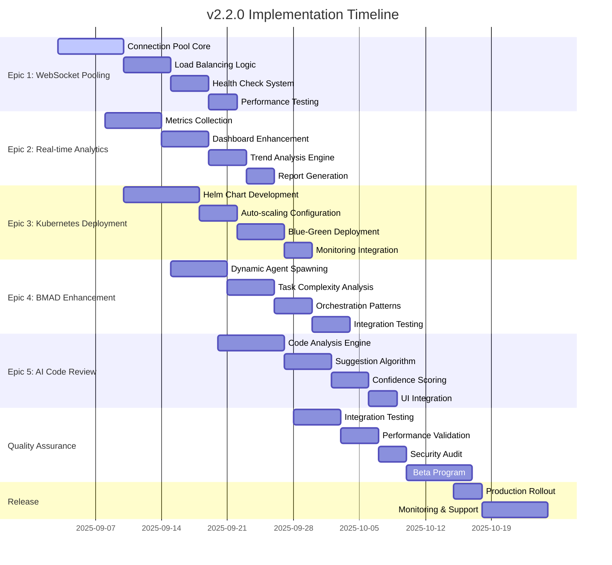
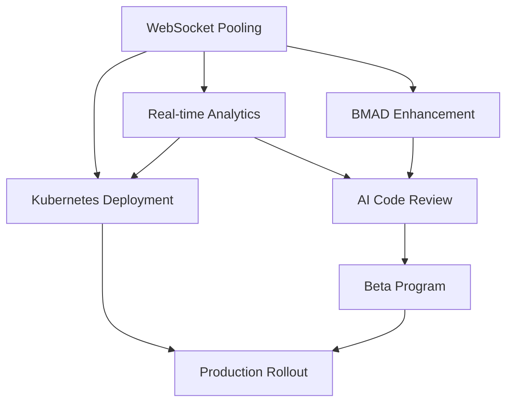
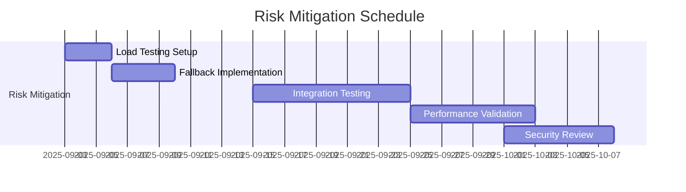

# Automatic Claude Code v2.2.0 Project Roadmap

## Executive Summary
Implementation roadmap for v2.2.0 featuring enterprise-scale agent coordination, WebSocket connection pooling, real-time analytics, and Kubernetes deployment capabilities.

## 📊 Gantt Chart

## 🎯 Milestones & Deliverables

### Phase 1: Foundation (Sep 3-17)
| Milestone | Date | Deliverables | Owner |
|-----------|------|--------------|-------|
| WebSocket Pool v1 | Sep 12 | Connection pooling, load balancing | Backend Team |
| Analytics Core | Sep 14 | Metrics collection, basic dashboard | Frontend Team |
| K8s Foundation | Sep 17 | Base Helm charts, pod configs | DevOps Team |

### Phase 2: Integration (Sep 18 - Oct 2)
| Milestone | Date | Deliverables | Owner |
|-----------|------|--------------|-------|
| BMAD Enhancement | Sep 25 | Dynamic spawning, complexity analysis | AI Team |
| AI Code Review Alpha | Sep 28 | Code analysis engine, basic suggestions | ML Team |
| Full Integration | Oct 2 | All epics integrated, QA ready | Full Team |

### Phase 3: Release (Oct 3-22)
| Milestone | Date | Deliverables | Owner |
|-----------|------|--------------|-------|
| Beta Release | Oct 10 | Feature-complete beta, documentation | Release Team |
| Production Ready | Oct 15 | Security audit complete, monitoring | QA Team |
| GA Release | Oct 22 | v2.2.0 production deployment | Release Team |

## 🔗 Epic Dependencies

## 👥 Resource Allocation

### Team Assignments
| Epic | Primary Owner | Team Size | Key Skills |
|------|--------------|-----------|------------|
| WebSocket Pooling | Backend Lead | 3 devs | Node.js, WebSocket, Load Balancing |
| Real-time Analytics | Frontend Lead | 2 devs + 1 designer | React, D3.js, WebSocket |
| Kubernetes Deployment | DevOps Lead | 2 devs | K8s, Helm, Docker, Monitoring |
| BMAD Enhancement | AI Architecture Lead | 2 devs | Agent Systems, TypeScript |
| AI Code Review | ML Lead | 2 devs + 1 researcher | NLP, Code Analysis, ML |

### Resource Requirements Matrix
| Resource Type | Week 1-2 | Week 3-4 | Week 5-6 | Week 7-8 |
|---------------|----------|----------|----------|----------|
| Backend Devs | 5 | 6 | 4 | 2 |
| Frontend Devs | 2 | 3 | 4 | 3 |
| DevOps Devs | 2 | 3 | 3 | 4 |
| QA Engineers | 1 | 2 | 4 | 3 |
| ML Engineers | 0 | 2 | 3 | 2 |

## ⚠️ Risk Timeline & Mitigation

### Critical Path Analysis
**Longest Path**: WebSocket Pooling → Real-time Analytics → AI Code Review → Beta Program (25 days)

### High-Risk Items
| Risk | Week | Probability | Impact | Mitigation |
|------|------|------------|---------|------------|
| WebSocket scaling issues | 2-3 | High | High | Parallel load testing, fallback to HTTP |
| K8s complexity | 4-5 | Medium | High | Simplified initial deployment, gradual rollout |
| BMAD integration breaks | 5-6 | Medium | Medium | Extensive backward compatibility testing |
| AI model accuracy | 6-7 | Low | Medium | Human reviewer fallback, confidence thresholds |

### Risk Mitigation Timeline

## 🚀 Release Strategy

### Feature Flags Configuration
| Feature | Flag Name | Default | Rollout % |
|---------|-----------|---------|-----------|
| WebSocket Pooling | `ws-pooling-enabled` | false | 0% → 25% → 100% |
| Real-time Analytics | `analytics-v2` | false | 0% → 50% → 100% |
| AI Code Review | `ai-review-beta` | false | 0% → 10% → 50% |
| Auto-scaling | `k8s-autoscale` | false | 0% → 100% |

### Testing Phases
1. **Unit Testing** (Continuous): 90%+ coverage
2. **Integration Testing** (Week 6): Cross-epic functionality
3. **Load Testing** (Week 7): 1000 concurrent users
4. **Security Testing** (Week 7): Penetration testing, vulnerability scan
5. **Beta Testing** (Week 8): 50 enterprise customers
6. **Canary Deployment** (Week 9): 5% production traffic

## 📊 Sprint Breakdown (2-week sprints)

### Sprint 1 (Sep 3-16): Foundation
- **WebSocket Pool**: Core connection management
- **Analytics**: Data collection infrastructure
- **K8s**: Base manifests and networking

### Sprint 2 (Sep 17-30): Enhancement
- **WebSocket Pool**: Load balancing and health checks  
- **BMAD**: Dynamic agent spawning
- **Analytics**: Dashboard improvements

### Sprint 3 (Oct 1-14): Integration
- **AI Code Review**: Analysis engine integration
- **K8s**: Auto-scaling and blue-green deployment
- **Full system integration testing**

### Sprint 4 (Oct 15-28): Release
- **Beta program execution**
- **Production deployment**
- **Monitoring and support setup**

## ✅ Success Metrics Checkpoints

### Technical KPIs
| Metric | Week 4 | Week 6 | Week 8 | GA |
|--------|--------|--------|--------|-----|
| WebSocket Connection Time | <200ms | <150ms | <100ms | <100ms |
| Dashboard Latency | <1s | <750ms | <500ms | <500ms |
| Agent Quality Score | >65% | >68% | >70% | >70% |
| System Uptime | >99% | >99.5% | >99.9% | >99.9% |

### Business KPIs
| Metric | Beta | Week 2 | Week 4 | Month 3 |
|--------|------|--------|--------|---------|
| Enterprise Adoption | 5 | 15 | 30 | 100 |
| Performance Improvement | 20% | 30% | 40% | 50% |
| Customer Satisfaction | 4.0/5 | 4.2/5 | 4.5/5 | 4.5/5 |

## 🔄 Production Rollout Strategy

### Deployment Phases
1. **Internal Alpha** (Oct 3-7): Engineering team validation
2. **Closed Beta** (Oct 8-14): 50 selected enterprise customers
3. **Open Beta** (Oct 15-18): Public beta with feature flags
4. **Canary Release** (Oct 19-21): 5% → 25% → 50% production traffic
5. **Full Release** (Oct 22): 100% traffic, full monitoring

### Rollback Triggers
- WebSocket connection success rate <95%
- Dashboard error rate >1%
- Agent coordination quality score <65%
- Memory usage >150MB per session
- Customer-reported critical issues >5/day

---

**Project Manager**: AI Development Lead  
**Last Updated**: 2025-09-02  
**Review Cycle**: Weekly (Mondays 9 AM EST)  
**Escalation Path**: Engineering Manager → VP Engineering → CTO