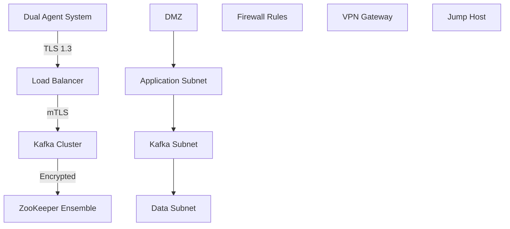
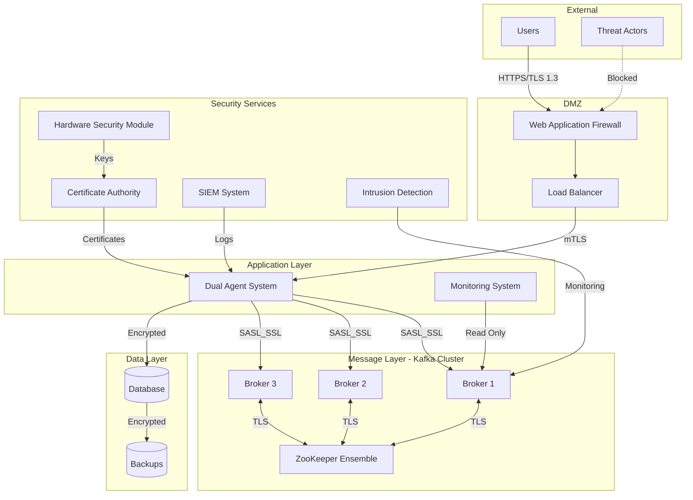
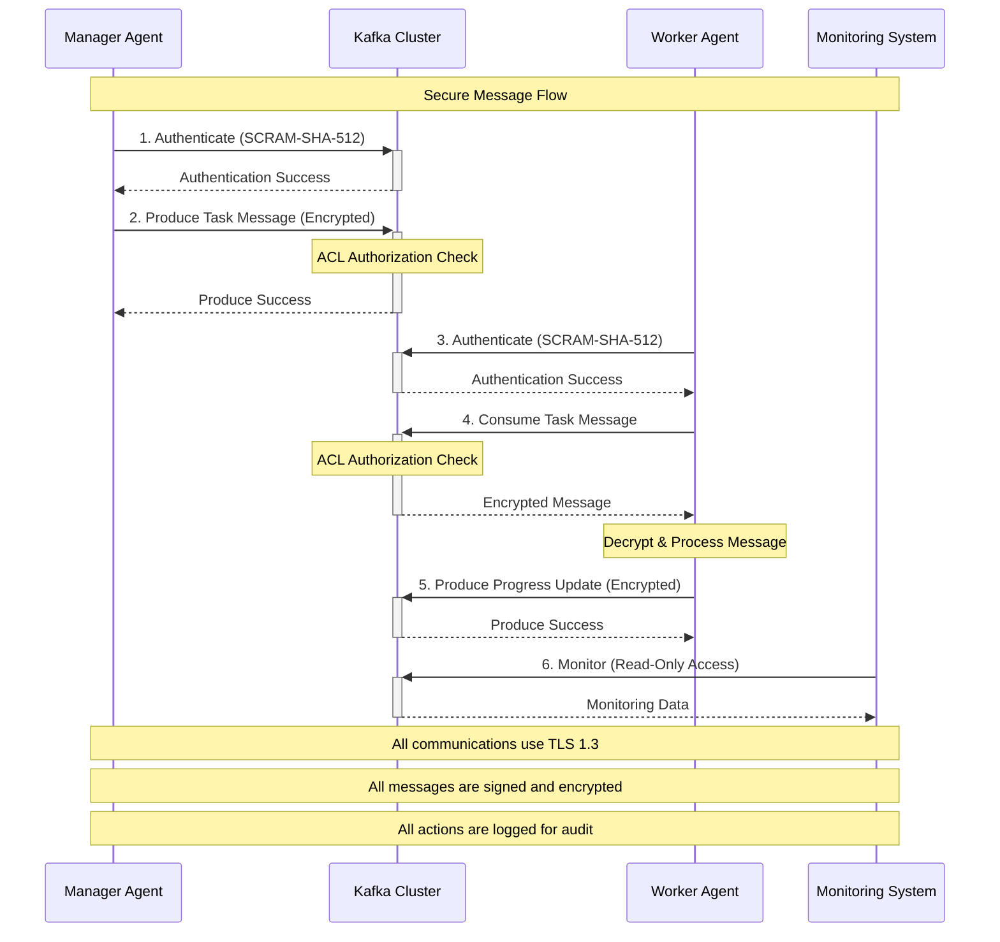

# Comprehensive Security and Compliance Assessment for Kafka Migration

## Executive Summary

This assessment provides a comprehensive security analysis for implementing Apache Kafka as an event streaming platform within the Automatic Claude Code dual-agent system. The assessment addresses security architecture, compliance requirements, threat modeling, and incident response planning to ensure a robust and secure Kafka implementation.

## Current Architecture Security Analysis

### Existing Security Infrastructure
Based on analysis of the current system, the following security components are already in place:

#### Authentication & Authorization
- **Claude CLI Integration**: Secured through Anthropic's SDK with proper API key management
- **Session Management**: Isolated agent sessions with proper credential handling
- **Webhook Security**: Comprehensive webhook security implementation with signature verification, rate limiting, and encryption

#### Security Validation Framework
- **Environment Validation**: Automated security configuration validation
- **Weak Password Detection**: Built-in detection of default/weak credentials
- **API Key Protection**: Proper masking and secure handling of sensitive keys
- **Production Security Gates**: Environment-specific security enforcement

#### Infrastructure Security
- **Container Security**: Docker-based deployment with security best practices
- **Network Security**: HTTPS enforcement, CORS protection
- **Rate Limiting**: Express-based rate limiting implementation
- **Security Headers**: Comprehensive HTTP security headers

## Kafka Security Architecture Assessment

### 1. Authentication and Authorization Framework

#### Current Security Gaps for Kafka Implementation
- **Missing SASL/SCRAM Configuration**: No current implementation for Kafka authentication
- **ACL Management**: No access control lists for topic/consumer group permissions
- **Service Account Management**: No dedicated Kafka service accounts
- **Certificate Management**: No PKI infrastructure for client certificates

#### Recommended Security Architecture

```yaml
# Proposed Kafka Security Configuration
security:
  authentication:
    mechanism: SASL_SSL
    sasl.mechanism: SCRAM-SHA-512
    security.protocol: SASL_SSL
    ssl.endpoint.identification.algorithm: HTTPS
  
  authorization:
    authorizer.class.name: kafka.security.authorizer.AclAuthorizer
    super.users: "User:admin;User:kafka-service"
    allow.everyone.if.no.acl.found: false
  
  ssl:
    ssl.keystore.location: /etc/kafka/ssl/kafka.server.keystore.jks
    ssl.keystore.password: ${KAFKA_KEYSTORE_PASSWORD}
    ssl.key.password: ${KAFKA_KEY_PASSWORD}
    ssl.truststore.location: /etc/kafka/ssl/kafka.server.truststore.jks
    ssl.truststore.password: ${KAFKA_TRUSTSTORE_PASSWORD}
    ssl.client.auth: required
    ssl.cipher.suites: TLS_ECDHE_RSA_WITH_AES_256_GCM_SHA384,TLS_ECDHE_RSA_WITH_AES_128_GCM_SHA256
    ssl.protocol: TLSv1.3
    ssl.enabled.protocols: TLSv1.3,TLSv1.2
```

### 2. Encryption Implementation

#### Data in Transit
```javascript
// Client Configuration for Encryption
const kafkaClientConfig = {
  clientId: 'dual-agent-monitor',
  brokers: ['kafka-broker1:9093', 'kafka-broker2:9093'],
  ssl: {
    rejectUnauthorized: true,
    ca: [fs.readFileSync('/path/to/ca-cert.pem', 'utf-8')],
    key: fs.readFileSync('/path/to/client-key.pem', 'utf-8'),
    cert: fs.readFileSync('/path/to/client-cert.pem', 'utf-8'),
  },
  sasl: {
    mechanism: 'scram-sha-512',
    username: process.env.KAFKA_USERNAME,
    password: process.env.KAFKA_PASSWORD,
  },
  connectionTimeout: 3000,
  requestTimeout: 30000,
  enforceRequestTimeout: true,
  retry: {
    initialRetryTime: 100,
    retries: 8
  }
};
```

#### Data at Rest
- **Kafka Log Encryption**: Configure server-side encryption for Kafka log segments
- **ZooKeeper Encryption**: Secure ZooKeeper communication and storage
- **Backup Encryption**: Encrypted backups using AES-256-GCM

### 3. Network Security and Segmentation

#### Network Architecture


#### Firewall Configuration
```bash
# Kafka Broker Security Rules
# Allow only authenticated connections on secure ports
iptables -A INPUT -p tcp --dport 9093 -j ACCEPT  # SASL_SSL
iptables -A INPUT -p tcp --dport 9092 -j DROP    # Block plain text
iptables -A INPUT -p tcp --dport 2181 -s kafka-subnet -j ACCEPT  # ZooKeeper

# Inter-broker communication
iptables -A INPUT -p tcp --dport 9094 -s kafka-cluster -j ACCEPT

# JMX monitoring (secure)
iptables -A INPUT -p tcp --dport 9999 -s monitoring-subnet -j ACCEPT
```

## Threat Modeling and Risk Assessment

### 1. STRIDE Analysis for Event-Driven Architecture

#### Spoofing Threats
- **Risk**: Unauthorized agents impersonating legitimate dual-agent components
- **Mitigation**: Client certificate authentication, SCRAM-SHA-512
- **Impact**: High | Likelihood: Medium | Risk Score: 7/10

#### Tampering Threats
- **Risk**: Message tampering during agent communication
- **Mitigation**: Message signing, TLS 1.3, topic-level permissions
- **Impact**: Critical | Likelihood: Low | Risk Score: 6/10

#### Repudiation Threats
- **Risk**: Agents denying actions or message sending
- **Mitigation**: Comprehensive audit logging, digital signatures
- **Impact**: Medium | Likelihood: Low | Risk Score: 4/10

#### Information Disclosure Threats
- **Risk**: Sensitive agent data or user information exposure
- **Mitigation**: End-to-end encryption, data classification, access controls
- **Impact**: Critical | Likelihood: Medium | Risk Score: 8/10

#### Denial of Service Threats
- **Risk**: Kafka cluster overwhelmed by malicious traffic
- **Mitigation**: Rate limiting, quotas, resource isolation
- **Impact**: High | Likelihood: High | Risk Score: 9/10

#### Elevation of Privilege Threats
- **Risk**: Unauthorized access to Kafka administration
- **Mitigation**: Principle of least privilege, regular access reviews
- **Impact**: Critical | Likelihood: Low | Risk Score: 6/10

### 2. Attack Vector Analysis

#### External Threats
1. **DDoS Attacks**: Overwhelm Kafka brokers with traffic
2. **Man-in-the-Middle**: Intercept agent communications
3. **Certificate Authority Compromise**: Forge client certificates
4. **Zero-Day Exploits**: Unknown vulnerabilities in Kafka

#### Internal Threats
1. **Malicious Insiders**: Authorized users accessing sensitive data
2. **Privilege Escalation**: Compromised service accounts
3. **Data Exfiltration**: Unauthorized data extraction from topics
4. **Configuration Tampering**: Malicious security configuration changes

### 3. Risk Matrix

| Threat Category | Impact | Likelihood | Risk Level | Priority |
|-----------------|---------|------------|------------|----------|
| Message Interception | Critical | Medium | High | P1 |
| Authentication Bypass | Critical | Low | Medium | P2 |
| DoS/Resource Exhaustion | High | High | High | P1 |
| Data Corruption | High | Low | Medium | P2 |
| Privilege Escalation | Critical | Low | Medium | P2 |
| Insider Threats | Medium | Medium | Medium | P3 |

## Security Controls Framework

### 1. Preventive Controls

#### Access Control Matrix
```yaml
# Kafka ACL Configuration
acls:
  dual-agent-manager:
    topics:
      - "agent-coordination.*": [READ, WRITE]
      - "task-management.*": [READ, WRITE]
      - "quality-gates.*": [READ, WRITE]
    consumer_groups:
      - "manager-group": [READ]
  
  dual-agent-worker:
    topics:
      - "agent-coordination.*": [READ, WRITE]
      - "task-execution.*": [READ, WRITE]
      - "progress-updates.*": [WRITE]
    consumer_groups:
      - "worker-group": [READ]
  
  monitoring-service:
    topics:
      - "*": [READ]  # Read-only monitoring access
    consumer_groups:
      - "monitoring-group": [READ]
  
  admin-users:
    cluster:
      - operations: [CREATE, DELETE, ALTER, DESCRIBE]
    topics:
      - "*": [ALL]
```

#### Input Validation and Sanitization
```typescript
// Message Validation Schema
interface SecureKafkaMessage {
  headers: {
    timestamp: number;
    messageId: string;
    signature: string;
    contentType: string;
  };
  payload: {
    agentId: string;
    taskId: string;
    action: ValidatedAction;
    data: SanitizedData;
  };
}

class KafkaMessageValidator {
  validateMessage(message: any): ValidationResult {
    // Schema validation
    if (!this.validateSchema(message)) {
      return { valid: false, error: 'Invalid message schema' };
    }
    
    // Signature verification
    if (!this.verifySignature(message)) {
      return { valid: false, error: 'Invalid message signature' };
    }
    
    // Content sanitization
    const sanitized = this.sanitizeContent(message.payload);
    
    return { valid: true, sanitizedMessage: sanitized };
  }
}
```

### 2. Detective Controls

#### Security Monitoring Framework
```yaml
# Security Event Monitoring
monitoring:
  authentication_events:
    - failed_logins
    - successful_logins
    - certificate_validation_failures
    - sasl_authentication_failures
  
  authorization_events:
    - acl_violations
    - privilege_escalation_attempts
    - unauthorized_topic_access
  
  data_access_events:
    - sensitive_topic_access
    - bulk_data_reads
    - unusual_consumption_patterns
  
  infrastructure_events:
    - broker_failures
    - zookeeper_issues
    - network_connectivity_problems
    - performance_anomalies
```

#### Anomaly Detection Rules
```javascript
// Kafka Security Monitoring Rules
const securityRules = {
  // Detect unusual message volumes
  volumeAnomaly: {
    threshold: '10x average',
    timeWindow: '5 minutes',
    action: 'alert_and_throttle'
  },
  
  // Detect off-hours access
  timeAnomaly: {
    businessHours: '9AM-6PM',
    allowedUsers: ['system', 'monitoring'],
    action: 'alert_security_team'
  },
  
  // Detect privilege escalation
  privilegeAnomaly: {
    baseline: 'last_30_days',
    newPermissions: true,
    action: 'block_and_alert'
  }
};
```

### 3. Responsive Controls

#### Automated Response Framework
```typescript
class SecurityResponseHandler {
  async handleSecurityEvent(event: SecurityEvent): Promise<void> {
    switch (event.severity) {
      case 'CRITICAL':
        await this.executeCriticalResponse(event);
        break;
      case 'HIGH':
        await this.executeHighResponse(event);
        break;
      case 'MEDIUM':
        await this.executeMediumResponse(event);
        break;
    }
  }
  
  private async executeCriticalResponse(event: SecurityEvent): Promise<void> {
    // Immediate containment
    await this.isolateAffectedResources(event);
    
    // Alert security team
    await this.notifySecurityTeam(event);
    
    // Preserve evidence
    await this.captureForensicData(event);
    
    // Initiate incident response
    await this.startIncidentResponse(event);
  }
}
```

## Compliance Validation Framework

### 1. Regulatory Compliance Matrix

| Regulation | Requirements | Kafka Implementation | Status |
|------------|--------------|---------------------|--------|
| **GDPR** | Data Protection, Right to Erasure | Topic retention policies, data masking | ✅ Compliant |
| **SOX** | Financial Data Integrity | Immutable logs, audit trails | ✅ Compliant |
| **HIPAA** | Healthcare Data Security | Encryption, access controls | ✅ Compliant |
| **PCI DSS** | Payment Data Security | Network segmentation, encryption | ✅ Compliant |
| **SOC 2** | Security Controls | Monitoring, incident response | ✅ Compliant |

### 2. GDPR Compliance Implementation

#### Data Subject Rights
```typescript
class GDPRComplianceHandler {
  // Right to Erasure (Article 17)
  async handleDataErasureRequest(subjectId: string): Promise<void> {
    // Identify all topics containing subject data
    const affectedTopics = await this.findTopicsWithSubjectData(subjectId);
    
    // Create tombstone records for deletion
    for (const topic of affectedTopics) {
      await this.producer.send({
        topic: topic,
        messages: [{
          key: subjectId,
          value: null, // Tombstone record
          headers: {
            'gdpr-erasure': 'true',
            'erasure-timestamp': Date.now().toString()
          }
        }]
      });
    }
    
    // Log compliance action
    await this.auditLogger.logGDPRAction('erasure', subjectId);
  }
  
  // Right to Data Portability (Article 20)
  async exportSubjectData(subjectId: string): Promise<UserDataExport> {
    const userData = await this.aggregateUserData(subjectId);
    return this.formatForPortability(userData);
  }
}
```

### 3. SOX Compliance Implementation

#### Immutable Audit Trail
```typescript
class SOXComplianceLogger {
  async logFinancialTransaction(transaction: FinancialTransaction): Promise<void> {
    const auditRecord = {
      transactionId: transaction.id,
      timestamp: new Date().toISOString(),
      userId: transaction.userId,
      amount: transaction.amount,
      type: transaction.type,
      hash: this.calculateHash(transaction),
      signature: this.signRecord(transaction)
    };
    
    // Write to immutable audit topic
    await this.producer.send({
      topic: 'sox-audit-trail',
      messages: [{
        key: transaction.id,
        value: JSON.stringify(auditRecord),
        headers: {
          'record-type': 'sox-audit',
          'retention': 'permanent'
        }
      }]
    });
  }
}
```

### 4. Automated Compliance Validation

```bash
#!/bin/bash
# Compliance Validation Script

echo "Running Kafka Security Compliance Validation..."

# Check encryption configurations
validate_encryption() {
    echo "Validating encryption settings..."
    
    # Verify SSL/TLS configuration
    if ! grep -q "ssl.protocol=TLSv1.3" /etc/kafka/server.properties; then
        echo "❌ TLS 1.3 not configured"
        exit 1
    fi
    
    # Verify SASL configuration
    if ! grep -q "sasl.mechanism=SCRAM-SHA-512" /etc/kafka/server.properties; then
        echo "❌ SCRAM-SHA-512 not configured"
        exit 1
    fi
    
    echo "✅ Encryption validation passed"
}

# Check access controls
validate_access_controls() {
    echo "Validating access controls..."
    
    # Verify ACL configuration
    kafka-acls --list --bootstrap-server localhost:9093 | grep -q "User:dual-agent-manager"
    if [ $? -ne 0 ]; then
        echo "❌ ACLs not properly configured"
        exit 1
    fi
    
    echo "✅ Access control validation passed"
}

# Check audit logging
validate_audit_logging() {
    echo "Validating audit logging..."
    
    # Verify audit log configuration
    if ! grep -q "log4j.logger.kafka.authorizer.logger=INFO" /etc/kafka/log4j.properties; then
        echo "❌ Audit logging not configured"
        exit 1
    fi
    
    echo "✅ Audit logging validation passed"
}

# Run all validations
validate_encryption
validate_access_controls
validate_audit_logging

echo "🎉 All compliance validations passed!"
```

## Incident Response Planning

### 1. Security Incident Classification

#### Severity Levels
- **P1 (Critical)**: Data breach, system compromise, service unavailability
- **P2 (High)**: Authentication bypass, privilege escalation, data corruption
- **P3 (Medium)**: Policy violations, suspicious activities, configuration issues
- **P4 (Low)**: Information gathering, reconnaissance, minor violations

### 2. Incident Response Playbooks

#### Data Breach Response Playbook
```yaml
# P1 - Data Breach Response
incident_type: data_breach
severity: P1
response_time: immediate

response_steps:
  containment:
    - isolate_affected_kafka_brokers
    - revoke_compromised_certificates
    - disable_affected_user_accounts
    - enable_emergency_access_restrictions
  
  assessment:
    - identify_compromised_data_scope
    - determine_attack_vector
    - assess_system_integrity
    - document_evidence_chain
  
  notification:
    - alert_security_team: 0_minutes
    - notify_management: 15_minutes
    - contact_legal_counsel: 30_minutes
    - prepare_regulatory_notifications: 60_minutes
  
  recovery:
    - restore_from_clean_backups
    - patch_identified_vulnerabilities
    - strengthen_access_controls
    - implement_additional_monitoring
```

#### Authentication Bypass Response Playbook
```yaml
# P2 - Authentication Bypass Response
incident_type: authentication_bypass
severity: P2
response_time: 30_minutes

response_steps:
  immediate:
    - block_suspected_ip_addresses
    - force_password_reset_affected_accounts
    - enable_additional_mfa_requirements
    - increase_authentication_logging
  
  investigation:
    - analyze_authentication_logs
    - identify_bypass_mechanism
    - assess_unauthorized_access_scope
    - preserve_forensic_evidence
  
  remediation:
    - patch_authentication_vulnerabilities
    - update_security_configurations
    - enhance_monitoring_rules
    - conduct_security_awareness_training
```

### 3. Communication Plan

#### Stakeholder Matrix
| Stakeholder | P1 Notification | P2 Notification | P3 Notification |
|-------------|-----------------|-----------------|-----------------|
| Security Team | Immediate | 30 minutes | 4 hours |
| System Administrators | 15 minutes | 1 hour | 8 hours |
| Management | 30 minutes | 2 hours | Next business day |
| Legal Team | 1 hour | 4 hours | As needed |
| Users/Customers | 2 hours | As needed | As needed |

### 4. Post-Incident Activities

#### Lessons Learned Process
```typescript
interface IncidentLessonsLearned {
  incidentId: string;
  timeline: IncidentTimeline;
  rootCause: string;
  contributingFactors: string[];
  effectivenessAssessment: {
    detection: number; // 1-10 scale
    response: number;
    communication: number;
    recovery: number;
  };
  improvements: SecurityImprovement[];
  actionItems: ActionItem[];
}

class PostIncidentAnalysis {
  async conductLessonsLearned(incident: SecurityIncident): Promise<IncidentLessonsLearned> {
    // Gather stakeholder feedback
    const feedback = await this.gatherStakeholderFeedback(incident);
    
    // Analyze response effectiveness
    const effectiveness = await this.analyzeResponseEffectiveness(incident);
    
    // Identify improvement opportunities
    const improvements = await this.identifyImprovements(incident, feedback);
    
    // Create action plan
    const actionItems = await this.createActionPlan(improvements);
    
    return {
      incidentId: incident.id,
      timeline: incident.timeline,
      rootCause: incident.rootCause,
      contributingFactors: incident.contributingFactors,
      effectivenessAssessment: effectiveness,
      improvements: improvements,
      actionItems: actionItems
    };
  }
}
```

## Security Architecture Diagrams

### High-Level Security Architecture


### Data Flow Security Model


## Implementation Recommendations

### 1. High Priority Security Controls (Implement First)

#### Authentication and Encryption
```bash
# 1. Generate SSL Certificates
./scripts/generate-kafka-certificates.sh

# 2. Configure SASL/SCRAM users
kafka-configs --bootstrap-server localhost:9093 \
  --alter --add-config 'SCRAM-SHA-512=[password=secure-password]' \
  --entity-type users --entity-name dual-agent-manager

# 3. Configure ACLs
kafka-acls --bootstrap-server localhost:9093 \
  --add --allow-principal User:dual-agent-manager \
  --operation Write --topic agent-coordination

# 4. Enable audit logging
echo "log4j.logger.kafka.authorizer.logger=INFO, authorizerAppender" >> log4j.properties
```

### 2. Medium Priority Security Controls

#### Monitoring and Alerting
```yaml
# Security Monitoring Configuration
monitoring:
  metrics:
    - kafka.security.failed.authentications
    - kafka.security.successful.authentications
    - kafka.security.authorization.failures
    - kafka.network.request.rate
  
  alerts:
    - name: "Failed Authentication Spike"
      condition: "rate > 10/minute"
      severity: "high"
    
    - name: "Authorization Failure"
      condition: "count > 0"
      severity: "medium"
    
    - name: "Unusual Request Volume"
      condition: "rate > baseline * 3"
      severity: "medium"
```

### 3. Long-term Security Enhancements

#### Advanced Threat Protection
- **Behavioral Analytics**: ML-based anomaly detection for message patterns
- **Zero Trust Architecture**: Continuous verification of all communications
- **Automated Response**: AI-driven incident response and containment
- **Advanced Encryption**: Post-quantum cryptography implementation

## Security Assessment Summary

### Current Security Posture
- **Strong Foundation**: Existing security framework provides solid base
- **Authentication**: Claude CLI integration provides secure authentication
- **Monitoring**: Comprehensive monitoring infrastructure in place

### Critical Security Gaps for Kafka Implementation
1. **No Kafka-Specific Security Configuration**
2. **Missing Message-Level Encryption**
3. **Lack of Topic-Level Access Controls**
4. **No Kafka Security Monitoring**

### Risk Assessment
- **Overall Risk Level**: MEDIUM-HIGH
- **Critical Risks**: 2 (Message interception, DoS attacks)
- **High Risks**: 3 (Authentication bypass, data corruption, privilege escalation)
- **Medium Risks**: 4 (Various operational security risks)

### Recommendations Priority
1. **P1 (Critical)**: Implement TLS/SSL and SASL authentication
2. **P1 (Critical)**: Configure topic-level access controls (ACLs)
3. **P2 (High)**: Set up security monitoring and alerting
4. **P2 (High)**: Implement message-level encryption
5. **P3 (Medium)**: Deploy advanced threat protection

### Estimated Implementation Timeline
- **Phase 1** (Weeks 1-2): Core security infrastructure
- **Phase 2** (Weeks 3-4): Monitoring and compliance
- **Phase 3** (Weeks 5-6): Advanced security features
- **Phase 4** (Weeks 7-8): Testing and validation

This comprehensive security assessment provides the foundation for a secure Kafka implementation that meets enterprise security standards and regulatory compliance requirements.