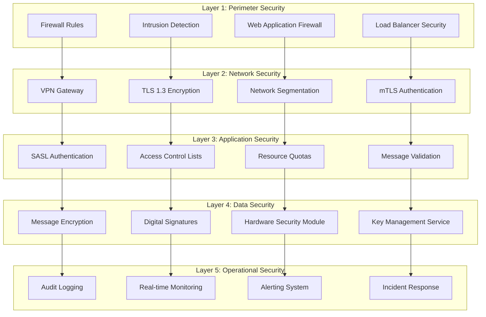

# Kafka Security Controls and Monitoring Framework

## Overview

This document defines a comprehensive security controls framework for Apache Kafka implementation within the dual-agent system. The framework provides layered security controls, real-time monitoring, and automated response capabilities to protect against identified threats.

## Security Control Architecture

### Layered Security Model


## Security Control Categories

### 1. Preventive Controls

#### Authentication and Authorization

##### Multi-Factor Authentication Framework
```typescript
interface AuthenticationContext {
  clientId: string;
  certificateFingerprint: string;
  saslCredentials: {
    username: string;
    passwordHash: string;
    mechanism: 'SCRAM-SHA-512' | 'OAUTHBEARER';
  };
  ipAddress: string;
  timestamp: Date;
  sessionToken?: string;
}

class KafkaAuthenticationManager {
  private readonly certificateStore: CertificateStore;
  private readonly credentialValidator: CredentialValidator;
  private readonly tokenManager: TokenManager;

  async authenticateClient(context: AuthenticationContext): Promise<AuthenticationResult> {
    // Step 1: Certificate validation
    const certValid = await this.certificateStore.validateCertificate(
      context.certificateFingerprint
    );
    
    if (!certValid.isValid) {
      await this.auditLogger.logAuthFailure(context, 'INVALID_CERTIFICATE');
      return { success: false, reason: 'Certificate validation failed' };
    }

    // Step 2: SASL credential verification
    const credValid = await this.credentialValidator.validateCredentials(
      context.saslCredentials
    );
    
    if (!credValid.isValid) {
      await this.auditLogger.logAuthFailure(context, 'INVALID_CREDENTIALS');
      return { success: false, reason: 'Invalid credentials' };
    }

    // Step 3: IP-based access control
    const ipAllowed = await this.validateIPAccess(context.ipAddress, context.clientId);
    
    if (!ipAllowed) {
      await this.auditLogger.logAuthFailure(context, 'IP_NOT_ALLOWED');
      return { success: false, reason: 'IP address not authorized' };
    }

    // Step 4: Generate session token
    const sessionToken = await this.tokenManager.generateSessionToken(context);
    
    await this.auditLogger.logAuthSuccess(context);
    
    return {
      success: true,
      sessionToken: sessionToken,
      permissions: await this.getClientPermissions(context.clientId)
    };
  }
}
```

##### Fine-Grained Access Control Lists
```yaml
# ACL Configuration for Dual-Agent System
acl_rules:
  # Manager Agent Permissions
  manager_agent:
    principal: "User:dual-agent-manager"
    permissions:
      cluster:
        - operation: "DescribeConfigs"
          resource: "cluster"
          permission: "ALLOW"
      topics:
        - name: "agent.coordination.*"
          operations: ["READ", "WRITE", "DESCRIBE"]
          permission: "ALLOW"
        - name: "task.management.*"
          operations: ["READ", "WRITE", "CREATE", "DESCRIBE"]
          permission: "ALLOW"
        - name: "quality.gates.*"
          operations: ["READ", "WRITE", "DESCRIBE"]
          permission: "ALLOW"
        - name: "audit.*"
          operations: ["WRITE", "DESCRIBE"]
          permission: "ALLOW"
        - name: "sensitive.*"
          operations: ["ALL"]
          permission: "DENY"
      consumer_groups:
        - name: "manager-coordination-group"
          operations: ["READ", "DESCRIBE"]
          permission: "ALLOW"
        - name: "manager-quality-group"
          operations: ["READ", "DESCRIBE"]
          permission: "ALLOW"

  # Worker Agent Permissions
  worker_agent:
    principal: "User:dual-agent-worker"
    permissions:
      topics:
        - name: "agent.coordination.worker.*"
          operations: ["READ", "DESCRIBE"]
          permission: "ALLOW"
        - name: "task.execution.*"
          operations: ["READ", "WRITE", "DESCRIBE"]
          permission: "ALLOW"
        - name: "progress.updates.*"
          operations: ["WRITE", "DESCRIBE"]
          permission: "ALLOW"
        - name: "file.operations.*"
          operations: ["READ", "WRITE", "DESCRIBE"]
          permission: "ALLOW"
        - name: "audit.*"
          operations: ["WRITE", "DESCRIBE"]
          permission: "ALLOW"
        - name: "sensitive.*"
          operations: ["ALL"]
          permission: "DENY"
        - name: "admin.*"
          operations: ["ALL"]
          permission: "DENY"
      consumer_groups:
        - name: "worker-task-group"
          operations: ["READ", "DESCRIBE"]
          permission: "ALLOW"

  # Monitoring Service Permissions
  monitoring_service:
    principal: "User:monitoring-service"
    permissions:
      topics:
        - name: "*"
          operations: ["READ", "DESCRIBE"]
          permission: "ALLOW"
          conditions:
            - source_ip: "10.0.1.0/24"  # Monitoring subnet only
            - time_window: "00:00-23:59"  # 24/7 access
        - name: "sensitive.*"
          operations: ["ALL"]
          permission: "DENY"
      consumer_groups:
        - name: "monitoring-*"
          operations: ["READ", "DESCRIBE"]
          permission: "ALLOW"

  # Admin Users (Emergency Access)
  admin_users:
    principal: "User:kafka-admin"
    permissions:
      cluster:
        - operation: "ALL"
          permission: "ALLOW"
          conditions:
            - mfa_required: true
            - approval_required: true
            - session_timeout: 3600  # 1 hour max
      topics:
        - name: "*"
          operations: ["ALL"]
          permission: "ALLOW"
          conditions:
            - justification_required: true
            - audit_enhanced: true
```

#### Input Validation and Sanitization

##### Message Validation Framework
```typescript
interface KafkaMessageSchema {
  messageId: string;
  agentId: string;
  messageType: string;
  timestamp: number;
  payload: any;
  signature?: string;
  encryptionMetadata?: EncryptionMetadata;
}

class MessageValidator {
  private readonly schemaRegistry: SchemaRegistry;
  private readonly signatureValidator: SignatureValidator;
  private readonly sanitizer: DataSanitizer;

  async validateMessage(message: any): Promise<ValidationResult> {
    const validationResult: ValidationResult = {
      isValid: true,
      errors: [],
      warnings: [],
      sanitizedMessage: null
    };

    try {
      // Step 1: Schema validation
      const schemaValidation = await this.schemaRegistry.validate(message);
      if (!schemaValidation.isValid) {
        validationResult.isValid = false;
        validationResult.errors.push('Schema validation failed');
        return validationResult;
      }

      // Step 2: Required field validation
      const requiredFields = ['messageId', 'agentId', 'messageType', 'timestamp'];
      for (const field of requiredFields) {
        if (!message[field]) {
          validationResult.errors.push(`Missing required field: ${field}`);
        }
      }

      // Step 3: Data type validation
      if (typeof message.timestamp !== 'number' || message.timestamp <= 0) {
        validationResult.errors.push('Invalid timestamp format');
      }

      if (typeof message.agentId !== 'string' || !this.isValidAgentId(message.agentId)) {
        validationResult.errors.push('Invalid agent ID format');
      }

      // Step 4: Message size validation
      const messageSize = JSON.stringify(message).length;
      if (messageSize > this.getMaxMessageSize()) {
        validationResult.errors.push(`Message exceeds maximum size: ${messageSize} bytes`);
      }

      // Step 5: Signature validation (if present)
      if (message.signature) {
        const signatureValid = await this.signatureValidator.verify(
          message,
          message.signature
        );
        if (!signatureValid) {
          validationResult.errors.push('Invalid message signature');
        }
      }

      // Step 6: Content sanitization
      validationResult.sanitizedMessage = await this.sanitizer.sanitize(message);

      // Step 7: Business logic validation
      await this.validateBusinessRules(message, validationResult);

      validationResult.isValid = validationResult.errors.length === 0;
      
    } catch (error) {
      validationResult.isValid = false;
      validationResult.errors.push(`Validation error: ${error.message}`);
    }

    return validationResult;
  }

  private async validateBusinessRules(message: any, result: ValidationResult): Promise<void> {
    // Agent-specific validation rules
    switch (message.messageType) {
      case 'TASK_ASSIGNMENT':
        await this.validateTaskAssignment(message, result);
        break;
      case 'PROGRESS_UPDATE':
        await this.validateProgressUpdate(message, result);
        break;
      case 'QUALITY_GATE':
        await this.validateQualityGate(message, result);
        break;
    }
  }

  private isValidAgentId(agentId: string): boolean {
    // Agent ID format: agent-type:instance-id (e.g., "manager:001", "worker:003")
    const agentIdPattern = /^(manager|worker|monitoring):[a-zA-Z0-9-]+$/;
    return agentIdPattern.test(agentId);
  }
}
```

#### Resource Protection Controls

##### Resource Quotas and Rate Limiting
```yaml
# Kafka Resource Quotas Configuration
quotas:
  # Per-client quotas
  clients:
    dual_agent_manager:
      producer_byte_rate: 10485760      # 10 MB/sec
      consumer_byte_rate: 20971520      # 20 MB/sec
      request_rate: 1000                # 1000 requests/sec
      controller_mutation_rate: 100     # 100 mutations/sec
    
    dual_agent_worker:
      producer_byte_rate: 52428800      # 50 MB/sec (higher for file operations)
      consumer_byte_rate: 10485760      # 10 MB/sec
      request_rate: 2000                # 2000 requests/sec
      controller_mutation_rate: 50      # 50 mutations/sec
    
    monitoring_service:
      producer_byte_rate: 1048576       # 1 MB/sec
      consumer_byte_rate: 104857600     # 100 MB/sec (monitoring needs high read)
      request_rate: 500                 # 500 requests/sec
      controller_mutation_rate: 10      # 10 mutations/sec

  # Per-user quotas (fallback)
  users:
    default:
      producer_byte_rate: 1048576       # 1 MB/sec
      consumer_byte_rate: 1048576       # 1 MB/sec
      request_rate: 100                 # 100 requests/sec
      controller_mutation_rate: 10      # 10 mutations/sec

  # Topic-specific quotas
  topics:
    sensitive_data:
      max_message_size: 1048576         # 1 MB max message
      retention_time: 604800000         # 7 days retention
      max_partitions: 3                 # Limited partitions
    
    audit_logs:
      retention_time: 31536000000       # 1 year retention
      max_message_size: 10485760        # 10 MB max for audit data
      min_in_sync_replicas: 3           # High durability
```

##### Connection and Session Management
```typescript
class ConnectionManager {
  private readonly maxConnections = new Map<string, number>();
  private readonly activeConnections = new Map<string, Set<string>>();
  private readonly sessionTimeouts = new Map<string, NodeJS.Timeout>();

  constructor() {
    // Define connection limits per client type
    this.maxConnections.set('dual-agent-manager', 5);
    this.maxConnections.set('dual-agent-worker', 10);
    this.maxConnections.set('monitoring-service', 3);
    this.maxConnections.set('admin-user', 2);
  }

  async validateConnection(clientId: string, connectionId: string): Promise<boolean> {
    const clientType = this.extractClientType(clientId);
    const maxAllowed = this.maxConnections.get(clientType) || 1;
    
    // Get current connections for this client
    const currentConnections = this.activeConnections.get(clientId) || new Set();
    
    if (currentConnections.size >= maxAllowed) {
      await this.auditLogger.logConnectionRejected(clientId, 'MAX_CONNECTIONS_EXCEEDED');
      return false;
    }

    // Register the connection
    currentConnections.add(connectionId);
    this.activeConnections.set(clientId, currentConnections);

    // Set session timeout
    const timeout = setTimeout(() => {
      this.closeConnection(clientId, connectionId);
    }, this.getSessionTimeout(clientType));
    
    this.sessionTimeouts.set(connectionId, timeout);

    await this.auditLogger.logConnectionEstablished(clientId, connectionId);
    return true;
  }

  async closeConnection(clientId: string, connectionId: string): Promise<void> {
    const connections = this.activeConnections.get(clientId);
    if (connections) {
      connections.delete(connectionId);
      if (connections.size === 0) {
        this.activeConnections.delete(clientId);
      }
    }

    const timeout = this.sessionTimeouts.get(connectionId);
    if (timeout) {
      clearTimeout(timeout);
      this.sessionTimeouts.delete(connectionId);
    }

    await this.auditLogger.logConnectionClosed(clientId, connectionId);
  }

  private getSessionTimeout(clientType: string): number {
    const timeouts = {
      'dual-agent-manager': 3600000,    // 1 hour
      'dual-agent-worker': 7200000,     // 2 hours
      'monitoring-service': 86400000,   // 24 hours
      'admin-user': 1800000             // 30 minutes
    };
    return timeouts[clientType] || 1800000;
  }
}
```

### 2. Detective Controls

#### Real-Time Security Monitoring

##### Security Event Detection Engine
```typescript
interface SecurityEvent {
  eventId: string;
  timestamp: Date;
  severity: 'LOW' | 'MEDIUM' | 'HIGH' | 'CRITICAL';
  category: string;
  source: string;
  details: any;
  correlationId?: string;
}

class SecurityMonitor {
  private readonly eventProcessors: Map<string, SecurityEventProcessor>;
  private readonly alertManager: AlertManager;
  private readonly correlationEngine: CorrelationEngine;

  constructor() {
    this.initializeEventProcessors();
  }

  private initializeEventProcessors(): void {
    // Authentication monitoring
    this.eventProcessors.set('AUTH_FAILURE', new AuthFailureProcessor());
    this.eventProcessors.set('AUTH_SUCCESS', new AuthSuccessProcessor());
    
    // Authorization monitoring
    this.eventProcessors.set('ACL_VIOLATION', new ACLViolationProcessor());
    this.eventProcessors.set('PRIVILEGE_ESCALATION', new PrivilegeEscalationProcessor());
    
    // Data access monitoring
    this.eventProcessors.set('SENSITIVE_ACCESS', new SensitiveAccessProcessor());
    this.eventProcessors.set('BULK_READ', new BulkReadProcessor());
    
    // Infrastructure monitoring
    this.eventProcessors.set('RESOURCE_EXHAUSTION', new ResourceExhaustionProcessor());
    this.eventProcessors.set('SERVICE_FAILURE', new ServiceFailureProcessor());
    
    // Anomaly detection
    this.eventProcessors.set('BEHAVIOR_ANOMALY', new BehaviorAnomalyProcessor());
    this.eventProcessors.set('TRAFFIC_ANOMALY', new TrafficAnomalyProcessor());
  }

  async processSecurityEvent(event: SecurityEvent): Promise<void> {
    try {
      // Enrich event with context
      const enrichedEvent = await this.enrichEvent(event);
      
      // Process with specific processor
      const processor = this.eventProcessors.get(event.category);
      if (processor) {
        await processor.process(enrichedEvent);
      }

      // Correlation analysis
      const correlatedEvents = await this.correlationEngine.analyze(enrichedEvent);
      
      // Generate alerts if needed
      await this.evaluateAlertConditions(enrichedEvent, correlatedEvents);
      
      // Store for analysis
      await this.persistEvent(enrichedEvent);
      
    } catch (error) {
      console.error('Error processing security event:', error);
    }
  }
}

// Example: Authentication Failure Processor
class AuthFailureProcessor implements SecurityEventProcessor {
  private readonly suspiciousActivityTracker = new Map<string, number>();
  
  async process(event: SecurityEvent): Promise<void> {
    const sourceIp = event.details.sourceIp;
    const failures = this.suspiciousActivityTracker.get(sourceIp) || 0;
    
    // Increment failure count
    this.suspiciousActivityTracker.set(sourceIp, failures + 1);
    
    // Check for brute force patterns
    if (failures + 1 >= 5) {
      await this.triggerBruteForceAlert(event);
      
      if (failures + 1 >= 10) {
        await this.triggerIPBlock(sourceIp);
      }
    }
    
    // Reset counter after 1 hour
    setTimeout(() => {
      this.suspiciousActivityTracker.delete(sourceIp);
    }, 3600000);
  }
  
  private async triggerBruteForceAlert(event: SecurityEvent): Promise<void> {
    const alert: SecurityAlert = {
      id: uuidv4(),
      severity: 'HIGH',
      title: 'Potential Brute Force Attack Detected',
      description: `Multiple authentication failures from IP: ${event.details.sourceIp}`,
      timestamp: new Date(),
      source: event.source,
      recommendedActions: [
        'Block source IP address',
        'Investigate user accounts',
        'Review authentication logs'
      ]
    };
    
    await this.alertManager.sendAlert(alert);
  }
}
```

##### Behavioral Analysis Engine
```typescript
class BehaviorAnalysisEngine {
  private readonly baselineModels: Map<string, UserBaseline>;
  private readonly anomalyDetectors: AnomalyDetector[];

  async analyzeBehavior(clientId: string, activities: Activity[]): Promise<BehaviorAnalysis> {
    // Get or create baseline for client
    const baseline = this.baselineModels.get(clientId) || await this.createBaseline(clientId);
    
    const analysis: BehaviorAnalysis = {
      clientId,
      timestamp: new Date(),
      anomalies: [],
      riskScore: 0,
      confidence: 0
    };

    // Analyze each activity type
    for (const activity of activities) {
      const activityAnalysis = await this.analyzeActivity(activity, baseline);
      
      if (activityAnalysis.isAnomalous) {
        analysis.anomalies.push({
          type: activity.type,
          description: activityAnalysis.description,
          severity: activityAnalysis.severity,
          confidence: activityAnalysis.confidence
        });
      }
    }

    // Calculate overall risk score
    analysis.riskScore = this.calculateRiskScore(analysis.anomalies);
    analysis.confidence = this.calculateConfidence(analysis.anomalies);

    // Update baseline with new data
    await this.updateBaseline(clientId, activities);

    return analysis;
  }

  private async analyzeActivity(activity: Activity, baseline: UserBaseline): Promise<ActivityAnalysis> {
    const analysis: ActivityAnalysis = {
      isAnomalous: false,
      confidence: 0,
      severity: 'LOW',
      description: ''
    };

    // Time-based analysis
    if (!this.isWithinNormalHours(activity.timestamp, baseline.normalHours)) {
      analysis.isAnomalous = true;
      analysis.severity = 'MEDIUM';
      analysis.description = 'Activity outside normal hours';
      analysis.confidence = 0.8;
    }

    // Volume-based analysis
    if (this.isVolumeAnomalous(activity, baseline)) {
      analysis.isAnomalous = true;
      analysis.severity = 'HIGH';
      analysis.description = 'Unusual activity volume';
      analysis.confidence = 0.9;
    }

    // Location-based analysis
    if (!this.isLocationNormal(activity.sourceIp, baseline.normalLocations)) {
      analysis.isAnomalous = true;
      analysis.severity = 'HIGH';
      analysis.description = 'Activity from unusual location';
      analysis.confidence = 0.85;
    }

    // Resource access pattern analysis
    if (this.isResourceAccessAnomalous(activity, baseline)) {
      analysis.isAnomalous = true;
      analysis.severity = 'CRITICAL';
      analysis.description = 'Unusual resource access pattern';
      analysis.confidence = 0.95;
    }

    return analysis;
  }
}
```

#### Log Analysis and SIEM Integration

##### Comprehensive Audit Logging
```typescript
interface AuditLogEntry {
  timestamp: Date;
  eventType: string;
  clientId: string;
  userId?: string;
  sourceIp: string;
  resource: string;
  operation: string;
  result: 'SUCCESS' | 'FAILURE' | 'ERROR';
  details: any;
  risk_level: 'LOW' | 'MEDIUM' | 'HIGH' | 'CRITICAL';
}

class ComprehensiveAuditLogger {
  private readonly logDestinations: LogDestination[];
  private readonly logFilters: LogFilter[];

  constructor() {
    // Initialize log destinations
    this.logDestinations = [
      new KafkaLogDestination('audit-logs'),
      new ElasticsearchDestination(),
      new SyslogDestination(),
      new FileDestination('/var/log/kafka-security.log')
    ];

    // Initialize security filters
    this.logFilters = [
      new SensitiveDataFilter(),
      new PersonalDataFilter(),
      new CredentialFilter()
    ];
  }

  async logSecurityEvent(event: AuditLogEntry): Promise<void> {
    try {
      // Apply filters to sanitize sensitive data
      const sanitizedEvent = await this.applySanitization(event);
      
      // Enrich with additional context
      const enrichedEvent = await this.enrichLogEntry(sanitizedEvent);
      
      // Send to all destinations
      await Promise.all(
        this.logDestinations.map(dest => dest.write(enrichedEvent))
      );
      
      // Check for high-risk events
      if (enrichedEvent.risk_level === 'CRITICAL' || enrichedEvent.risk_level === 'HIGH') {
        await this.triggerImmediateAlert(enrichedEvent);
      }
      
    } catch (error) {
      // Fallback logging - never lose security events
      await this.emergencyLog(event, error);
    }
  }

  private async applySanitization(event: AuditLogEntry): Promise<AuditLogEntry> {
    let sanitizedEvent = { ...event };
    
    for (const filter of this.logFilters) {
      sanitizedEvent = await filter.apply(sanitizedEvent);
    }
    
    return sanitizedEvent;
  }

  private async enrichLogEntry(event: AuditLogEntry): Promise<AuditLogEntry> {
    return {
      ...event,
      correlationId: this.generateCorrelationId(),
      sessionId: await this.getSessionId(event.clientId),
      geoLocation: await this.getGeoLocation(event.sourceIp),
      threat_intel: await this.checkThreatIntelligence(event.sourceIp),
      compliance_tags: this.generateComplianceTags(event)
    };
  }

  // Specific logging methods for different event types
  async logAuthentication(clientId: string, result: boolean, details: any): Promise<void> {
    await this.logSecurityEvent({
      timestamp: new Date(),
      eventType: 'AUTHENTICATION',
      clientId,
      sourceIp: details.sourceIp,
      resource: 'kafka-cluster',
      operation: 'authenticate',
      result: result ? 'SUCCESS' : 'FAILURE',
      details: {
        mechanism: details.mechanism,
        certificate_fingerprint: details.certificateFingerprint,
        failure_reason: result ? null : details.failureReason
      },
      risk_level: result ? 'LOW' : 'MEDIUM'
    });
  }

  async logAuthorization(clientId: string, resource: string, operation: string, allowed: boolean): Promise<void> {
    await this.logSecurityEvent({
      timestamp: new Date(),
      eventType: 'AUTHORIZATION',
      clientId,
      sourceIp: await this.getClientIP(clientId),
      resource,
      operation,
      result: allowed ? 'SUCCESS' : 'FAILURE',
      details: {
        acl_rule_matched: allowed ? 'ALLOW' : 'DENY',
        requested_permissions: operation
      },
      risk_level: allowed ? 'LOW' : 'HIGH'
    });
  }

  async logDataAccess(clientId: string, topic: string, operation: string, messageCount?: number): Promise<void> {
    const riskLevel = this.calculateDataAccessRisk(topic, operation, messageCount);
    
    await this.logSecurityEvent({
      timestamp: new Date(),
      eventType: 'DATA_ACCESS',
      clientId,
      sourceIp: await this.getClientIP(clientId),
      resource: topic,
      operation,
      result: 'SUCCESS',
      details: {
        message_count: messageCount,
        data_classification: this.getTopicClassification(topic),
        retention_policy: this.getTopicRetention(topic)
      },
      risk_level: riskLevel
    });
  }

  private calculateDataAccessRisk(topic: string, operation: string, messageCount?: number): 'LOW' | 'MEDIUM' | 'HIGH' | 'CRITICAL' {
    // High risk for sensitive topics
    if (topic.includes('sensitive') || topic.includes('pii') || topic.includes('financial')) {
      return 'HIGH';
    }
    
    // High risk for bulk operations
    if (messageCount && messageCount > 1000) {
      return 'HIGH';
    }
    
    // Medium risk for administrative operations
    if (operation.includes('DELETE') || operation.includes('ALTER')) {
      return 'MEDIUM';
    }
    
    return 'LOW';
  }
}
```

### 3. Responsive Controls

#### Automated Incident Response

##### Security Automation Engine
```typescript
interface IncidentResponse {
  incidentId: string;
  severity: 'LOW' | 'MEDIUM' | 'HIGH' | 'CRITICAL';
  trigger: SecurityEvent;
  automatedActions: AutomatedAction[];
  manualActions: ManualAction[];
  status: 'DETECTED' | 'RESPONDING' | 'CONTAINED' | 'RESOLVED';
  timeline: IncidentTimeline;
}

class SecurityAutomationEngine {
  private readonly responsePlaybooks: Map<string, ResponsePlaybook>;
  private readonly actionExecutors: Map<string, ActionExecutor>;

  constructor() {
    this.initializePlaybooks();
    this.initializeExecutors();
  }

  async handleSecurityIncident(event: SecurityEvent): Promise<IncidentResponse> {
    const incident: IncidentResponse = {
      incidentId: uuidv4(),
      severity: event.severity,
      trigger: event,
      automatedActions: [],
      manualActions: [],
      status: 'DETECTED',
      timeline: {
        detected: new Date(),
        responded: null,
        contained: null,
        resolved: null
      }
    };

    try {
      // Select appropriate playbook
      const playbook = this.selectPlaybook(event);
      
      if (playbook) {
        // Execute automated responses
        incident.automatedActions = await this.executeAutomatedActions(playbook, event);
        incident.status = 'RESPONDING';
        incident.timeline.responded = new Date();

        // Determine manual actions needed
        incident.manualActions = await this.determineManualActions(playbook, event);

        // Containment actions
        const containmentSuccess = await this.executeContainment(playbook, event);
        if (containmentSuccess) {
          incident.status = 'CONTAINED';
          incident.timeline.contained = new Date();
        }

        // Notify relevant teams
        await this.notifyIncidentTeams(incident);
      }

    } catch (error) {
      console.error('Error in incident response:', error);
      await this.escalateToHuman(incident, error);
    }

    return incident;
  }

  private async executeAutomatedActions(playbook: ResponsePlaybook, event: SecurityEvent): Promise<AutomatedAction[]> {
    const actions: AutomatedAction[] = [];

    for (const action of playbook.automatedActions) {
      try {
        const executor = this.actionExecutors.get(action.type);
        if (executor) {
          const result = await executor.execute(action, event);
          actions.push({
            ...action,
            result,
            executedAt: new Date(),
            success: result.success
          });
        }
      } catch (error) {
        actions.push({
          ...action,
          result: { success: false, error: error.message },
          executedAt: new Date(),
          success: false
        });
      }
    }

    return actions;
  }

  private initializePlaybooks(): void {
    // Brute Force Attack Playbook
    this.responsePlaybooks.set('BRUTE_FORCE_ATTACK', {
      name: 'Brute Force Attack Response',
      triggers: ['AUTH_FAILURE_SPIKE', 'MULTIPLE_FAILED_LOGINS'],
      severity: 'HIGH',
      automatedActions: [
        {
          type: 'IP_BLOCK',
          params: { duration: 3600, scope: 'source_ip' },
          priority: 1
        },
        {
          type: 'RATE_LIMIT',
          params: { rate: 10, window: 60, target: 'client' },
          priority: 2
        },
        {
          type: 'ALERT_SECURITY_TEAM',
          params: { urgency: 'high', channels: ['slack', 'email'] },
          priority: 3
        }
      ],
      manualActions: [
        {
          type: 'INVESTIGATE_SOURCE',
          description: 'Investigate source IP and user accounts',
          assignee: 'security_team',
          priority: 'high'
        },
        {
          type: 'REVIEW_LOGS',
          description: 'Review authentication logs for patterns',
          assignee: 'security_analyst',
          priority: 'medium'
        }
      ]
    });

    // Data Exfiltration Playbook
    this.responsePlaybooks.set('DATA_EXFILTRATION', {
      name: 'Data Exfiltration Response',
      triggers: ['BULK_DATA_READ', 'SUSPICIOUS_DOWNLOAD'],
      severity: 'CRITICAL',
      automatedActions: [
        {
          type: 'ACCOUNT_SUSPEND',
          params: { immediate: true, reason: 'suspected_exfiltration' },
          priority: 1
        },
        {
          type: 'SESSION_TERMINATE',
          params: { all_sessions: true },
          priority: 1
        },
        {
          type: 'NETWORK_ISOLATE',
          params: { scope: 'client_connections' },
          priority: 2
        },
        {
          type: 'EVIDENCE_CAPTURE',
          params: { include: ['logs', 'network_traces', 'memory_dumps'] },
          priority: 3
        }
      ],
      manualActions: [
        {
          type: 'FORENSIC_ANALYSIS',
          description: 'Conduct forensic analysis of affected systems',
          assignee: 'incident_response_team',
          priority: 'critical'
        },
        {
          type: 'LEGAL_NOTIFICATION',
          description: 'Notify legal team for potential breach response',
          assignee: 'compliance_officer',
          priority: 'high'
        }
      ]
    });

    // Privilege Escalation Playbook
    this.responsePlaybooks.set('PRIVILEGE_ESCALATION', {
      name: 'Privilege Escalation Response',
      triggers: ['ADMIN_ACCESS_ATTEMPT', 'ACL_BYPASS'],
      severity: 'HIGH',
      automatedActions: [
        {
          type: 'PRIVILEGE_REVOKE',
          params: { scope: 'all_elevated', immediate: true },
          priority: 1
        },
        {
          type: 'ACCOUNT_REVIEW',
          params: { target: 'affected_accounts', action: 'freeze' },
          priority: 2
        },
        {
          type: 'ACCESS_LOG_REVIEW',
          params: { lookback_hours: 24, focus: 'admin_operations' },
          priority: 3
        }
      ],
      manualActions: [
        {
          type: 'SECURITY_REVIEW',
          description: 'Review all recent privilege changes',
          assignee: 'security_team',
          priority: 'high'
        }
      ]
    });
  }
}

// Example Action Executor: IP Blocking
class IPBlockExecutor implements ActionExecutor {
  async execute(action: AutomatedAction, event: SecurityEvent): Promise<ActionResult> {
    try {
      const sourceIp = event.details.sourceIp;
      const duration = action.params.duration || 3600; // Default 1 hour
      
      // Add to firewall block list
      await this.addFirewallRule({
        action: 'DENY',
        source: sourceIp,
        destination: 'kafka-cluster',
        duration: duration,
        reason: `Automated block due to ${event.category}`
      });

      // Add to Kafka broker IP filter
      await this.updateKafkaIPFilter(sourceIp, 'BLOCK', duration);

      return {
        success: true,
        message: `Successfully blocked IP ${sourceIp} for ${duration} seconds`,
        details: {
          blocked_ip: sourceIp,
          duration: duration,
          expiry: new Date(Date.now() + duration * 1000)
        }
      };

    } catch (error) {
      return {
        success: false,
        error: error.message
      };
    }
  }
}
```

##### Threat Intelligence Integration
```typescript
class ThreatIntelligenceEngine {
  private readonly threatFeeds: ThreatFeed[];
  private readonly iocDatabase: IOCDatabase;
  private readonly riskEngine: RiskAssessmentEngine;

  async checkThreatIntelligence(indicator: string, type: IOCType): Promise<ThreatAssessment> {
    const assessment: ThreatAssessment = {
      indicator,
      type,
      threat_level: 'UNKNOWN',
      confidence: 0,
      sources: [],
      details: {}
    };

    // Check against all threat feeds
    const feedResults = await Promise.all(
      this.threatFeeds.map(feed => feed.lookup(indicator, type))
    );

    // Consolidate results
    for (const result of feedResults) {
      if (result.found) {
        assessment.sources.push(result.source);
        assessment.details[result.source] = result.details;
        
        // Update threat level based on highest severity
        if (this.getThreatLevelScore(result.threat_level) > this.getThreatLevelScore(assessment.threat_level)) {
          assessment.threat_level = result.threat_level;
        }
        
        // Increase confidence
        assessment.confidence = Math.min(assessment.confidence + result.confidence, 1.0);
      }
    }

    // Check historical incidents
    const historicalData = await this.iocDatabase.getHistoricalData(indicator);
    if (historicalData.length > 0) {
      assessment.details.historical_incidents = historicalData;
      assessment.confidence = Math.min(assessment.confidence + 0.2, 1.0);
    }

    // Risk assessment
    assessment.risk_score = await this.riskEngine.calculateRisk(assessment);

    return assessment;
  }

  async enrichSecurityEvent(event: SecurityEvent): Promise<SecurityEvent> {
    const enrichedEvent = { ...event };

    // Extract indicators from event
    const indicators = await this.extractIndicators(event);

    // Check each indicator
    for (const indicator of indicators) {
      const threatAssessment = await this.checkThreatIntelligence(
        indicator.value, 
        indicator.type
      );
      
      if (threatAssessment.threat_level !== 'UNKNOWN') {
        enrichedEvent.details.threat_intelligence = enrichedEvent.details.threat_intelligence || {};
        enrichedEvent.details.threat_intelligence[indicator.type] = threatAssessment;
        
        // Upgrade event severity if high threat detected
        if (threatAssessment.threat_level === 'HIGH' || threatAssessment.threat_level === 'CRITICAL') {
          enrichedEvent.severity = this.upgradeEventSeverity(enrichedEvent.severity);
        }
      }
    }

    return enrichedEvent;
  }

  private async extractIndicators(event: SecurityEvent): Promise<Indicator[]> {
    const indicators: Indicator[] = [];

    // Extract IP addresses
    if (event.details.sourceIp) {
      indicators.push({
        type: 'IP',
        value: event.details.sourceIp
      });
    }

    // Extract domains (if any)
    const domains = this.extractDomains(event.details);
    for (const domain of domains) {
      indicators.push({
        type: 'DOMAIN',
        value: domain
      });
    }

    // Extract file hashes (if any)
    const hashes = this.extractHashes(event.details);
    for (const hash of hashes) {
      indicators.push({
        type: 'HASH',
        value: hash
      });
    }

    // Extract URLs (if any)
    const urls = this.extractURLs(event.details);
    for (const url of urls) {
      indicators.push({
        type: 'URL',
        value: url
      });
    }

    return indicators;
  }
}
```

This comprehensive security controls framework provides multiple layers of protection, real-time monitoring, and automated response capabilities to secure the Kafka implementation within the dual-agent system. The framework includes preventive controls to stop attacks before they happen, detective controls to identify threats in real-time, and responsive controls to automatically contain and mitigate security incidents.