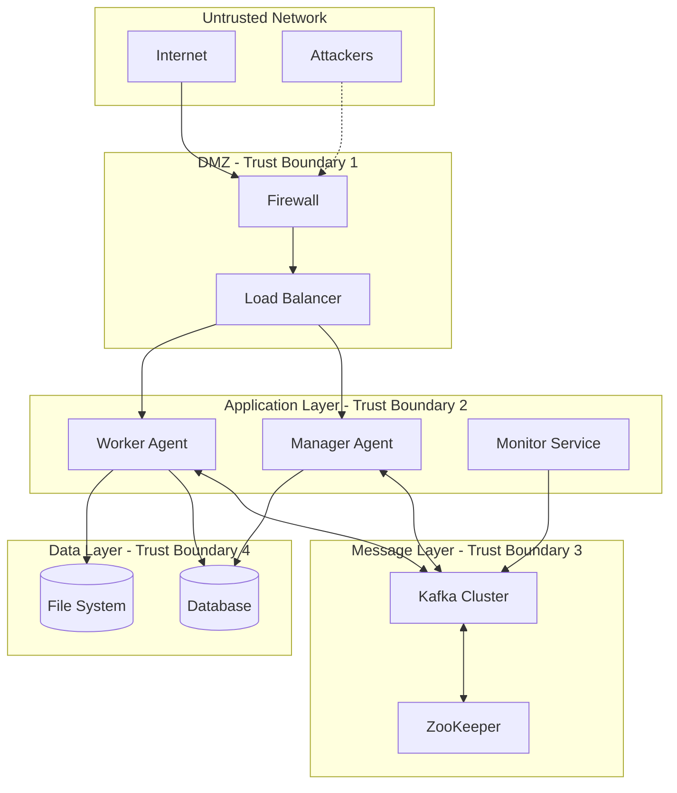

# Kafka Threat Modeling for Dual-Agent Architecture

## Overview

This document provides a comprehensive threat model for implementing Apache Kafka within the Automatic Claude Code dual-agent system. The analysis follows STRIDE methodology and provides detailed attack scenarios, impact assessments, and mitigation strategies.

## System Context and Assets

### Key Assets
1. **Agent Communication Messages**: Sensitive task assignments, progress updates, and coordination data
2. **User Project Data**: Code, configurations, and proprietary information processed by agents
3. **Authentication Credentials**: API keys, certificates, and session tokens
4. **System Configuration**: Kafka cluster settings, security policies, and operational parameters
5. **Audit Logs**: Security events, compliance records, and forensic data

### Trust Boundaries


## STRIDE Threat Analysis

### S - Spoofing Identity Threats

#### Threat: Malicious Agent Impersonation
**Description**: An attacker creates a fake agent that impersonates a legitimate Manager or Worker agent to gain unauthorized access to the Kafka cluster.

**Attack Scenario**:
1. Attacker obtains or generates client certificates
2. Creates malicious agent with legitimate-looking identity
3. Connects to Kafka cluster using spoofed credentials
4. Intercepts or manipulates agent communications

**Impact Assessment**:
- **Confidentiality**: High - Access to sensitive task data
- **Integrity**: High - Ability to manipulate task assignments
- **Availability**: Medium - Could disrupt agent coordination
- **Overall Risk**: HIGH

**Mitigation Strategies**:
```yaml
# Client Certificate Authentication
ssl:
  client.auth: required
  ssl.truststore.location: /etc/kafka/ssl/truststore.jks
  ssl.keystore.location: /etc/kafka/ssl/keystore.jks
  
# Strong SASL Configuration
sasl:
  mechanism: SCRAM-SHA-512
  jaas.config: |
    org.apache.kafka.common.security.scram.ScramLoginModule required
    username="${KAFKA_CLIENT_USERNAME}"
    password="${KAFKA_CLIENT_PASSWORD}";
```

**Detection Methods**:
- Certificate validation logs
- Unusual connection patterns
- Authentication failure spikes
- Message pattern analysis

---

#### Threat: Certificate Authority Compromise
**Description**: An attacker compromises the Certificate Authority used to issue client certificates, allowing them to generate valid certificates for any client.

**Attack Scenario**:
1. Attacker gains access to CA private key
2. Generates valid client certificates for malicious agents
3. Uses certificates to authenticate to Kafka cluster
4. Performs unauthorized operations

**Impact Assessment**:
- **Confidentiality**: Critical - Complete access to encrypted communications
- **Integrity**: Critical - Ability to modify any data
- **Availability**: High - Could disrupt entire system
- **Overall Risk**: CRITICAL

**Mitigation Strategies**:
- Hardware Security Module (HSM) for CA key storage
- Certificate pinning for known clients
- Short certificate validity periods
- Certificate Transparency logs
- Multi-factor authentication for CA operations

---

### T - Tampering with Data Threats

#### Threat: Message Tampering in Transit
**Description**: An attacker intercepts and modifies messages between agents during transmission through Kafka.

**Attack Scenario**:
1. Attacker performs man-in-the-middle attack on network traffic
2. Intercepts Kafka messages between agents
3. Modifies message content (task assignments, status updates)
4. Forwards modified messages to recipients

**Impact Assessment**:
- **Confidentiality**: Medium - Message content exposed
- **Integrity**: Critical - Task execution could be compromised
- **Availability**: Low - System continues to function
- **Overall Risk**: HIGH

**Mitigation Strategies**:
```typescript
// Message Signing Implementation
class SecureKafkaMessage {
  private static async signMessage(message: any, privateKey: string): Promise<string> {
    const messageString = JSON.stringify(message);
    const signature = crypto.sign('sha256', Buffer.from(messageString), privateKey);
    return signature.toString('base64');
  }
  
  private static async verifyMessage(message: any, signature: string, publicKey: string): Promise<boolean> {
    const messageString = JSON.stringify(message);
    return crypto.verify('sha256', Buffer.from(messageString), publicKey, Buffer.from(signature, 'base64'));
  }
  
  async sendSecureMessage(producer: Producer, topic: string, message: any): Promise<void> {
    const signature = await SecureKafkaMessage.signMessage(message, this.privateKey);
    
    await producer.send({
      topic: topic,
      messages: [{
        key: message.id,
        value: JSON.stringify(message),
        headers: {
          signature: signature,
          timestamp: Date.now().toString(),
          sender: this.agentId
        }
      }]
    });
  }
}
```

**Detection Methods**:
- Message integrity verification failures
- Signature validation errors
- Unusual message modification patterns
- Network traffic analysis

---

#### Threat: Kafka Log File Tampering
**Description**: An attacker gains access to Kafka broker storage and modifies log files to alter historical message data.

**Attack Scenario**:
1. Attacker gains access to Kafka broker file system
2. Modifies Kafka log segment files
3. Alters historical agent communications
4. Covers tracks by modifying timestamps

**Impact Assessment**:
- **Confidentiality**: Low - Historical data exposed
- **Integrity**: Critical - Audit trail compromised
- **Availability**: Medium - Could cause data corruption
- **Overall Risk**: HIGH

**Mitigation Strategies**:
- File system-level encryption
- Immutable storage backends
- Regular integrity checks
- Write-only log permissions
- Real-time log replication to secure storage

---

### R - Repudiation Threats

#### Threat: Agent Action Denial
**Description**: An agent (or compromised agent) denies performing actions that were actually executed, creating accountability issues.

**Attack Scenario**:
1. Agent performs unauthorized or malicious actions
2. Actions are recorded in Kafka logs
3. Agent or attacker claims actions were not performed
4. Investigation is complicated by lack of non-repudiation

**Impact Assessment**:
- **Confidentiality**: Low - Information disclosure limited
- **Integrity**: Medium - Trust in system compromised
- **Availability**: Low - System remains functional
- **Overall Risk**: MEDIUM

**Mitigation Strategies**:
```typescript
// Non-Repudiation Implementation
class NonRepudiationLogger {
  async logAgentAction(
    agentId: string,
    action: string,
    data: any,
    privateKey: string
  ): Promise<void> {
    const timestamp = new Date().toISOString();
    const logEntry = {
      agentId,
      action,
      data: this.sanitizeData(data),
      timestamp,
      nonce: crypto.randomBytes(16).toString('hex')
    };
    
    // Create digital signature
    const signature = crypto.sign('sha256', Buffer.from(JSON.stringify(logEntry)), privateKey);
    
    // Log to immutable audit topic
    await this.producer.send({
      topic: 'audit-trail',
      messages: [{
        key: logEntry.nonce,
        value: JSON.stringify({
          ...logEntry,
          signature: signature.toString('base64')
        }),
        headers: {
          'log-type': 'agent-action',
          'retention': 'permanent'
        }
      }]
    });
  }
}
```

**Detection Methods**:
- Digital signature verification
- Cross-reference with multiple log sources
- Behavioral analysis patterns
- Timeline consistency checks

---

### I - Information Disclosure Threats

#### Threat: Unauthorized Message Consumption
**Description**: An attacker gains access to Kafka topics and consumes sensitive agent communication messages.

**Attack Scenario**:
1. Attacker compromises a service account or certificate
2. Uses credentials to connect to Kafka cluster
3. Subscribes to sensitive topics containing agent communications
4. Extracts sensitive project data and agent strategies

**Impact Assessment**:
- **Confidentiality**: Critical - Sensitive data exposed
- **Integrity**: Low - Data not modified
- **Availability**: Low - System continues operating
- **Overall Risk**: HIGH

**Mitigation Strategies**:
```yaml
# Topic-Level ACL Configuration
acls:
  sensitive-topics:
    - name: "agent-coordination.manager"
      permissions:
        - principal: "User:manager-agent"
          operations: [READ, WRITE]
        - principal: "User:worker-agent"
          operations: [READ]
    
    - name: "task-execution.sensitive"
      permissions:
        - principal: "User:worker-agent"
          operations: [READ, WRITE]
        - principal: "User:monitoring-service"
          operations: [READ]
          conditions:
            - ip_range: "10.0.1.0/24"
            - time_window: "business_hours"
```

**Detection Methods**:
- Unusual consumption patterns
- Access from unexpected IP addresses
- Off-hours access attempts
- Consumer group analysis

---

#### Threat: Memory Dump Data Exposure
**Description**: Sensitive data from Kafka brokers or client applications is exposed through memory dumps during crashes or maintenance.

**Attack Scenario**:
1. System crashes or maintenance triggers memory dump
2. Memory dump contains unencrypted message data
3. Attacker gains access to memory dump files
4. Extracts sensitive agent communications and credentials

**Impact Assessment**:
- **Confidentiality**: High - Memory may contain sensitive data
- **Integrity**: Low - Data not actively modified
- **Availability**: Low - Minimal impact on operations
- **Overall Risk**: MEDIUM

**Mitigation Strategies**:
- Memory encryption for sensitive processes
- Secure memory dump storage
- Data zeroization practices
- Encrypted swap files
- Limited core dump permissions

---

### D - Denial of Service Threats

#### Threat: Resource Exhaustion Attack
**Description**: An attacker overwhelms the Kafka cluster with excessive requests, causing service degradation or failure.

**Attack Scenario**:
1. Attacker gains access to valid client credentials
2. Creates multiple producer connections
3. Floods topics with high-volume message traffic
4. Exhausts broker resources (CPU, memory, disk I/O)
5. Legitimate agent communications fail or become severely delayed

**Impact Assessment**:
- **Confidentiality**: Low - Data not directly exposed
- **Integrity**: Medium - Message processing may be affected
- **Availability**: Critical - System becomes unusable
- **Overall Risk**: HIGH

**Mitigation Strategies**:
```yaml
# Kafka Quotas Configuration
quotas:
  producer_byte_rate: 10485760  # 10MB/sec per client
  consumer_byte_rate: 10485760  # 10MB/sec per client
  request_rate: 1000            # 1000 requests/sec per client
  
# Connection limits
num.network.threads: 8
num.io.threads: 16
socket.send.buffer.bytes: 102400
socket.receive.buffer.bytes: 102400

# Topic-level rate limiting
rate_limiting:
  agent_coordination: 100_messages_per_minute
  task_execution: 500_messages_per_minute
  monitoring: 1000_messages_per_minute
```

**Detection Methods**:
- Resource utilization monitoring
- Request rate analysis
- Client connection patterns
- Message volume anomalies

---

#### Threat: ZooKeeper Consensus Attack
**Description**: An attacker disrupts ZooKeeper consensus to cause Kafka cluster instability.

**Attack Scenario**:
1. Attacker gains network access to ZooKeeper cluster
2. Floods ZooKeeper nodes with requests
3. Disrupts leader election process
4. Causes Kafka metadata inconsistencies
5. Results in broker failures and message loss

**Impact Assessment**:
- **Confidentiality**: Low - Metadata exposure limited
- **Integrity**: High - Metadata corruption possible
- **Availability**: Critical - Cluster becomes unstable
- **Overall Risk**: HIGH

**Mitigation Strategies**:
- ZooKeeper network segmentation
- Authentication for ZooKeeper access
- Rate limiting for ZooKeeper requests
- Monitoring ZooKeeper performance metrics
- Multi-datacenter ZooKeeper deployment

---

### E - Elevation of Privilege Threats

#### Threat: Service Account Compromise
**Description**: An attacker compromises a Kafka service account and uses it to escalate privileges within the system.

**Attack Scenario**:
1. Attacker compromises a worker agent service account
2. Uses account to explore Kafka cluster permissions
3. Discovers overly permissive ACLs or configuration
4. Escalates to administrative access
5. Gains control over entire Kafka cluster

**Impact Assessment**:
- **Confidentiality**: Critical - Full access to all data
- **Integrity**: Critical - Ability to modify any configuration
- **Availability**: Critical - Can shutdown or disrupt services
- **Overall Risk**: CRITICAL

**Mitigation Strategies**:
```yaml
# Principle of Least Privilege ACLs
service_accounts:
  manager_agent:
    permissions:
      - topic: "agent-coordination.*"
        operations: [READ, WRITE]
      - topic: "task-management.*"
        operations: [READ, WRITE]
      - consumer_group: "manager-group"
        operations: [READ]
    restrictions:
      - no_admin_operations: true
      - no_acl_modifications: true
      - no_cluster_operations: true
  
  worker_agent:
    permissions:
      - topic: "task-execution.*"
        operations: [READ, WRITE]
      - topic: "progress-updates.*"
        operations: [WRITE]
      - consumer_group: "worker-group"
        operations: [READ]
    restrictions:
      - no_admin_operations: true
      - no_sensitive_topics: true
```

**Detection Methods**:
- Privilege escalation attempts
- Administrative operation alerts
- Unusual permission requests
- Account behavior changes

---

## Attack Trees

### High-Level Attack Tree: Compromise Agent Communications
```
Compromise Agent Communications
├── OR: Intercept Messages in Transit
│   ├── AND: Perform MITM Attack
│   │   ├── Compromise Network Infrastructure
│   │   └── Break TLS Encryption
│   └── AND: Compromise Kafka Broker
│       ├── Gain Server Access
│       └── Extract Messages from Logs
├── OR: Impersonate Legitimate Agent
│   ├── AND: Obtain Valid Certificates
│   │   ├── Compromise CA
│   │   └── Steal Client Certificates
│   └── AND: Compromise Agent Credentials
│       ├── Extract from Configuration
│       └── Social Engineering Attack
└── OR: Exploit Kafka Vulnerabilities
    ├── Zero-Day Exploitation
    └── Known CVE Exploitation
```

### Attack Tree: Data Exfiltration
```
Exfiltrate Sensitive Data
├── OR: Direct Topic Access
│   ├── AND: Compromise Consumer Credentials
│   │   ├── Credential Theft
│   │   └── Brute Force Attack
│   └── AND: Exploit ACL Misconfiguration
│       ├── Overpermissive Rules
│       └── Default Configurations
├── OR: Broker-Level Access
│   ├── AND: Compromise Broker Server
│   │   ├── OS-Level Exploitation
│   │   └── Container Escape
│   └── AND: Access Log Files
│       ├── File System Access
│       └── Backup System Access
└── OR: Memory/Process Exploitation
    ├── Memory Dump Analysis
    └── Process Debugging
```

## Risk Assessment Matrix

| Threat Category | Likelihood | Impact | Risk Score | Priority |
|-----------------|------------|---------|------------|----------|
| Malicious Agent Impersonation | Medium | High | 7/10 | P1 |
| CA Compromise | Low | Critical | 6/10 | P1 |
| Message Tampering | Medium | Critical | 8/10 | P1 |
| Log File Tampering | Low | High | 5/10 | P2 |
| Action Denial/Repudiation | Medium | Medium | 4/10 | P3 |
| Unauthorized Consumption | High | Critical | 9/10 | P1 |
| Memory Dump Exposure | Low | High | 5/10 | P2 |
| Resource Exhaustion | High | Critical | 9/10 | P1 |
| ZooKeeper Consensus Attack | Medium | Critical | 8/10 | P1 |
| Service Account Compromise | Medium | Critical | 8/10 | P1 |

## Mitigation Priorities

### Priority 1 (Critical - Implement Immediately)
1. **Strong Authentication**: Implement SCRAM-SHA-512 and mTLS
2. **Topic-Level ACLs**: Restrict access based on principle of least privilege
3. **Message Signing**: Implement digital signatures for message integrity
4. **Resource Quotas**: Prevent DoS through resource exhaustion
5. **Monitoring**: Real-time security event monitoring

### Priority 2 (High - Implement Within 30 Days)
1. **Log File Encryption**: Encrypt Kafka log segments at rest
2. **Memory Protection**: Implement secure memory handling
3. **Certificate Management**: Robust PKI infrastructure
4. **Network Segmentation**: Isolate Kafka traffic
5. **Incident Response**: Automated security response procedures

### Priority 3 (Medium - Implement Within 60 Days)
1. **Advanced Monitoring**: Behavioral analysis and anomaly detection
2. **Backup Security**: Secure backup and recovery procedures
3. **Compliance Logging**: Enhanced audit trail capabilities
4. **Security Testing**: Regular penetration testing and vulnerability assessments
5. **Security Awareness**: Team training on Kafka security best practices

## Security Controls Validation

### Testing Methodologies

#### Authentication Testing
```bash
#!/bin/bash
# Test SASL Authentication
echo "Testing SASL Authentication..."

# Test valid credentials
kafka-console-producer --bootstrap-server localhost:9093 \
  --topic test-topic \
  --producer-property security.protocol=SASL_SSL \
  --producer-property sasl.mechanism=SCRAM-SHA-512 \
  --producer-property sasl.jaas.config='org.apache.kafka.common.security.scram.ScramLoginModule required username="valid-user" password="valid-password";'

# Test invalid credentials (should fail)
kafka-console-producer --bootstrap-server localhost:9093 \
  --topic test-topic \
  --producer-property security.protocol=SASL_SSL \
  --producer-property sasl.mechanism=SCRAM-SHA-512 \
  --producer-property sasl.jaas.config='org.apache.kafka.common.security.scram.ScramLoginModule required username="invalid-user" password="invalid-password";'
```

#### ACL Testing
```bash
#!/bin/bash
# Test Topic ACL Enforcement
echo "Testing Topic ACL Enforcement..."

# Test authorized access (should succeed)
kafka-console-consumer --bootstrap-server localhost:9093 \
  --topic authorized-topic \
  --consumer-property security.protocol=SASL_SSL \
  --consumer-property sasl.mechanism=SCRAM-SHA-512 \
  --consumer-property sasl.jaas.config='org.apache.kafka.common.security.scram.ScramLoginModule required username="authorized-user" password="password";'

# Test unauthorized access (should fail)
kafka-console-consumer --bootstrap-server localhost:9093 \
  --topic restricted-topic \
  --consumer-property security.protocol=SASL_SSL \
  --consumer-property sasl.mechanism=SCRAM-SHA-512 \
  --consumer-property sasl.jaas.config='org.apache.kafka.common.security.scram.ScramLoginModule required username="unauthorized-user" password="password";'
```

#### Encryption Testing
```bash
#!/bin/bash
# Test TLS Encryption
echo "Testing TLS Encryption..."

# Verify TLS handshake
openssl s_client -connect kafka-broker:9093 -verify_return_error

# Test certificate validation
kafka-console-producer --bootstrap-server localhost:9093 \
  --topic test-topic \
  --producer-property security.protocol=SSL \
  --producer-property ssl.truststore.location=/path/to/truststore.jks \
  --producer-property ssl.truststore.password=truststore-password \
  --producer-property ssl.keystore.location=/path/to/keystore.jks \
  --producer-property ssl.keystore.password=keystore-password
```

This comprehensive threat model provides the foundation for implementing robust security controls to protect the Kafka-based dual-agent communication system against a wide range of potential threats.