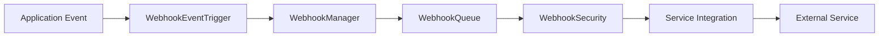

# Dual-Agent Monitor Webhook System

A comprehensive webhook system for external integrations with the Dual-Agent Monitor, enabling real-time notifications and seamless integration with popular services like Slack, Discord, email, Jira, GitHub, and PagerDuty.

## Features

- 🔄 **Reliable Delivery**: Built-in retry logic with exponential backoff and dead letter queues
- 🔒 **Security**: HMAC signature verification, rate limiting, and IP whitelisting
- 📊 **Monitoring**: Comprehensive logging, statistics, and health monitoring
- 🎯 **Event Filtering**: Flexible event subscription and payload field filtering
- 🚀 **High Performance**: Concurrent delivery processing with queue management
- 🔌 **Pre-built Integrations**: Ready-to-use templates for popular services
- 📱 **Rich Payloads**: Service-specific payload transformations (Slack attachments, Discord embeds, HTML emails)

## Architecture

### Core Components

```
webhooks/
├── WebhookManager.ts       # Core webhook delivery engine
├── WebhookRegistry.ts      # Endpoint registration and management
├── WebhookQueue.ts         # Reliable delivery queue with retries
├── WebhookSecurity.ts      # Security features and validation
├── WebhookEventTrigger.ts  # Application integration layer
├── webhookRoutes.ts        # REST API endpoints
├── integrations/           # Service-specific transformations
│   ├── SlackIntegration.ts
│   ├── DiscordIntegration.ts
│   └── EmailIntegration.ts
└── __tests__/             # Comprehensive test suite
```

### Event Flow



## Supported Events

| Event | Description | Payload |
|-------|-------------|---------|
| `session.started` | New dual-agent session initiated | Session details, initial task |
| `session.completed` | Session finished successfully | Session summary, metrics |
| `session.failed` | Session encountered critical error | Error details, failure reason |
| `agent.message` | Real-time agent communication | Agent type, message content |
| `performance.alert` | Performance threshold violation | Metrics, threshold details |
| `anomaly.detected` | ML anomaly detection alert | Anomaly type, confidence score |
| `user.login` | User authentication event | User details, timestamp |
| `cost.threshold` | Budget threshold exceeded | Current cost, threshold limits |
| `webhook.test` | Test webhook delivery | Test payload |

## Service Integrations

### Slack
- **Rich Attachments**: Color-coded messages with structured fields
- **Bot Configuration**: Custom username and emoji support
- **Channel Targeting**: Direct messages or channel notifications
- **Thread Support**: Reply to existing messages

Example Slack payload:
```json
{
  "text": "🚀 *New Dual-Agent Session Started*",
  "username": "Dual-Agent Monitor",
  "icon_emoji": ":robot_face:",
  "attachments": [{
    "color": "good",
    "fields": [
      {"title": "Session ID", "value": "sess_123", "short": true},
      {"title": "Task", "value": "Create React component", "short": false}
    ]
  }]
}
```

### Discord
- **Rich Embeds**: Structured messages with colors and fields
- **Custom Bot**: Avatar and username customization
- **Mention Support**: User and role mentions
- **Timestamp Integration**: Automatic timestamps

Example Discord embed:
```json
{
  "embeds": [{
    "title": "✅ Session Completed Successfully",
    "color": 65280,
    "fields": [
      {"name": "Duration", "value": "45s", "inline": true},
      {"name": "Success Rate", "value": "95%", "inline": true}
    ],
    "timestamp": "2024-01-01T12:00:00.000Z",
    "footer": {"text": "Dual-Agent Monitor"}
  }]
}
```

### Email
- **HTML Templates**: Professional responsive email templates
- **Plain Text**: Fallback text-only versions
- **Attachment Support**: File attachments for reports
- **Multiple Recipients**: CC/BCC support

### Generic HTTP
- **Flexible Headers**: Custom headers and authentication
- **JSON/Form Data**: Multiple payload formats
- **Custom Methods**: Support for POST, PUT, PATCH
- **Timeout Control**: Configurable request timeouts

## API Endpoints

### Webhook Management
```http
GET    /api/webhooks              # List all webhooks
POST   /api/webhooks              # Create new webhook
GET    /api/webhooks/:id          # Get specific webhook
PUT    /api/webhooks/:id          # Update webhook
DELETE /api/webhooks/:id          # Delete webhook
POST   /api/webhooks/:id/test     # Test webhook delivery
GET    /api/webhooks/:id/logs     # Get delivery logs
```

### Templates and Integrations
```http
GET    /api/webhooks/templates         # Get available templates
GET    /api/webhooks/integrations      # Get integration guides
POST   /api/webhooks/from-template     # Create from template
```

### System Management
```http
POST   /api/webhooks/trigger          # Manually trigger event
GET    /api/webhooks/statistics       # System statistics
GET    /api/webhooks/health           # Health status
```

## Configuration

### Basic Webhook Configuration
```json
{
  "name": "Slack Notifications",
  "url": "https://hooks.slack.com/services/...",
  "secret": "webhook-signing-secret",
  "events": ["session.completed", "session.failed"],
  "active": true,
  "headers": {
    "Content-Type": "application/json"
  },
  "payloadFields": ["sessionId", "message", "timestamp"],
  "integration": "slack"
}
```

### WebhookManager Options
```typescript
const manager = new WebhookManager({
  maxRetries: 3,              // Maximum delivery attempts
  retryDelayMs: 1000,         // Base retry delay
  timeoutMs: 30000,           // Request timeout
  maxConcurrentDeliveries: 10, // Concurrent deliveries
  rateLimitPerMinute: 60,     // Rate limit per endpoint
  enableDeadLetterQueue: true // Failed delivery storage
});
```

### Security Configuration
```typescript
const security = new WebhookSecurity({
  enableSignatureVerification: true,
  signatureAlgorithm: 'sha256',
  signatureHeader: 'X-Webhook-Signature',
  timestampHeader: 'X-Webhook-Timestamp',
  timestampToleranceSeconds: 300,
  enableRateLimiting: true,
  rateLimitWindow: 3600,
  rateLimitMaxRequests: 1000,
  enableIpWhitelisting: false,
  allowedIps: [],
  enablePayloadEncryption: false
});
```

## Usage Examples

### Setting Up Slack Integration
```typescript
import { WebhookManager, WebhookRegistry } from './webhooks';

const webhookManager = new WebhookManager();
const webhookRegistry = new WebhookRegistry();

// Register Slack webhook
const slackWebhook = await webhookRegistry.register({
  name: 'Team Notifications',
  url: 'https://hooks.slack.com/services/YOUR/SLACK/WEBHOOK',
  events: ['session.completed', 'session.failed', 'performance.alert'],
  integration: 'slack',
  active: true,
  headers: {
    'Content-Type': 'application/json'
  }
});
```

### Triggering Events
```typescript
import { WebhookEventTrigger } from './webhooks/WebhookEventTrigger';

const eventTrigger = new WebhookEventTrigger(webhookManager);

// Session lifecycle events
await eventTrigger.triggerSessionStarted(session);
await eventTrigger.triggerSessionCompleted(session);
await eventTrigger.triggerSessionFailed(session, 'Build failed');

// Performance monitoring
await eventTrigger.triggerPerformanceAlert({
  type: 'high_response_time',
  severity: 'medium',
  message: 'Agent response time exceeded 10 seconds',
  sessionId: 'sess_123',
  metrics: performanceMetrics
});

// Custom events
await eventTrigger.triggerAnomalyDetected({
  type: 'unusual_error_pattern',
  confidence: 0.85,
  description: 'High error rate detected',
  data: { errorCount: 15, timeWindow: '5m' }
});
```

### Creating Custom Integration
```typescript
export class CustomIntegration {
  static transformPayload(event: WebhookEvent, payload: WebhookEventPayload): any {
    switch (event) {
      case 'session.started':
        return {
          title: 'New Session',
          message: `Session ${payload.sessionId} started`,
          priority: 'normal',
          tags: ['dual-agent', 'session']
        };
      
      case 'session.failed':
        return {
          title: 'Session Failed',
          message: payload.alert?.message || 'Unknown error',
          priority: 'high',
          tags: ['dual-agent', 'error']
        };
      
      default:
        return payload;
    }
  }
  
  static validateConfig(config: any): { valid: boolean; errors: string[] } {
    const errors: string[] = [];
    
    if (!config.apiKey) {
      errors.push('API key is required');
    }
    
    return { valid: errors.length === 0, errors };
  }
}

// Register custom integration
IntegrationRegistry.registerIntegration('custom', CustomIntegration);
```

## Frontend Components

### WebhookManager Component
```tsx
import { WebhookManager } from './components/webhooks/WebhookManager';

function App() {
  return <WebhookManager />;
}
```

Features:
- ✅ Complete webhook CRUD operations
- ✅ Real-time delivery statistics
- ✅ Event filtering and search
- ✅ Test webhook functionality
- ✅ Delivery logs viewer
- ✅ Integration templates

### WebhookForm Component
```tsx
import { WebhookForm } from './components/webhooks/WebhookForm';

function CreateWebhook() {
  return (
    <WebhookForm
      isOpen={showForm}
      onClose={() => setShowForm(false)}
      onSuccess={() => {
        setShowForm(false);
        loadWebhooks();
      }}
    />
  );
}
```

## Security Features

### HMAC Signature Verification
```typescript
// Generating signature
const signature = webhookSecurity.generateSignature(payload, secret);
// X-Webhook-Signature: sha256=abcdef123456...

// Verifying signature
const result = webhookSecurity.verifySignature(payload, signature, secret);
if (result.valid) {
  // Process webhook
}
```

### Rate Limiting
```typescript
const rateLimit = webhookSecurity.checkRateLimit('endpoint-id');
if (rateLimit.allowed) {
  // Deliver webhook
} else {
  // Rate limited - retry later
  console.log(`Rate limited, retry at: ${rateLimit.resetTime}`);
}
```

### IP Whitelisting
```typescript
const ipCheck = webhookSecurity.verifyIpWhitelist(clientIp);
if (ipCheck.allowed) {
  // IP is whitelisted
} else {
  console.log(`Blocked IP: ${clientIp}`);
}
```

## Monitoring and Observability

### Delivery Statistics
```typescript
const stats = webhookManager.getStatistics();
console.log({
  totalEndpoints: stats.totalEndpoints,
  activeEndpoints: stats.activeEndpoints,
  totalDeliveries: stats.totalDeliveries,
  successfulDeliveries: stats.successfulDeliveries,
  failedDeliveries: stats.failedDeliveries,
  averageDeliveryTime: stats.averageDeliveryTime
});
```

### Delivery Logs
```typescript
const logs = webhookManager.getDeliveryLogs('endpoint-id', 50);
logs.forEach(log => {
  console.log({
    event: log.event,
    success: log.result.success,
    statusCode: log.result.statusCode,
    duration: log.result.duration,
    error: log.result.error
  });
});
```

### Queue Health
```typescript
const health = webhookQueue.getHealthStatus();
if (health.status === 'critical') {
  console.error('Webhook queue issues:', health.issues);
  health.recommendations.forEach(rec => console.log('💡', rec));
}
```

## Error Handling

### Retry Logic
- **Exponential Backoff**: 1s, 2s, 4s, 8s... up to 5 minutes
- **Jitter**: Random delay to prevent thundering herd
- **Max Retries**: Configurable (default: 3 attempts)
- **Dead Letter Queue**: Failed deliveries stored for manual retry

### Error Recovery
```typescript
// Automatic retry for transient errors (5xx, network errors)
// Permanent failure for client errors (4xx)
// Custom retry logic based on response codes

webhookManager.on('delivery.failed', async ({ delivery, result }) => {
  if (result.statusCode >= 500) {
    // Server error - will be retried automatically
    console.log('Server error, will retry:', result.error);
  } else {
    // Client error - permanent failure
    console.error('Permanent failure:', result.error);
    await handlePermanentFailure(delivery);
  }
});
```

## Testing

### Running Tests
```bash
# Run all webhook tests
npm test -- --testPathPattern=webhooks

# Run specific test suites
npm test WebhookManager.test.ts
npm test SlackIntegration.test.ts

# Run with coverage
npm test -- --coverage --testPathPattern=webhooks
```

### Test Coverage
- ✅ WebhookManager: Complete CRUD and delivery logic
- ✅ WebhookQueue: Queue operations and health monitoring
- ✅ WebhookSecurity: All security features and validation
- ✅ Integrations: Payload transformations for all services
- ✅ API Routes: All endpoints and error cases
- ✅ Event Triggering: Application integration points

### Manual Testing
```bash
# Test webhook endpoint
curl -X POST http://localhost:3001/api/webhooks/test-id/test

# Trigger manual event
curl -X POST http://localhost:3001/api/webhooks/trigger \
  -H "Content-Type: application/json" \
  -d '{"event": "webhook.test", "payload": {"test": true}}'
```

## Performance Considerations

### Optimization Tips
1. **Batch Processing**: Group multiple events for efficiency
2. **Payload Filtering**: Only send required fields to reduce bandwidth
3. **Concurrent Limits**: Tune `maxConcurrentDeliveries` based on target service limits
4. **Rate Limiting**: Respect external service rate limits
5. **Queue Monitoring**: Monitor queue size and processing times

### Scaling
- **Horizontal Scaling**: Deploy multiple webhook processors
- **Load Balancing**: Distribute webhook deliveries across instances
- **Database Storage**: Migrate from in-memory to persistent storage
- **Message Queue**: Use Redis or RabbitMQ for enterprise deployments

## Troubleshooting

### Common Issues

**1. Webhooks not delivering**
- Check endpoint is active: `GET /api/webhooks/:id`
- Verify event subscription: Check `events` array
- Check delivery logs: `GET /api/webhooks/:id/logs`

**2. High failure rate**
- Verify endpoint URL is correct and accessible
- Check for rate limiting on target service
- Review error messages in delivery logs

**3. Signature verification failing**
- Ensure secret matches on both sides
- Check timestamp tolerance settings
- Verify payload hasn't been modified

**4. Performance issues**
- Monitor queue health: `GET /api/webhooks/health`
- Check concurrent delivery settings
- Review rate limiting configuration

### Debug Mode
```typescript
const webhookManager = new WebhookManager({
  // Enable verbose logging
  debug: true
});

// Listen to all events for debugging
webhookManager.on('*', (eventName, data) => {
  console.log(`Webhook Event: ${eventName}`, data);
});
```

## Contributing

### Adding New Integrations
1. Create integration class in `integrations/` directory
2. Implement `transformPayload()` method
3. Add validation with `validateConfig()`
4. Register in `IntegrationRegistry`
5. Add comprehensive tests
6. Update documentation

### Development Setup
```bash
# Install dependencies
npm install

# Run in development mode
npm run dev

# Run tests with watch mode
npm test -- --watch

# Build for production
npm run build
```

## License

MIT License - see LICENSE file for details.

## Support

- 📚 Documentation: [Internal Wiki](./docs/)
- 🐛 Bug Reports: Create GitHub issue
- 💬 Questions: Team Slack channel
- 📧 Email: dev-team@company.com