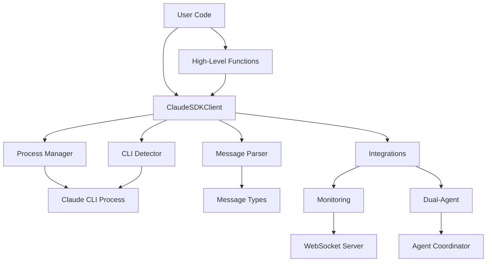

# Architecture Documentation

## Overview

The Claude Code Python SDK is designed as a high-performance, async-first wrapper around the Claude Code CLI with comprehensive integration support for dual-agent architectures and real-time monitoring systems.

## Core Architecture

### 1. Layered Design

```
┌─────────────────────────────────────────────────┐
│                User Application                  │
├─────────────────────────────────────────────────┤
│            High-Level Interfaces                │
│  query() | conversation() | query_stream()      │
├─────────────────────────────────────────────────┤
│                Core Client                      │
│            ClaudeSDKClient                      │
├─────────────────────────────────────────────────┤
│              Message System                     │
│   ResultMessage | ToolUseMessage | ErrorMessage │
├─────────────────────────────────────────────────┤
│             Process Management                  │
│       CLI Executor | Process Manager            │
├─────────────────────────────────────────────────┤
│             Integration Layer                   │
│      Monitoring | Dual-Agent | WebSocket       │
├─────────────────────────────────────────────────┤
│              Claude Code CLI                    │
│        (External Process Execution)             │
└─────────────────────────────────────────────────┘
```

### 2. Component Relationships



## Core Components

### 1. ClaudeSDKClient

The main client class that orchestrates all SDK functionality.

**Responsibilities:**
- Async context management
- Process lifecycle management  
- Message parsing and routing
- Error handling and classification
- Performance tracking

**Key Features:**
- Non-blocking async/await design
- Automatic resource cleanup
- Configurable execution modes
- Session state management

```python
class ClaudeSDKClient:
    def __init__(self, options: ClaudeCodeOptions)
    async def __aenter__(self) -> 'ClaudeSDKClient'
    async def __aexit__(self, exc_type, exc_val, exc_tb)
    async def query(self, prompt: str) -> AsyncGenerator[Message, None]
    async def close(self) -> None
```

### 2. Message System

Type-safe message handling with comprehensive message types.

**Message Hierarchy:**
```
BaseMessage
├── ResultMessage          # Final results from Claude
├── ToolUseMessage         # Tool usage notifications
├── ToolResultMessage      # Tool execution results
├── ErrorMessage           # Error notifications with classification
├── StreamMessage          # Streaming content chunks
└── StatusMessage          # Status updates and progress
```

**Features:**
- JSON serialization/deserialization
- Timestamp tracking
- Content validation
- Type-safe parsing

### 3. Process Management

Robust process lifecycle management for Claude CLI execution.

**ProcessManager Features:**
- Cross-platform process handling
- Graceful process termination
- Resource cleanup on errors
- Process tracking and monitoring

```python
class ProcessManager:
    def add_process(self, process: Process, session_id: str)
    def remove_process(self, process: Process)
    async def close_all(self) -> None
    async def kill_process_gracefully(self, process: Process)
```

### 4. Configuration System

Flexible configuration with validation and presets.

**ClaudeCodeOptions Features:**
- Type validation
- Environment variable integration
- Preset configurations
- CLI argument generation

```python
# Preset factories
create_development_options()  # Full tool access, verbose logging
create_production_options()   # Restricted tools, optimized timeouts
create_dual_agent_options()   # Agent-specific configurations
create_streaming_options()    # Optimized for real-time streaming
```

## Execution Models

### 1. Streaming Execution

Real-time message processing with immediate feedback.

```python
async def streaming_execution():
    async for message in client.query("prompt", stream=True):
        # Messages arrive as soon as available
        if isinstance(message, StreamMessage):
            print(message.content, end="", flush=True)
        elif isinstance(message, ToolUseMessage):
            print(f"\nUsing: {message.tool_name}")
```

**Benefits:**
- Immediate user feedback
- Reduced perceived latency
- Interactive experiences
- Progress monitoring

### 2. Blocking Execution  

Traditional request-response pattern for simple use cases.

```python
async def blocking_execution():
    async for message in client.query("prompt", stream=False):
        # Complete response arrives at once
        if isinstance(message, ResultMessage):
            return message.result
```

**Benefits:**
- Simpler error handling
- Atomic operations
- Easier debugging
- Predictable resource usage

## Integration Architecture

### 1. Automatic Claude Code Integration

Full integration with the dual-agent monitoring system.

```
┌─────────────────────┐    WebSocket    ┌─────────────────────┐
│   Python SDK        │◄───────────────►│  Monitoring Server  │
│                     │                 │                     │
│ AutomaticClaude     │    REST API     │  Dashboard UI       │
│ Integration         │◄───────────────►│  (React Frontend)   │
└─────────────────────┘                 └─────────────────────┘
         │
         │ Agent Communication
         ▼
┌─────────────────────┐
│ Dual-Agent System   │
│ Manager ↔ Worker    │
└─────────────────────┘
```

**Features:**
- Real-time event streaming
- Agent coordination tracking
- Performance metrics collection
- Dashboard visualization

### 2. Monitoring Integration

Comprehensive observability and performance tracking.

**Metrics Collected:**
- Query execution times
- Token usage statistics
- Error rates and types
- Tool usage patterns
- Agent coordination efficiency

```python
class MonitoringIntegration:
    async def send_event(self, event_type: str, data: Dict)
    async def track_query_performance(self, duration: float)
    async def log_agent_coordination(self, agent_type: str, action: str)
    def get_metrics_summary(self) -> Dict[str, Any]
```

## Error Handling Strategy

### 1. Exception Hierarchy

```
ClaudeCodeError (Base)
├── ClaudeTimeoutError      # Execution timeouts
├── ClaudeAuthError         # Authentication issues
├── ClaudeNotFoundError     # CLI installation issues
├── ClaudeConfigError       # Configuration validation
├── RateLimitError          # API rate limiting
├── QuotaExceededError      # Usage quota limits
├── InvalidModelError       # Model specification errors
├── SessionCorruptedError   # Session state issues
├── ResourceExhaustionError # System resource limits
├── NetworkError            # Connectivity issues
└── ProcessError            # Process execution failures
```

### 2. Error Classification

Automatic error classification with recovery strategies:

```python
def classify_error(error_text: str) -> ClaudeCodeError:
    """Automatically classify errors and suggest recovery"""
    if "timeout" in error_text.lower():
        return ClaudeTimeoutError(error_text, recoverable=True)
    elif "authentication" in error_text.lower():
        return ClaudeAuthError(error_text, recoverable=True)
    # ... more classifications
```

**Recovery Strategies:**
- **Retriable Errors:** Automatic retry with exponential backoff
- **Auth Errors:** Clear guidance on re-authentication
- **Timeout Errors:** Suggestions for task decomposition
- **Resource Errors:** Resource cleanup and optimization tips

## Performance Optimizations

### 1. Async Architecture

- **Non-blocking I/O:** All operations use async/await
- **Concurrent Execution:** Multiple queries can run simultaneously
- **Resource Pooling:** Connection reuse and process management
- **Memory Efficiency:** Streaming reduces memory footprint

### 2. Process Management

```python
# Efficient process lifecycle
async with ClaudeSDKClient() as client:
    # Process started once, reused for multiple queries
    for query in queries:
        async for message in client.query(query):
            pass
# Process cleaned up automatically
```

### 3. Message Parsing Optimization

- **Lazy Parsing:** Messages parsed only when accessed
- **Type Validation:** Efficient validation with early exit
- **Buffer Management:** Optimal buffer sizes for streaming
- **Memory Pools:** Reuse of message objects

## Security Architecture

### 1. Input Sanitization

All user inputs are sanitized before CLI execution:

```python
def sanitize_cli_args(args: List[str]) -> List[str]:
    """Remove dangerous characters and validate arguments"""
    sanitized = []
    for arg in args:
        # Remove shell metacharacters
        clean_arg = re.sub(r'[;&|`$(){}[\]<>]', '', arg)
        sanitized.append(clean_arg)
    return sanitized
```

### 2. Environment Isolation

- **Process Isolation:** Each query runs in isolated process
- **Environment Filtering:** Only safe environment variables passed
- **Working Directory Control:** Restricted to specified directories
- **Resource Limits:** Configurable memory and time limits

### 3. Authentication Security

- **Credential Protection:** No credentials stored in memory
- **Session Management:** Secure session token handling
- **API Key Safety:** Environment-based key management
- **Auto-expiration:** Automatic session cleanup

## Extensibility Design

### 1. Plugin Architecture

The SDK supports extensible functionality through plugins:

```python
class SDKPlugin(ABC):
    @abstractmethod
    async def before_query(self, prompt: str, options: ClaudeCodeOptions)
    
    @abstractmethod  
    async def after_query(self, result: Message, execution_time: float)
    
    @abstractmethod
    async def on_error(self, error: Exception)
```

### 2. Custom Message Types

Support for custom message types:

```python
class CustomMessage(BaseMessage):
    custom_field: str
    
    def validate(self) -> bool:
        return len(self.custom_field) > 0
```

### 3. Integration Points

- **Pre/Post Query Hooks:** Custom logic injection
- **Message Filters:** Custom message processing
- **Error Handlers:** Custom error recovery
- **Monitoring Extensions:** Custom metrics collection

## Deployment Considerations

### 1. Production Deployment

**Recommended Configuration:**
```python
options = create_production_options(
    timeout=60,           # Shorter timeouts
    max_turns=10,         # Limit conversation length  
    allowed_tools=["Read", "Write"],  # Restricted tools
    verbose=False         # Reduce logging overhead
)
```

**Monitoring Setup:**
- Enable comprehensive metrics collection
- Set up alerting for error rates
- Monitor resource usage patterns
- Track performance regression

### 2. Scaling Considerations

- **Connection Pooling:** Reuse Claude CLI processes
- **Rate Limiting:** Built-in respect for API limits
- **Load Balancing:** Multiple SDK instances support
- **Resource Management:** Automatic cleanup prevents leaks

### 3. High Availability

- **Graceful Degradation:** Fallback modes for failures
- **Circuit Breakers:** Automatic failure detection
- **Health Checks:** Regular system validation
- **Retry Logic:** Intelligent retry with backoff

## Future Architecture Plans

### 1. Enhanced Streaming

- **WebSocket Support:** Direct WebSocket connections
- **Bidirectional Streaming:** Real-time interactions
- **Stream Multiplexing:** Multiple streams per connection

### 2. Advanced Caching

- **Response Caching:** Intelligent response reuse
- **Session Persistence:** Cross-session state management
- **Distributed Caching:** Multi-instance cache sharing

### 3. AI-Powered Optimizations

- **Predictive Prefetching:** Anticipate user needs
- **Automatic Optimization:** Self-tuning parameters
- **Intelligent Error Recovery:** ML-based error handling

This architecture provides a solid foundation for scalable, maintainable, and high-performance Claude Code integrations while remaining flexible enough to adapt to future requirements.